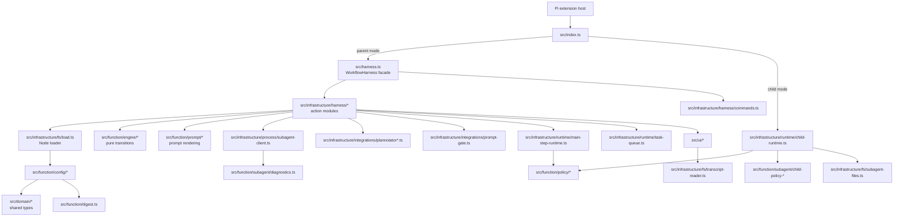
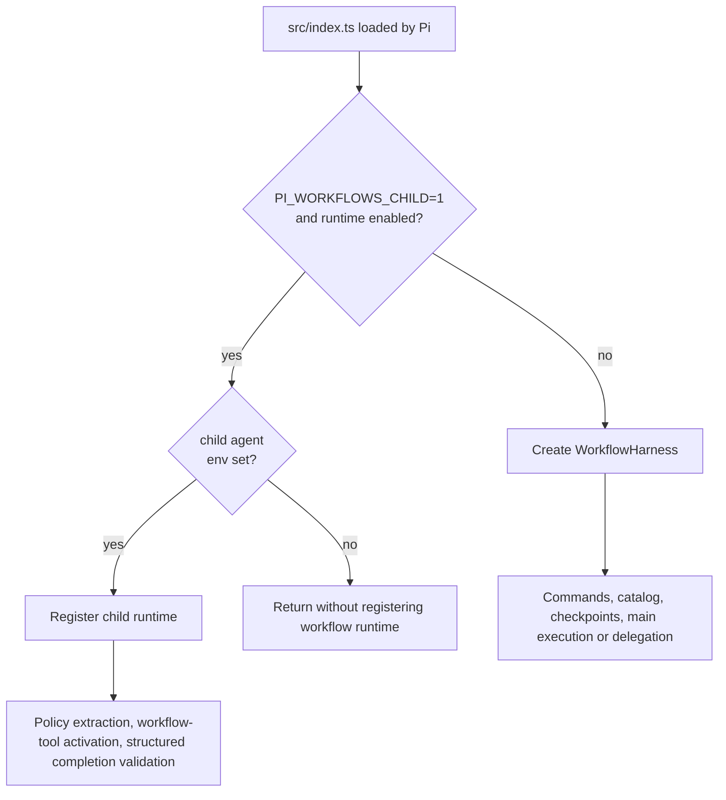
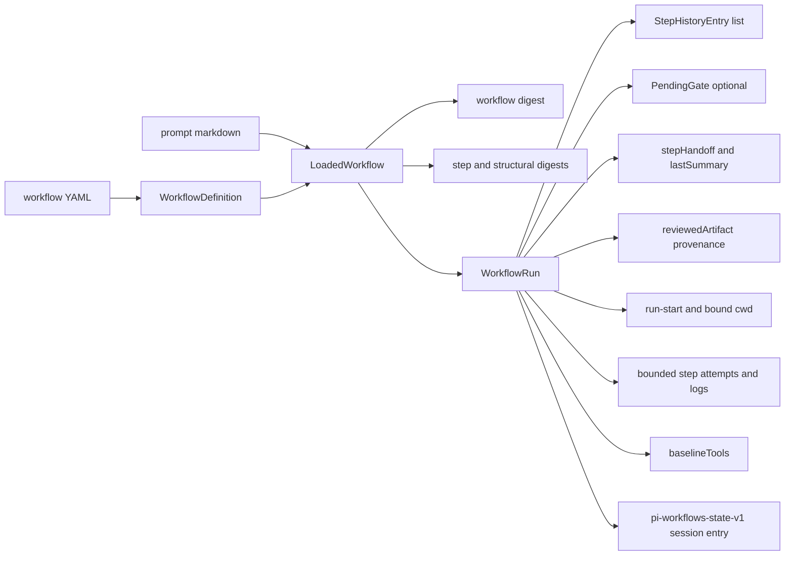
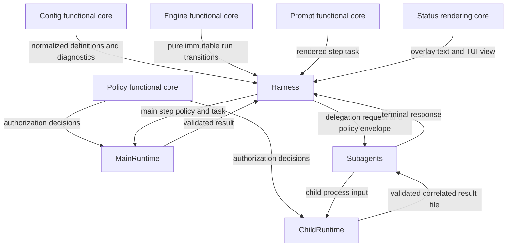
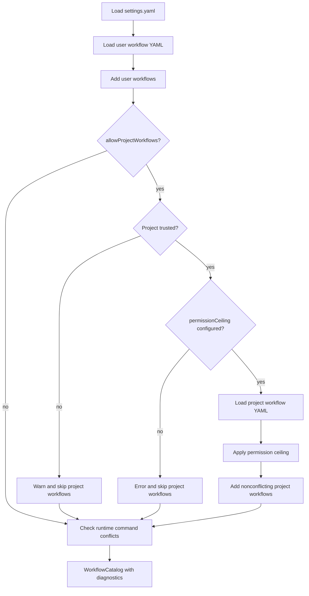

# Architecture Overview

## Module Topology

`src/index.ts` is the only Pi extension entry point. It chooses parent mode by
constructing `WorkflowHarness`, or child mode by registering the delegated
subagent runtime when `PI_WORKFLOWS_CHILD=1`,
`PI_WORKFLOWS_CHILD_RUNTIME=1`, and `PI_WORKFLOWS_CHILD_AGENT` is set.

## Source Tree Guide

The current source tree is split by dependency direction: shared domain types,
pure functional cores, infrastructure adapters that touch Pi/files/processes,
and UI rendering.

For file-level ownership, use
[Orchestration Modules](./orchestration-modules.md) for configuration, state,
and parent coordination, and
[Execution Modules](./execution-modules.md) for integrations, policy, prompts,
runtimes, and status rendering.

| Area                                   | Handles                                                                                                                                                                                                                         |
| -------------------------------------- | ------------------------------------------------------------------------------------------------------------------------------------------------------------------------------------------------------------------------------- |
| `src/domain/`                          | Canonical shared types and constants for configuration, runs, policies, harness state, Plannotator, status rendering, step results, subagents, and role profiles.                                                               |
| `src/function/`                        | Pure application logic: configuration validation, digests, workflow doctor checks, immutable engine transitions, policy decisions, preflight checks, prompt rendering, step-result parsing, and child-policy validation.          |
| `src/infrastructure/fs/`               | Node-backed filesystem adapters for settings/workflow loading, YAML parsing, catalog assembly, child result workspaces, and transcript reads.                                                                                   |
| `src/infrastructure/harness/`          | Parent-mode orchestration. `harness.ts` composes action modules for start, restart, pause, resume, lifecycle, status, gate, prompt-review, Plannotator, main-step, and delegation flows.                                        |
| `src/infrastructure/integrations/`     | External review adapters for Plannotator, prompt gates, and the optional Herdr companion reporter.                                                                                                                              |
| `src/infrastructure/process/`          | Pi Subagents parent-side process/event client.                                                                                                                                                                                   |
| `src/infrastructure/runtime/`          | Main-agent and child-agent runtimes, completion tools, policy hooks, lifecycle handling, trace capture, same-child repair, tool-budget handoff mode, and task serialization.                                                    |
| `src/ui/`                              | Workflow status text, board/detail rendering, usage formatting, step logs, layout helpers, shortcut labels, and the interactive TUI view.                                                                                       |
| `src/harness.ts`                       | Root compatibility export for `WorkflowHarness` from `src/infrastructure/harness/harness.ts`.                                                                                                                                   |
| `src/herdr-workflow-state.ts`          | Optional Herdr companion reporter that mirrors workflow lifecycle state to Herdr's managed pane status socket.                                                                                                                   |
| `src/index.ts`                         | Pi extension factory with injected environment, settings loader, child-runtime registration, and harness creation boundaries.                                                                                                    |

## Parent And Child Modes

## Data Model

## Responsibility Split

The functional cores are deliberately small and injectable. Configuration
loading binds filesystem and environment ports in `createConfigLoader`, the
harness binds Pi, timers, temporary workspaces, Plannotator, prompt gates,
subagents, status views, and main-step runtime through
`createWorkflowHarnessDependencies`, and the main-step and child runtimes take
policy/parsing/file dependencies. Tests can replace those ports without
changing workflow state logic.

Layer barrels keep internal imports explicit: `src/domain/index.ts` exports
shared types, `src/function/index.ts` exports pure logic, `src/infrastructure/index.ts`
exports adapters and runtimes, and `src/ui/index.ts` exports status rendering.

## Catalog Loading

