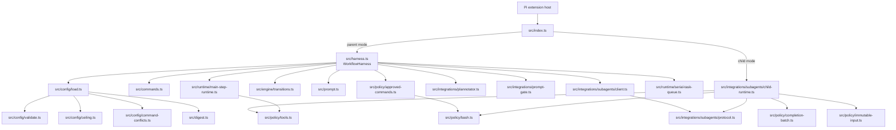
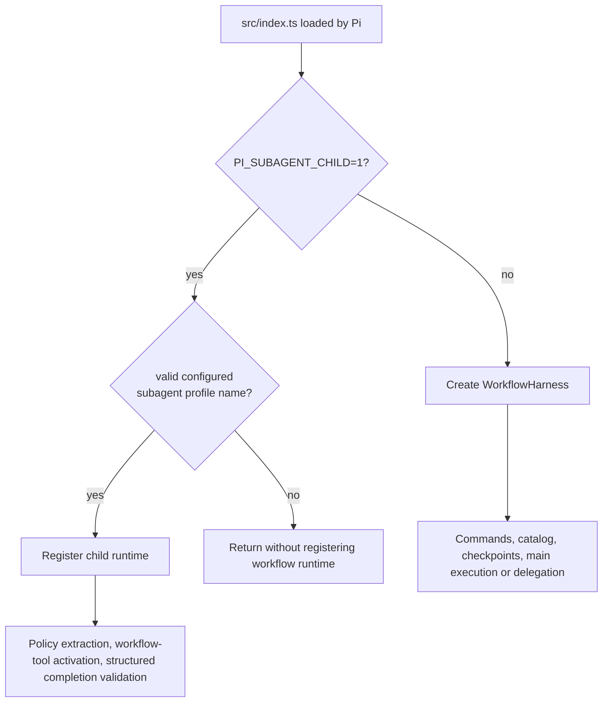
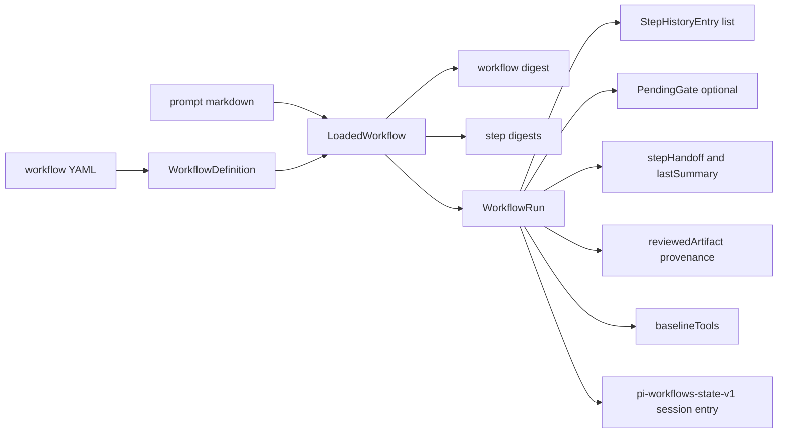
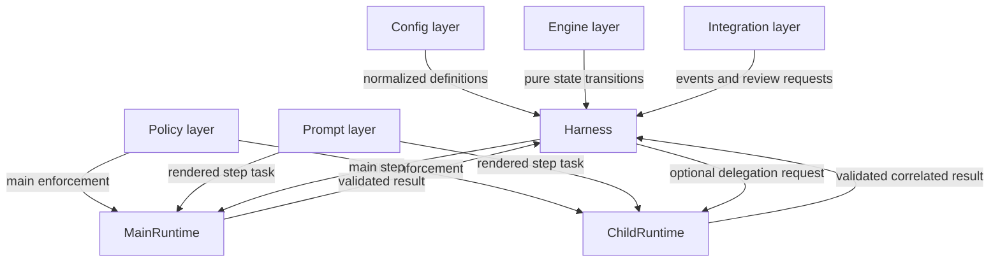
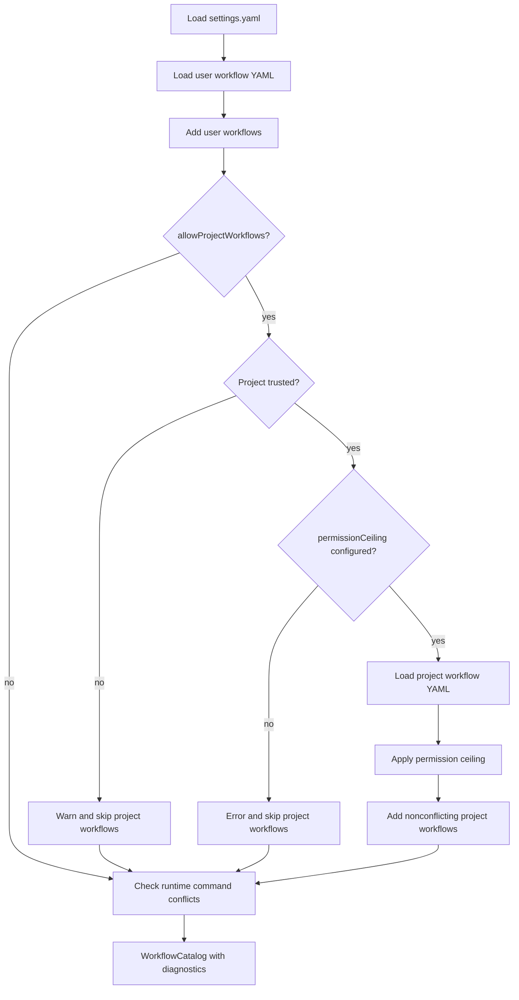

# Architecture Overview

## Module Topology

```mermaid
flowchart TD
  Pi[Pi extension host] --> Entry[src/index.ts]

  Entry -->|parent mode| Harness[src/harness.ts<br/>WorkflowHarness]
  Entry -->|child mode| ChildRuntime[src/integrations/subagents/child-runtime.ts]

  Harness --> Commands[src/commands.ts]
  Harness --> Load[src/config/load.ts]
  Harness --> Engine[src/engine/transitions.ts]
  Harness --> Prompt[src/prompt.ts]
  Harness --> SubClient[src/integrations/subagents/client.ts]
  Harness --> Plannotator[src/integrations/plannotator.ts]
  Harness --> PromptGate[src/integrations/prompt-gate.ts]
  Harness --> MainRuntime[src/runtime/main-step-runtime.ts]
  Harness --> Queue[src/runtime/serial-task-queue.ts]
  Harness --> Approved[src/policy/approved-commands.ts]

  Load --> Validate[src/config/validate.ts]
  Load --> Ceiling[src/config/ceiling.ts]
  Load --> Conflict[src/config/command-conflicts.ts]
  Load --> Digest[src/digest.ts]

  MainRuntime --> ToolPolicy[src/policy/tools.ts]
  ChildRuntime --> ToolPolicy
  ChildRuntime --> BashPolicy[src/policy/bash.ts]
  ChildRuntime --> BatchPolicy[src/policy/completion-batch.ts]
  ChildRuntime --> Freeze[src/policy/immutable-input.ts]
  ChildRuntime --> Protocol[src/integrations/subagents/protocol.ts]
  Approved --> BashPolicy

  SubClient --> Protocol
```

## Parent And Child Modes

```mermaid
flowchart TD
  Start[src/index.ts loaded by Pi]
  Start --> ChildEnv{PI_SUBAGENT_CHILD=1?}
  ChildEnv -- no --> Parent[Create WorkflowHarness]
  ChildEnv -- yes --> NameOk{valid configured<br/>subagent profile name?}
  NameOk -- yes --> Child[Register child runtime]
  NameOk -- no --> Noop[Return without registering workflow runtime]

  Parent --> ParentWork[Commands, catalog, checkpoints, main execution or delegation]
  Child --> ChildWork[Policy extraction, workflow-tool activation, structured completion validation]
```

## Data Model

```mermaid
flowchart LR
  WorkflowFile[workflow YAML] --> Definition[WorkflowDefinition]
  PromptFiles[prompt markdown] --> Loaded[LoadedWorkflow]
  Definition --> Loaded
  Loaded --> WorkflowDigest[workflow digest]
  Loaded --> StepDigests[step digests]

  Loaded --> Run[WorkflowRun]
  Run --> History[StepHistoryEntry list]
  Run --> Gate[PendingGate optional]
  Run --> Handoff[stepHandoff and lastSummary]
  Run --> Reviewed[reviewedArtifact provenance]
  Run --> Baseline[baselineTools]
  Run --> Checkpoint[pi-workflows-state-v1 session entry]
```

## Responsibility Split

```mermaid
flowchart TD
  Config[Config layer] -->|normalized definitions| Harness
  Engine[Engine layer] -->|pure state transitions| Harness
  Integrations[Integration layer] -->|events and review requests| Harness
  Policy[Policy layer] -->|main enforcement| MainRuntime
  Policy -->|child enforcement| ChildRuntime
  Prompting[Prompt layer] -->|rendered step task| MainRuntime
  Prompting -->|rendered step task| ChildRuntime

  Harness -->|main step| MainRuntime
  Harness -->|optional delegation request| ChildRuntime
  MainRuntime -->|validated result| Harness
  ChildRuntime -->|validated correlated result| Harness
```

## Catalog Loading

```mermaid
flowchart TD
  Settings[Load settings.yaml] --> UserDir[Load user workflow YAML]
  UserDir --> AddUser[Add user workflows]
  AddUser --> ProjectEnabled{allowProjectWorkflows?}
  ProjectEnabled -- no --> RuntimeConflicts[Check runtime command conflicts]
  ProjectEnabled -- yes --> Trusted{Project trusted?}
  Trusted -- no --> Warning[Warn and skip project workflows]
  Trusted -- yes --> CeilingSet{permissionCeiling configured?}
  CeilingSet -- no --> Error[Error and skip project workflows]
  CeilingSet -- yes --> ProjectDir[Load project workflow YAML]
  ProjectDir --> CeilingCheck[Apply permission ceiling]
  CeilingCheck --> AddProject[Add nonconflicting project workflows]
  AddProject --> RuntimeConflicts
  Warning --> RuntimeConflicts
  Error --> RuntimeConflicts
  RuntimeConflicts --> Catalog[WorkflowCatalog with diagnostics]
```
