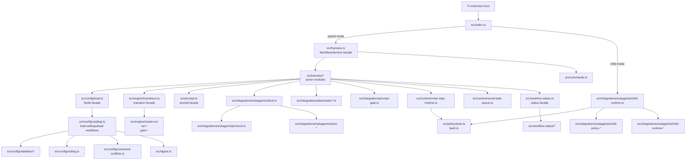
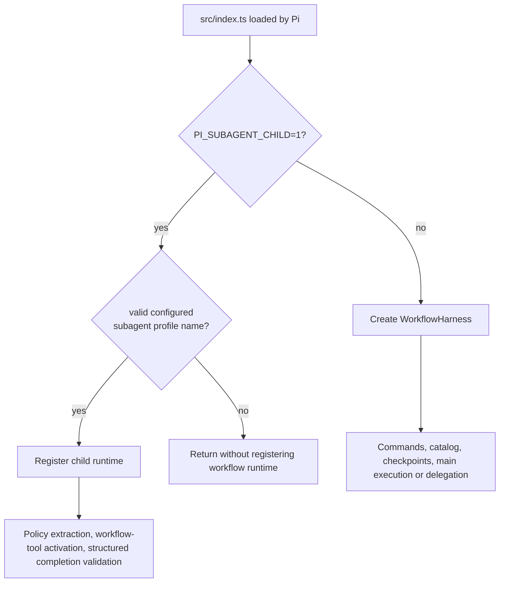
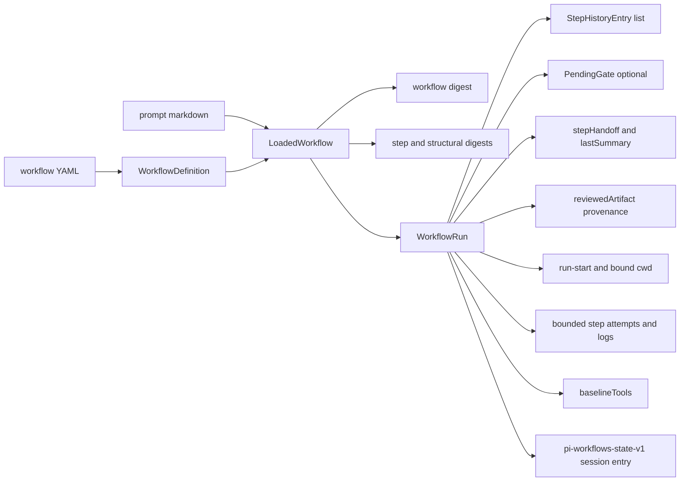
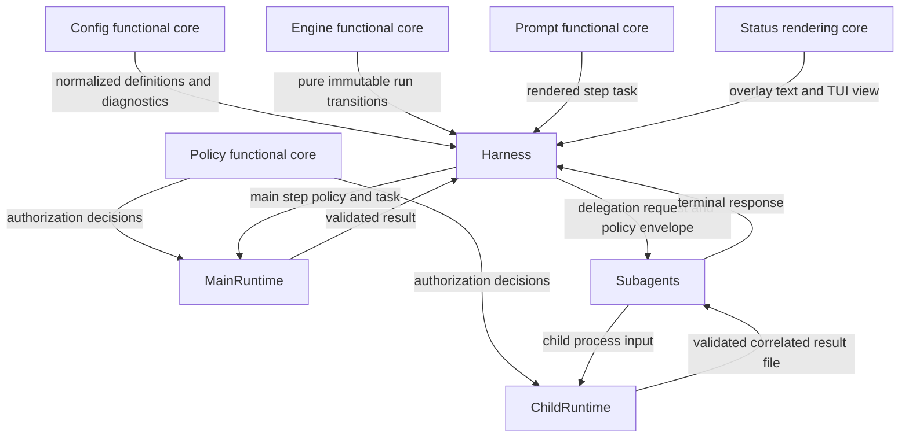
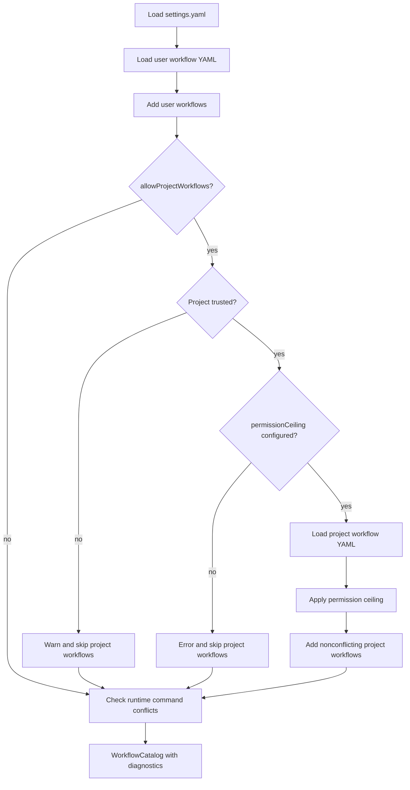

# Architecture Overview

## Module Topology

`src/index.ts` is the only Pi extension entry point. It chooses parent mode by
constructing `WorkflowHarness`, or child mode by registering the delegated
subagent runtime when `PI_SUBAGENT_CHILD=1` and the child profile name is valid.

## Source Tree Guide

The refactor keeps stable import surfaces while moving implementation details
into focused functional modules:

For file-level ownership, use
[Orchestration Modules](./orchestration-modules.md) for configuration, state,
and parent coordination, and
[Execution Modules](./execution-modules.md) for integrations, policy, prompts,
runtimes, and status rendering.

| Area                                                | Handles                                                                                                                                                                                                                                                                                                                                     |
| --------------------------------------------------- | ------------------------------------------------------------------------------------------------------------------------------------------------------------------------------------------------------------------------------------------------------------------------------------------------------------------------------------------- |
| `src/command-names.ts`                              | Reserved slash-command names owned by Pi and by the workflow extension. Config validation uses these names to prevent workflow command conflicts.                                                                                                                                                                                           |
| `src/commands.ts`                                   | Declarative registration for `/workflow-list`, `/workflow-doctor`, `/workflow-start`, `/workflow-pause`, `/workflow-resume`, `/workflow-abort`, and `/workflow-reload`. It depends only on the `WorkflowCommandController` port.                                                                                                            |
| `src/config/`                                       | Settings and workflow catalog loading. `load.ts`, `validate.ts`, and `types.ts` are compatibility/public facades; `catalog.ts`, `load-settings.ts`, `load-workflows.ts`, `yaml.ts`, `diagnostics.ts`, `ceiling.ts`, and `command-conflicts.ts` do the work.                                                                                 |
| `src/config/validation/`                            | Schema-level validation split by concern: settings, workflow, step, subagent, shortcut, permissions, prompt, and shared result helpers. These modules normalize untrusted YAML before it reaches the runtime.                                                                                                                               |
| `src/digest.ts`                                     | Stable hashing for workflow and step digests, used by catalog loading and run reconciliation.                                                                                                                                                                                                                                               |
| `src/engine/`                                       | Pure workflow state core. `state.ts` and `transitions.ts` are facades; `state-types.ts`, `transition-types.ts`, `create-run.ts`, `run-advance.ts`, `run-lifecycle.ts`, `gate-transitions.ts`, `run-reconciliation.ts`, `reconciliation-history.ts`, `run-validation.ts`, and `transition-helpers.ts` implement immutable state transitions. |
| `src/harness.ts` and `src/harness/`                 | Parent-mode orchestration. `harness.ts` preserves the `WorkflowHarness` class surface and wires action modules; `src/harness/*-actions.ts` handle start, pause, resume, lifecycle, status, gate, prompt-review, Plannotator, main-step, and delegation flows.                                                                               |
| `src/index.ts`                                      | Pi extension factory with injected environment, settings loader, child-runtime registration, and harness creation boundaries.                                                                                                                                                                                                               |
| `src/integrations/`                                 | External integration adapters. Plannotator request/response/type helpers live beside the public `plannotator.ts`; prompt review gates live in `prompt-gate.ts`; `subagents/` owns parent-child delegation and child runtime contracts.                                                                                                      |
| `src/integrations/subagents/`                       | Pi Subagents protocol family. `protocol.ts`, `client.ts`, `diagnostics.ts`, and `child-runtime.ts` are stable facades; implementation modules cover event protocol, delegation lifecycle, child policy envelope/path/validation, child completion/result files, replay safety, failure diagnostics, and transcript correlation.             |
| `src/policy/`                                       | Domain-neutral tool and command authorization. The `tools.ts` and `bash.ts` facades cover tool calls, MCP selectors, generic Bash modes and allow-list parsing, plus immutable completion inputs.                                                                                                                                           |
| `src/preflight.ts`                                  | Runtime availability checks for required tools, extensions, MCP proxy support, skills, Plannotator, and pi-subagents before a step launches.                                                                                                                                                                                                |
| `src/prompt.ts` and `src/prompt/`                   | Prompt rendering. The facade exports main workflow notices, main/delegated step tasks, retry tasks, step contract/sections, and template rendering.                                                                                                                                                                                         |
| `src/runtime/`                                      | Main-agent execution runtime and task serialization. `main-step-runtime.ts` is the public controller plus a compatibility class; sibling modules register lifecycle, policy, completion, state, completion-tool, step-result parsing, and the serial task queue.                                                                            |
| `src/workflow-list.ts`                              | Formatting for the workflow catalog list command.                                                                                                                                                                                                                                                                                           |
| `src/workflow-doctor.ts`                            | Deterministic transition-graph liveness diagnostics used by `/workflow-doctor` and start refusal.                                                                                                                                                                                                                                           |
| `src/workflow-status.ts` and `src/workflow-status/` | Status overlay rendering. The facade exports board/text formatting, shortcut labels, view controller, and types; the folder handles layout, path rendering, summary and detail rendering, transcript reads, status formatting, and the TUI view.                                                                                           |

## Parent And Child Modes

## Data Model

## Responsibility Split

The functional cores are deliberately small and injectable. Configuration
loading binds filesystem and environment ports in `createConfigLoader`, the
harness binds Pi, timers, temporary workspaces, Plannotator, prompt gates,
subagents, status views, and main-step runtime through
`createWorkflowHarnessDependencies`, and the main-step and child runtimes take
policy/parsing/file dependencies. Tests can replace those ports without
changing workflow state logic.

Compatibility facades keep older imports stable after the refactor. For
example, callers can still import from `src/engine/transitions.ts`,
`src/config/load.ts`, `src/config/validate.ts`, `src/prompt.ts`,
`src/policy/tools.ts`, `src/policy/bash.ts`, `src/runtime/main-step-runtime.ts`,
`src/integrations/subagents/protocol.ts`, and `src/workflow-status.ts`, while
the behavior is implemented in the narrower sibling modules.

## Catalog Loading

