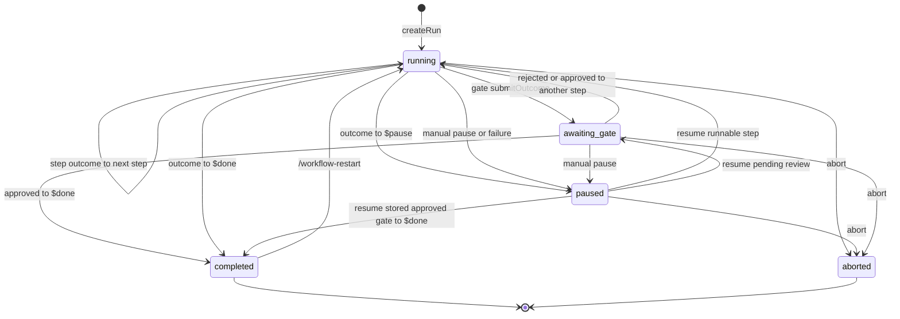
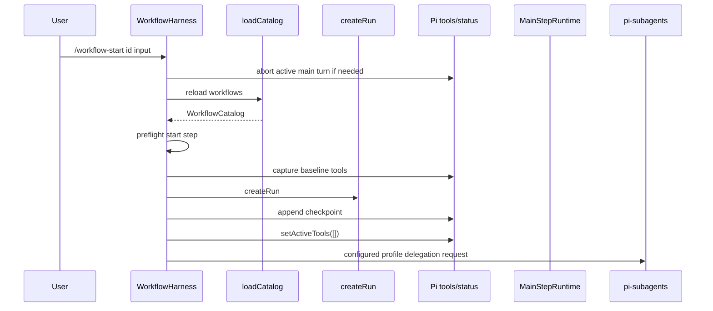
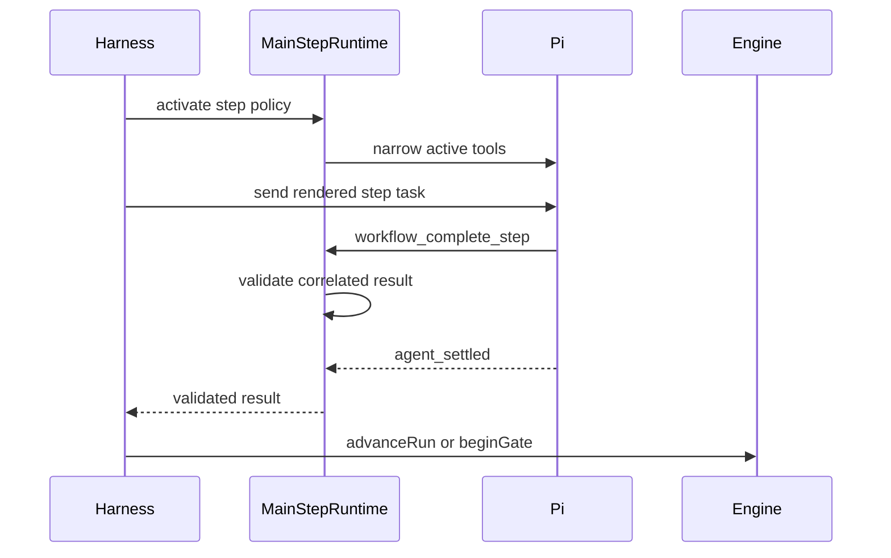
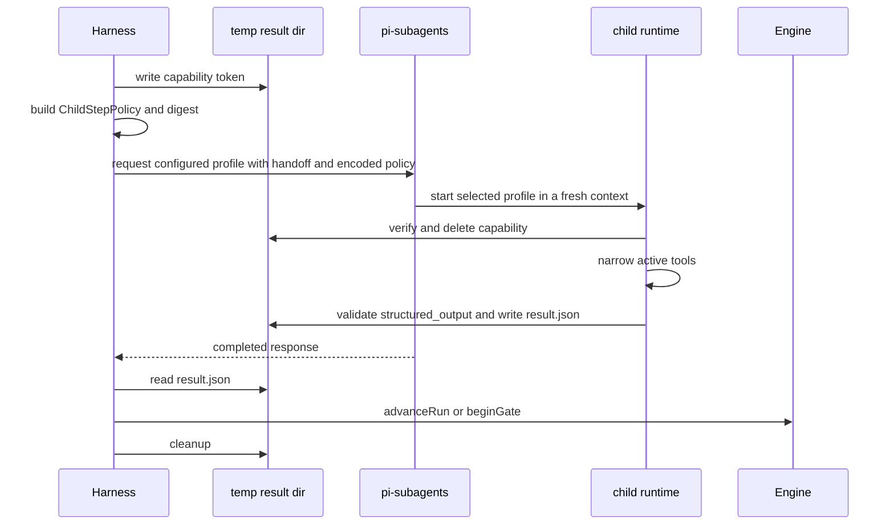
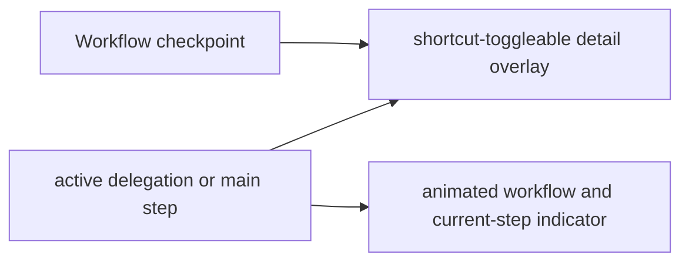
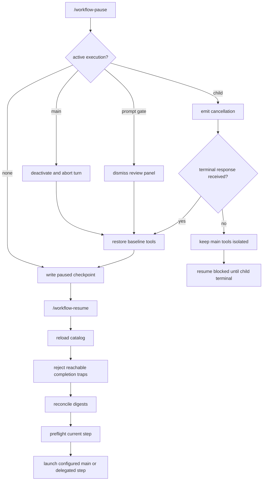
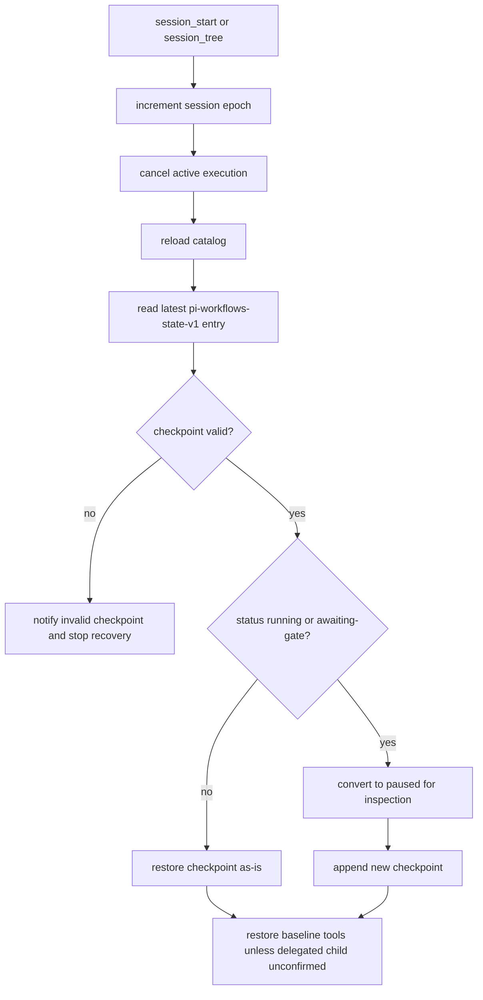
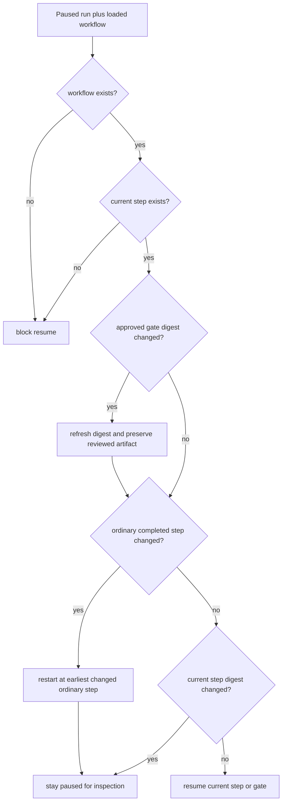

# Runtime Lifecycle

## Run State Machine

The state machine is implemented by the pure engine modules under
`src/engine/`. `create-run.ts` creates the initial immutable run,
`run-advance.ts` handles ordinary step outcomes, `gate-transitions.ts` handles
review submission and resolution, `run-lifecycle.ts` owns pause/resume/abort/restart
helpers, and `run-reconciliation.ts` plus `reconciliation-history.ts` reconcile
persisted checkpoints after workflow files change. `transitions.ts` and
`state.ts` are compatibility facades over those modules.

## Start Sequence

Parent-mode orchestration starts in `src/harness.ts`, but the behavior is now
split across action modules in `src/harness/`. `start-actions.ts` reloads the
catalog, checks the requested step, captures baseline tools, creates the run,
persists the checkpoint, and launches either a main step or a delegated step.
`dependencies.ts` is the injected boundary for Pi APIs, time, IDs,
configuration loading, temporary delegation workspaces, status display,
Plannotator, prompt gates, subagents, and the main-step runtime.

## Main-Agent Step Sequence

Main-agent execution is registered by `src/runtime/main-step-runtime.ts`. That
facade creates a controller over `main-step-state.ts`,
`main-step-lifecycle.ts`, `main-step-policy.ts`, and
`main-step-completion.ts`; it also preserves the older `MainStepRuntime` class
for compatibility. Policy decisions come from `src/policy/tools.ts`,
`bash.ts`, `completion-batch.ts`, and `immutable-input.ts`, while completion
payloads are parsed by `step-result.ts`.

## Delegated Step Sequence

The workflow `agent` value selects the workflow-owned role profile and is passed
as the Pi Subagents profile name for delegated execution. The profile is loaded
from `~/.agents/agents` with a bundled starter-kit fallback, and optional
frontmatter supplies model/thinking overrides. The request carries the rendered
role and step task, encoded policy envelope, cwd, request id, and a default
900000 ms timeout. It starts in a clean context with the original workflow
input and the previous step's compact result. Approved and rejected artifacts
are available only when the prompt explicitly renders `{{reviewed.artifact}}`
or `{{gate.artifact}}`; no accumulated parent or sibling transcript crosses
the step boundary.

Delegation planning lives in `src/harness/delegation-plan.ts`; response
handling and recovery decisions live in `delegation-response-actions.ts`,
`delegation-control-actions.ts`, and `delegation-recovery.ts`, then launch
through `step-execution-actions.ts`. The parent-side subagent client surface is
`src/integrations/subagents/client.ts`, which contains the correlated request,
event handling, cancellation, late terminal handling, and timeout work.

The child side is registered by `child-runtime.ts`. Its implementation modules
parse the encoded policy envelope, validate child agent identity and private
capability/result paths, narrow active tools, block interactive coordination
tools, authorize Bash/MCP/tool calls through the shared policy core, validate
structured completion, and write the bounded result file. Diagnostics classify
whether a missing-completion attempt is settled, complete, and read-only.

### Missing Completion Repair Before Pause

A child that settles without its required correlated result first receives one
same-session completion-only repair follow-up. The repair removes work tools
and keeps only `structured_output`, so the child can report the already-finished
step without repeating work.

If repair still produces no result, `delegation-recovery.ts` permits one fresh
child retry only for the first subagent attempt and only when diagnostics prove
the attempt was settled, untruncated, and used completed read-only calls:
`read`, `ls`, `grep`, or `structured_output`. Missing diagnostics, truncated
evidence, failed/started calls, Bash, edit/write, MCP, or any other tool class
pause the workflow.

A synchronous delegation startup exception is caught and routed through
serialized failure handling instead of escaping the harness.

Temporary delegation workspace removal is best-effort housekeeping. Cleanup
failures produce a bounded warning, but cannot interrupt an otherwise healthy
transition, successful recovery, or newly launched attempt.

## Live Status

The footer cycles through `◐`, `◓`, `◑`, and `◒` and identifies the workflow
and current step only while work runs; it is cleared when execution stops. For
delegated steps it also shows the active profile model when one came from
profile frontmatter. Once Pi reports finalized usage, the footer, fallback
status text, path rows, summary, and step detail include aggregated cost and
input/output/cache token totals by provider/model. The footer never renders a
below-editor task board. Completed steps, failures, pauses, reviews, attempt
logs, usage, and full history live in the overlay; its rendering clamps long
reasons to the available terminal width without altering the full persisted
reason. Arrow keys or `j`/`k` select a path entry; `Enter`, right, or `l` opens
its persisted attempt evidence. Detail and live-worker pages scroll with arrows
or `j`/`k`, `Ctrl+D`/`Ctrl+U` moving down/up by half a page, `gg`/`G` jumping to
the top/bottom, and left, `h`, or `Esc` returning. Attempt tasks, results, gate
decisions, and usage aggregates are globally bounded in the checkpoint.
Confined child transcript references are read on demand through stable
no-follow reads; displayed controls and common credentials are removed.
New main-agent attempts arm trace capture only when Pi finalizes the exact
workflow task, then persist a redacted, size-bounded prefix of finalized
assistant and tool events plus any finalized usage in source order. Delegated
usage is accepted only from terminal worker messages and is merged into the
same per-attempt, per-step, and workflow aggregates. These events remain part
of the parent session, but the explorer does not read unrelated parent-session
traffic; legacy attempts without a log still display their bounded task and
result.

After a transition is durably checkpointed, the harness posts one visible
`workflow-step-summary` message without triggering another model turn.
Successful steps and step-requested pauses relay only the schema-validated
summary; the final message also marks the workflow complete. Other pauses relay
their bounded reason. Failures relay a short redacted reason while their full
diagnostic and attempt history remain confined to the checkpoint and explorer.

The status facade is `src/workflow-status.ts`. Rendering and display details
are split into `workflow-status/format-status.ts`, `formatting.ts`,
`layout.ts`, `render-board.ts`, `render-path.ts`, `render-step-detail.ts`,
`render-summary.ts`, `transcript-reader.ts`, `types.ts`, and `view.ts`; harness
status actions call that facade instead of formatting the overlay inline.

## Pause And Resume

A step-requested `$pause` preserves the incoming `stepHandoff` and records the
failed attempt separately in `lastSummary`; the resumed prompt renders both.
The persisted `reviewedArtifact` stays opaque and cannot grant Bash authority.

External effects are not exactly once. If a publish step stops after a remote
action succeeds but before it checkpoints, resume uses the same declarative step
permissions. The step prompt must inspect observable remote state, skip only
proven-complete actions, and pause on ambiguity.

Pause and resume are coordinated by `pause-actions.ts`, `resume-action.ts`,
`delegation-control-actions.ts`, `prompt-gate-actions.ts`, and
`plannotator-result-actions.ts`. Engine helpers only produce the next
checkpoint state; harness actions own effect cleanup, active-tool restoration,
child cancellation, prompt review dismissal, and relaunching the current step.

## Session Restore

Each workflow checkpoint is appended to Pi and immediately materializes a new
session file when the parent has not yet emitted a regular assistant message.
The harness then re-adopts that file so Pi appends later custom and assistant
entries normally. This happens before the first step launches, so reopening the
session after a forced process stop follows the restore flow above. As with
Pi's own session writes, a stop that interrupts the synchronous filesystem write
itself cannot guarantee a complete checkpoint.

## Reconciliation On Resume

A completed human-approved gate is reconciled from its separately persisted
reviewed artifact, so editing or reloading that gated step's prompt does not ask
the step to run again. This exception applies only while the gate still exists,
its approved outcome matches the recorded outcome, and the recorded history
retains the same artifact. Legacy checkpoints fall back to their historical
summary representation. Other completed-step drift still rewinds to the
earliest changed step.
