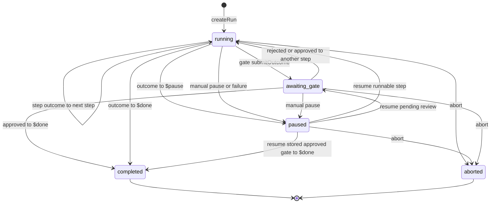
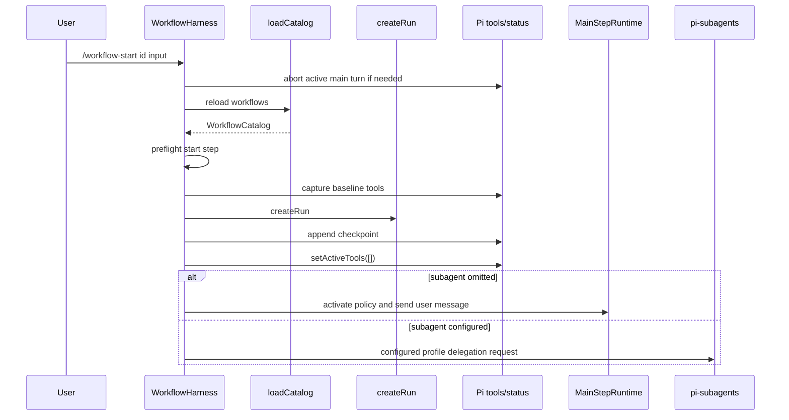
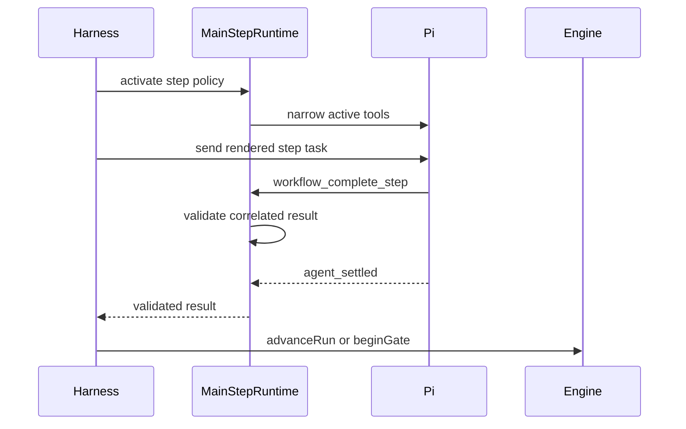
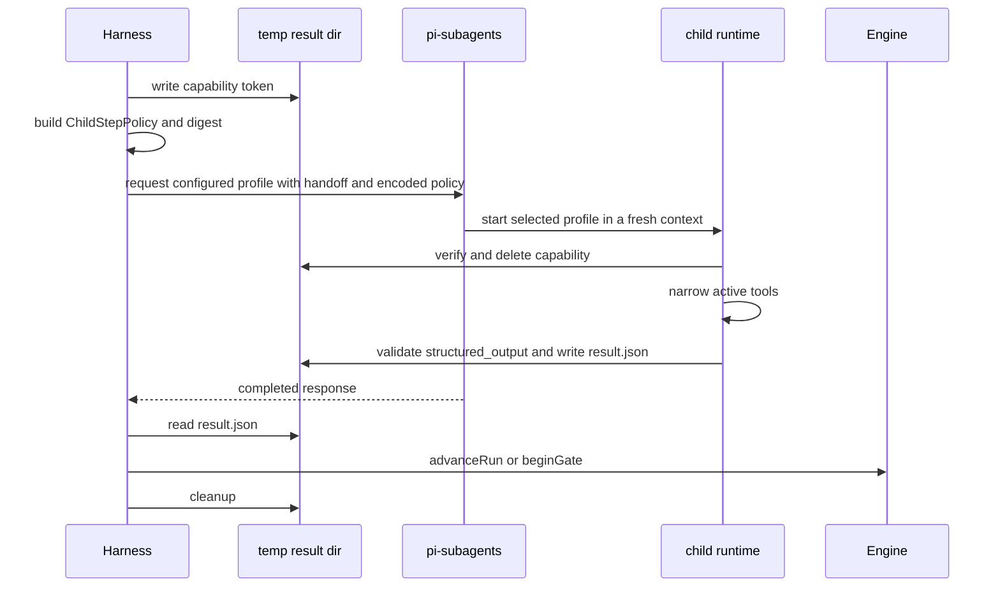
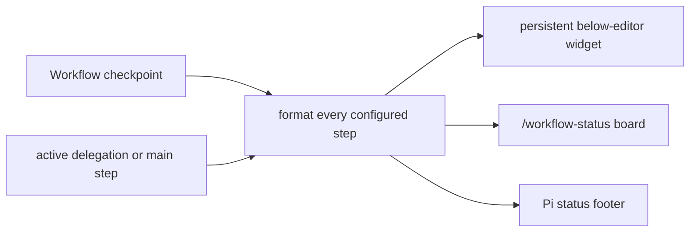
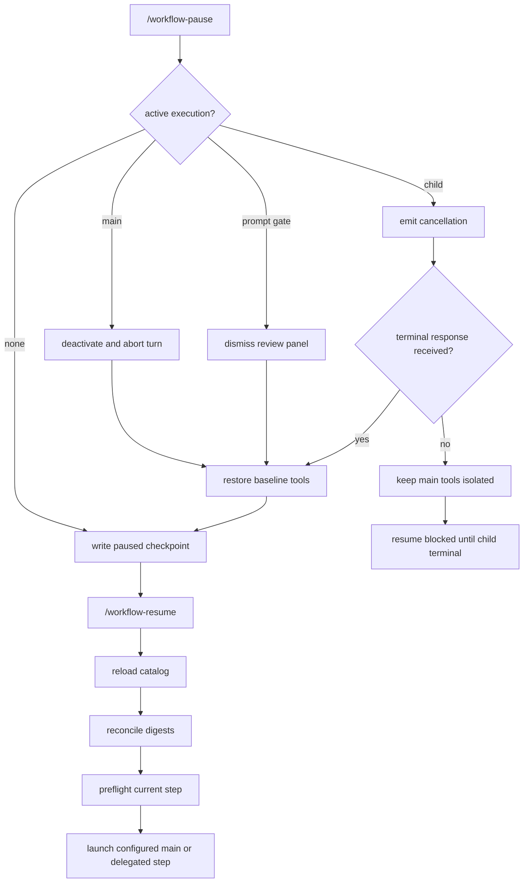
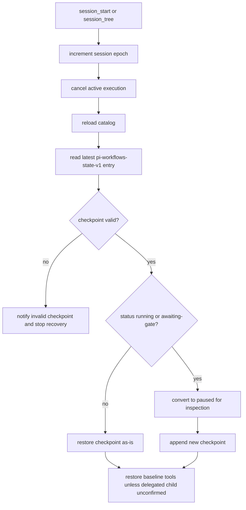
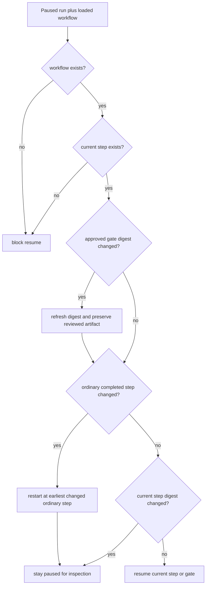

# Runtime Lifecycle

## Run State Machine

## Start Sequence

## Main-Agent Step Sequence

## Delegated Step Sequence

The workflow `subagent.agent` value selects the actual Pi Subagents profile.
Each v1 request uses `output: false`, the workflow `outputSchema`, and agent
contract v1. It starts in a clean context with the original workflow input and
the previous step's compact result or approved artifact. No accumulated parent
or sibling transcript crosses the step boundary.

## Live Status

The current step displays `↻` while it runs, completed steps display `✓`, and
failed or aborted runs display `✕`; `◆` marks a pause or review. Status rendering
clamps long failure and pause reasons to the available terminal width without
altering the full persisted reason.

## Pause And Resume

A step-requested `$pause` preserves the incoming `stepHandoff` and records the
failed attempt separately in `lastSummary`; the resumed prompt renders both.
Reviewed Bash commands derive only from the persisted `reviewedArtifact`.

External effects are not exactly once. If a publish step stops after a remote
action succeeds but before it checkpoints, resume grants the same exact
reviewed capability. The step prompt must inspect observable remote state,
skip only proven-complete actions, and pause on ambiguity.

## Session Restore

## Reconciliation On Resume

A completed human-approved gate is reconciled from its persisted reviewed
artifact, so editing or reloading the planning prompt does not ask the planning
child to run again. This exception applies only while the gate still exists,
its approved outcome matches the recorded outcome, and the recorded history
summary is the same reviewed artifact. Other completed-step drift still rewinds
to the earliest changed step.
