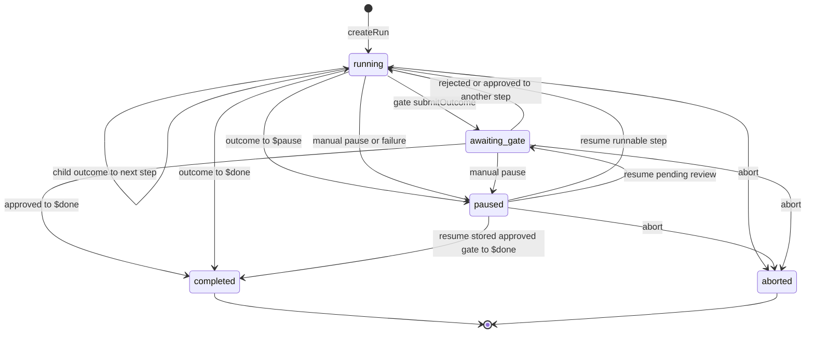
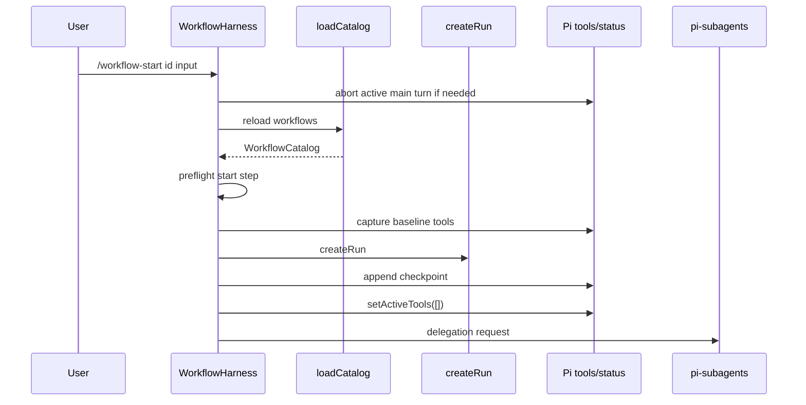
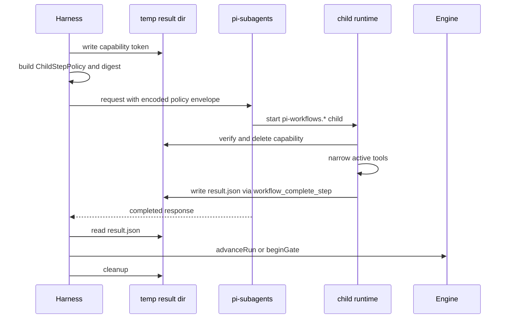
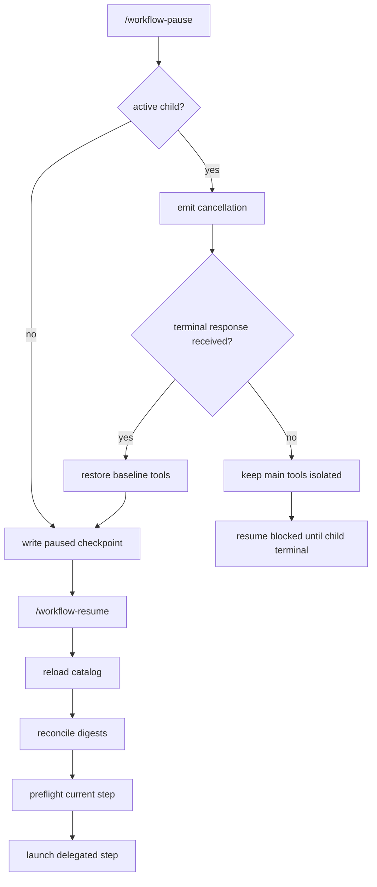
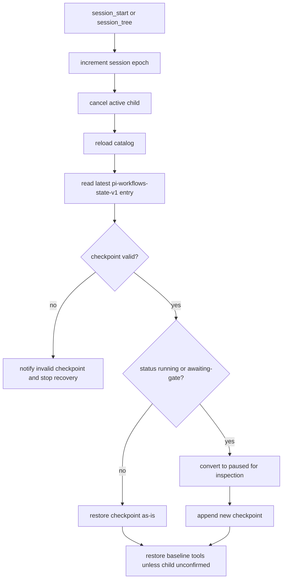
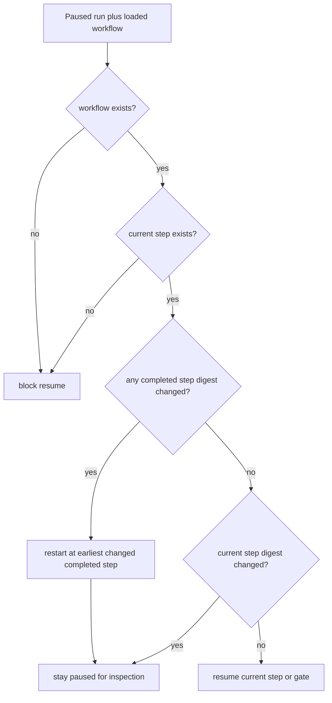

# Runtime Lifecycle

## Run State Machine

```mermaid
stateDiagram-v2
  [*] --> running: createRun
  running --> running: child outcome to next step
  running --> awaiting_gate: gate submitOutcome
  awaiting_gate --> running: rejected or approved to another step
  awaiting_gate --> completed: approved to $done
  running --> completed: outcome to $done
  running --> paused: outcome to $pause
  running --> paused: manual pause or failure
  awaiting_gate --> paused: manual pause
  paused --> running: resume runnable step
  paused --> awaiting_gate: resume pending review
  paused --> completed: resume stored approved gate to $done
  running --> aborted: abort
  paused --> aborted: abort
  awaiting_gate --> aborted: abort
  completed --> [*]
  aborted --> [*]
```

## Start Sequence

```mermaid
sequenceDiagram
  participant User
  participant Harness as WorkflowHarness
  participant Config as loadCatalog
  participant Engine as createRun
  participant Pi as Pi tools/status
  participant Sub as pi-subagents

  User->>Harness: /workflow-start id input
  Harness->>Pi: abort active main turn if needed
  Harness->>Config: reload workflows
  Config-->>Harness: WorkflowCatalog
  Harness->>Harness: preflight start step
  Harness->>Pi: capture baseline tools
  Harness->>Engine: createRun
  Harness->>Pi: append checkpoint
  Harness->>Pi: setActiveTools([])
  Harness->>Sub: delegation request
```

## Delegated Step Sequence

```mermaid
sequenceDiagram
  participant Harness
  participant Tmp as temp result dir
  participant Sub as pi-subagents
  participant Child as child runtime
  participant Engine

  Harness->>Tmp: write capability token
  Harness->>Harness: build ChildStepPolicy and digest
  Harness->>Sub: request with encoded policy envelope
  Sub->>Child: start pi-workflows.* child
  Child->>Tmp: verify and delete capability
  Child->>Child: narrow active tools
  Child->>Tmp: write result.json via workflow_complete_step
  Sub-->>Harness: completed response
  Harness->>Tmp: read result.json
  Harness->>Engine: advanceRun or beginGate
  Harness->>Tmp: cleanup
```

## Pause And Resume

```mermaid
flowchart TD
  Pause["/workflow-pause"] --> ActiveChild{active child?}
  ActiveChild -- yes --> Cancel[emit cancellation]
  ActiveChild -- no --> Checkpoint[write paused checkpoint]
  Cancel --> Confirmed{terminal response received?}
  Confirmed -- yes --> Restore[restore baseline tools]
  Confirmed -- no --> Isolate[keep main tools isolated]
  Restore --> Checkpoint
  Isolate --> BlockResume[resume blocked until child terminal]
  Checkpoint --> Resume["/workflow-resume"]
  Resume --> Reload[reload catalog]
  Reload --> Reconcile[reconcile digests]
  Reconcile --> Preflight[preflight current step]
  Preflight --> Launch[launch delegated step]
```

## Session Restore

```mermaid
flowchart TD
  Session[session_start or session_tree] --> Epoch[increment session epoch]
  Epoch --> Cancel[cancel active child]
  Cancel --> Reload[reload catalog]
  Reload --> Latest[read latest pi-workflows-state-v1 entry]
  Latest --> Valid{checkpoint valid?}
  Valid -- no --> Stop[notify invalid checkpoint and stop recovery]
  Valid -- yes --> Running{status running or awaiting-gate?}
  Running -- yes --> Pause[convert to paused for inspection]
  Running -- no --> Restore[restore checkpoint as-is]
  Pause --> Persist[append new checkpoint]
  Restore --> Tools[restore baseline tools unless child unconfirmed]
  Persist --> Tools
```

## Reconciliation On Resume

```mermaid
flowchart TD
  Resume[Paused run plus loaded workflow] --> Exists{workflow exists?}
  Exists -- no --> Error[block resume]
  Exists -- yes --> Current{current step exists?}
  Current -- no --> Error
  Current -- yes --> CompletedChanged{any completed step digest changed?}
  CompletedChanged -- yes --> Restart[restart at earliest changed completed step]
  CompletedChanged -- no --> CurrentChanged{current step digest changed?}
  CurrentChanged -- yes --> Pause[stay paused for inspection]
  CurrentChanged -- no --> Continue[resume current step or gate]
  Restart --> Pause
```
