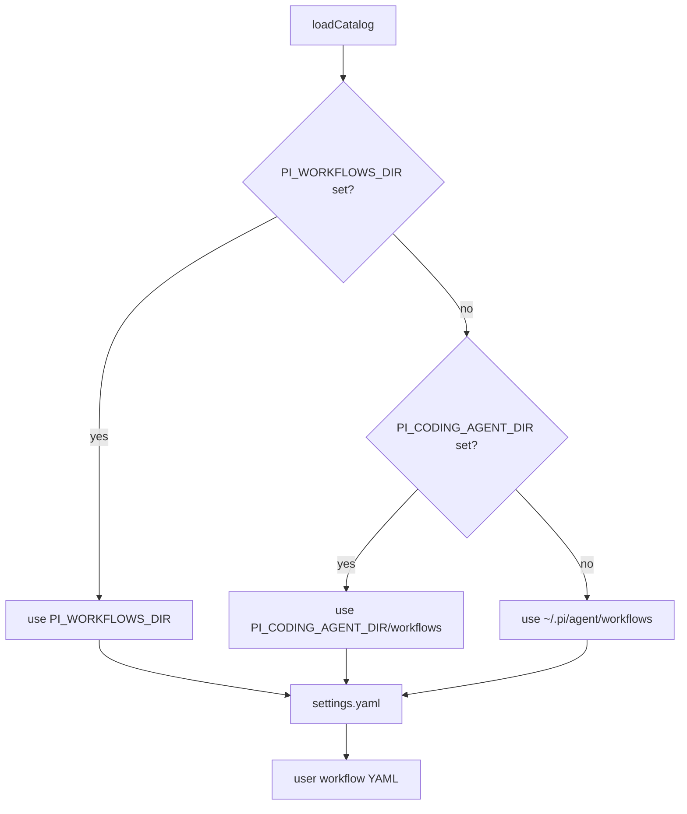
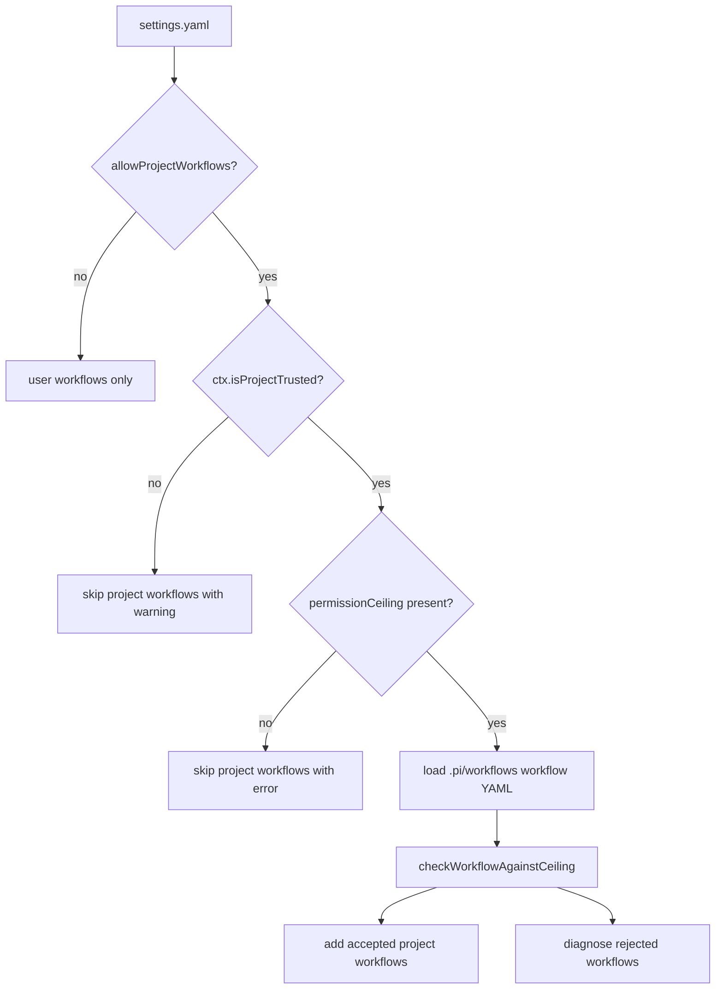
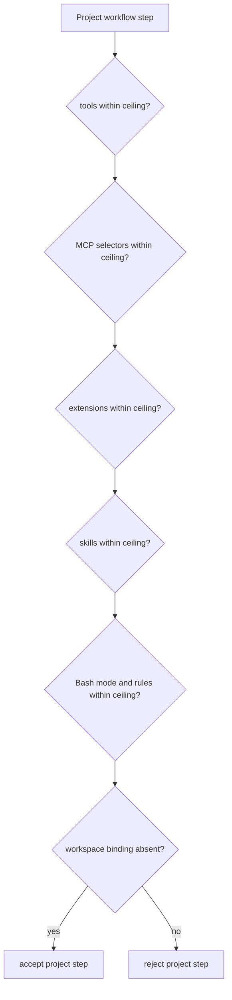
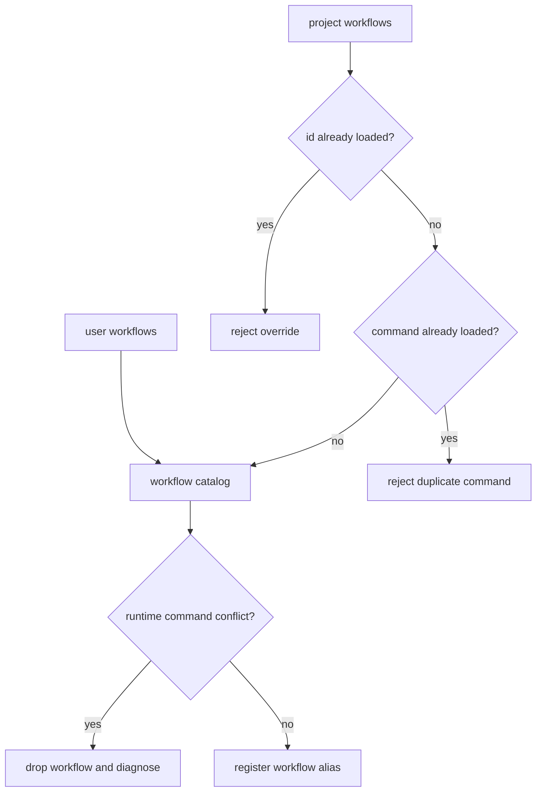
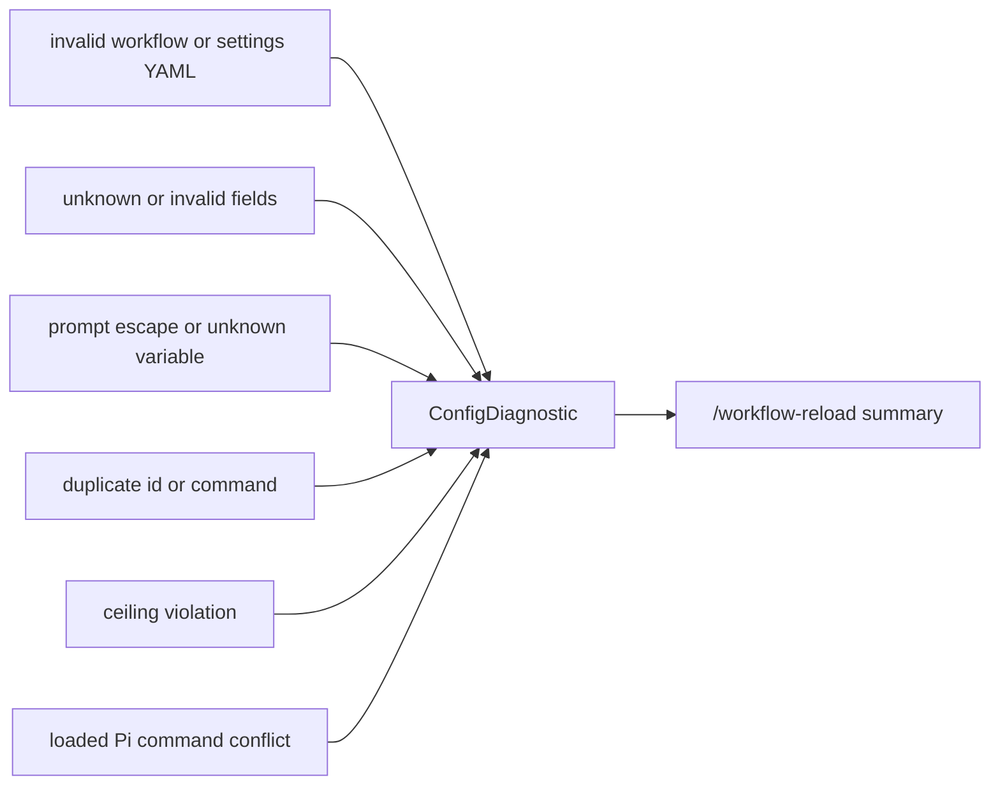

# Settings And Project Workflows

## Directory Resolution



## Status Shortcut

The workflow status overlay uses `Ctrl+Alt+W` by default. Configure another Pi
key identifier in the user-owned settings file:

```yaml
version: 1
statusShortcut: ctrl+shift+y
```

Run `/workflow-status` to open the same overlay without using the shortcut.

Run Pi's `/reload` after changing `statusShortcut` so the extension can
re-register the key. `/workflow-reload` reloads workflow definitions and warns
about a shortcut mismatch, but the active editor keeps the startup binding.

## Project Workflow Gate



## Permission Ceiling



If any decision is false, the project workflow is diagnosed and skipped.
The runtime settings validator accepts only tool, MCP, extension, skill, and
Bash ceilings. Project workflow steps may name an `agent` role profile, but
there is no project-level agent ceiling field.

Project workflows cannot declare `workspace` binding. Workflows that create,
choose, or bind a different execution directory must live in the user-owned
workflow directory instead of `.pi/workflows`.

## Duplicate And Command Conflict Rules



## Diagnostics


