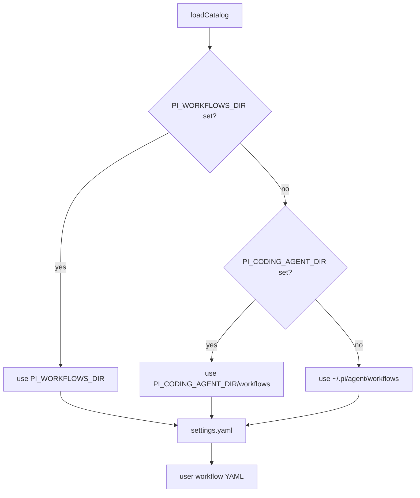
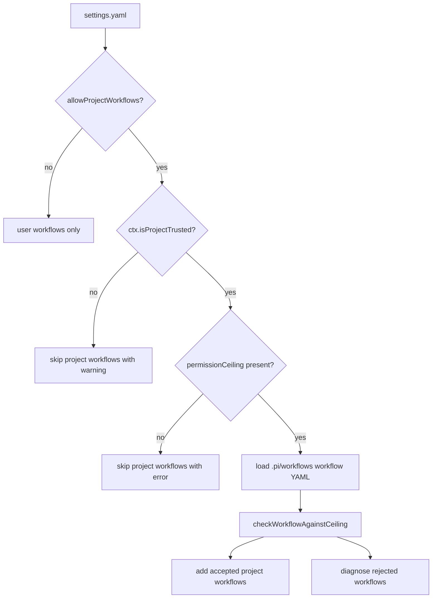
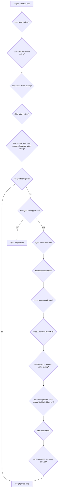
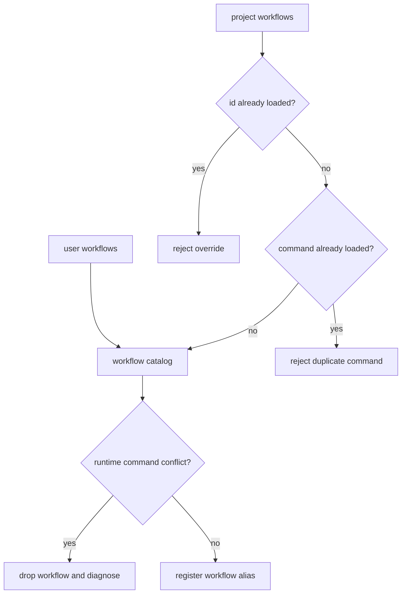
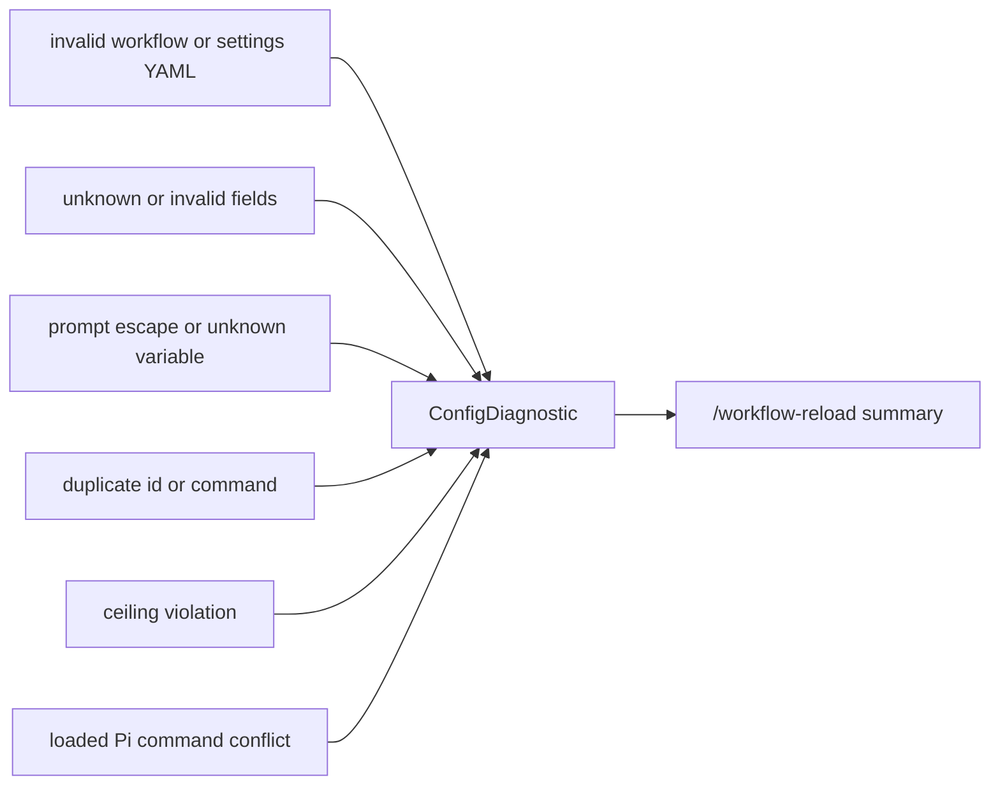

# Settings And Project Workflows

## Directory Resolution



## Status Shortcut

The workflow status overlay uses `Ctrl+Alt+W` by default. Configure another Pi
key identifier in the user-owned settings file:

```yaml
version: 1
statusShortcut: ctrl+shift+y
```

Run Pi's `/reload` after changing `statusShortcut` so the extension can
re-register the key. `/workflow-reload` reloads workflow definitions and warns
about a shortcut mismatch, but the active editor keeps the startup binding.

## Project Workflow Gate



## Permission Ceiling



If any decision is false, the project workflow is diagnosed and skipped.
Main-only project workflows do not need a `subagent` ceiling. Delegated project
steps require that ceiling plus explicit turn and tool budgets. The ceiling's
`agents` list contains the actual Pi Subagents profiles a project workflow may
launch. Each delegated request still uses a fresh context. After its capability
is verified, the workflow policy is the sole active-tool allow-list inside the
child; the selected profile still determines which extension providers were
loaded and therefore available to activate.

`retryToolFailures` authorizes up to two fresh automatic recovery attempts in
allow-list or unrestricted Bash mode. Denied and read-only Bash do not need the
opt-in. In every mode, each candidate failure still needs a complete trusted
child transcript, the original task and per-request binding, and an audit
proving that every actual call was read-only or rejected before execution under
the same approved exact-command inputs as child execution.

A step may expose `edit` or `write` and still use automatic recovery when those
tools were not called. Their availability alone is not a veto; a recorded
`edit`, `write`, mutation-capable Bash, or unknown-effect call makes that
attempt unsafe. Recovery also stops when a fresh attempt repeats a previous
semantic failure fingerprint. Project workflows may enable broader Bash
recovery only when the user ceiling also sets
`subagent.retryToolFailures: true`.

## Duplicate And Command Conflict Rules



## Diagnostics


