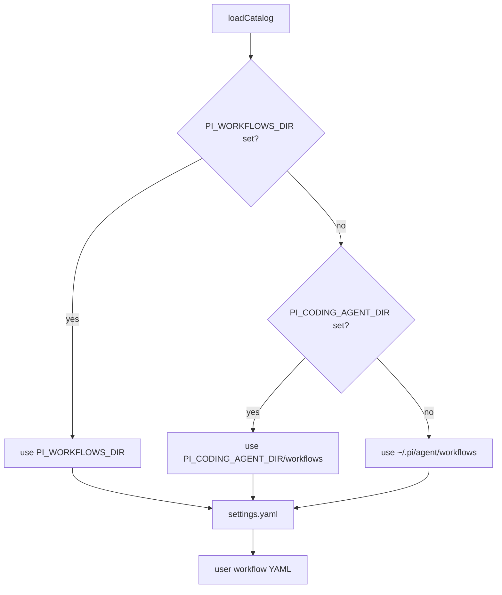
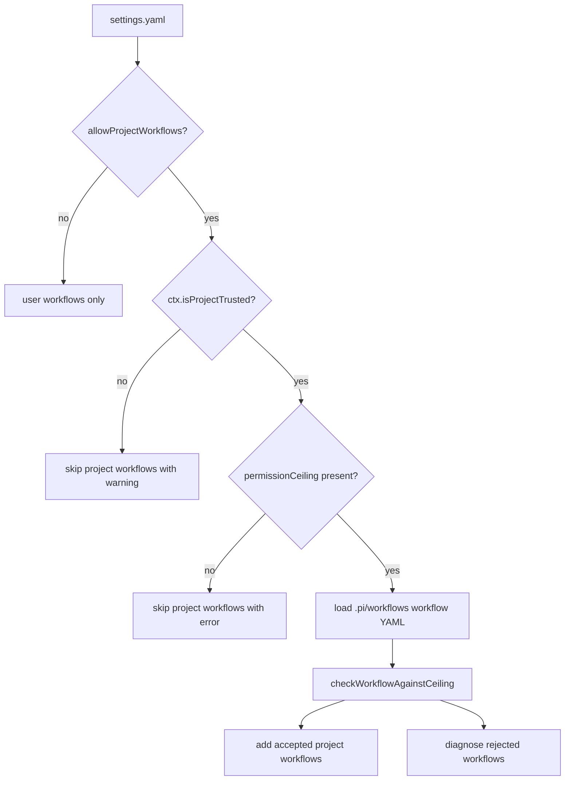
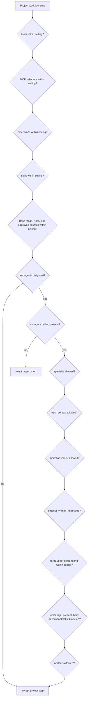
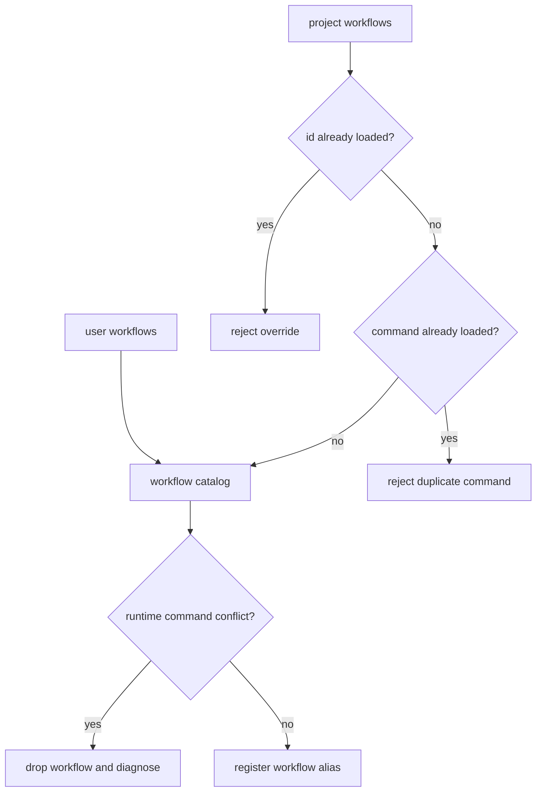
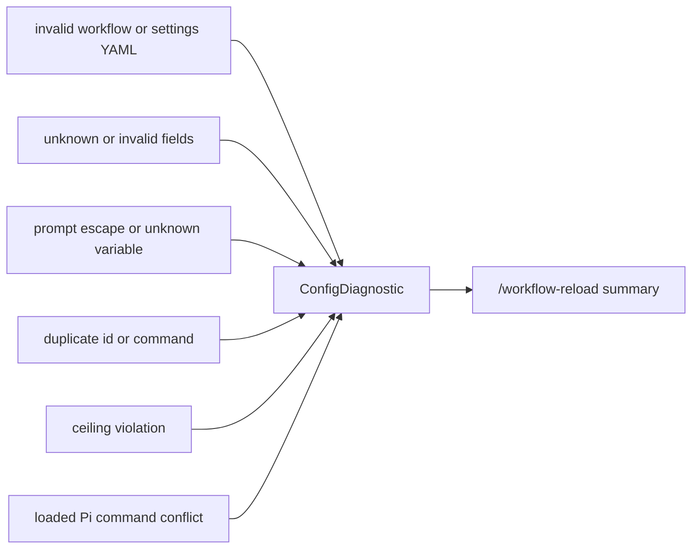

# Settings And Project Workflows

## Directory Resolution

## Project Workflow Gate

## Permission Ceiling

If any decision is false, the project workflow is diagnosed and skipped.
Main-only project workflows do not need a `subagent` ceiling. Delegated project
steps require that ceiling plus explicit turn and tool budgets. The ceiling's
`agents` list contains permitted workflow specialty identities; delegated
execution still uses the bundled `pi-workflows.step` runtime.

## Duplicate And Command Conflict Rules

## Diagnostics

