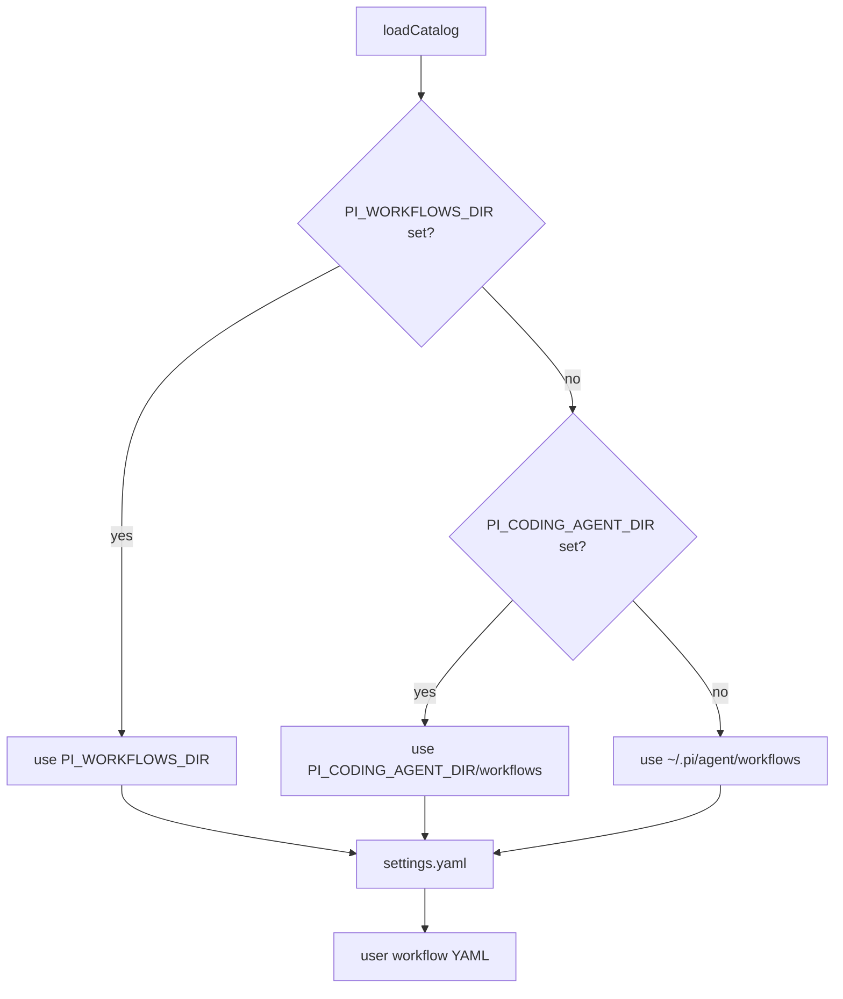

# Settings And Workflow Directories

## Directory Resolution



Only this user-owned directory is loaded. Project-local `.pi/workflows`, project trust settings, and permission ceilings are not supported.

## Status Shortcut

The workflow status overlay uses `Ctrl+Alt+W` by default. Configure another Pi key identifier in the user-owned settings file:

```yaml
version: 1
statusShortcut: ctrl+shift+y
```

Run `/workflow-status` to open the overlay. Run Pi's `/reload` after changing `statusShortcut` so the extension can re-register the key.

## Duplicate And Command Conflict Rules

Duplicate workflow IDs, duplicate workflow commands, and commands that conflict with Pi are diagnosed and not registered.

## Diagnostics

Invalid workflow or settings YAML, unknown fields, unsafe prompt paths, duplicate IDs or commands, and runtime command conflicts produce `ConfigDiagnostic` entries in `/workflow-reload` output.
