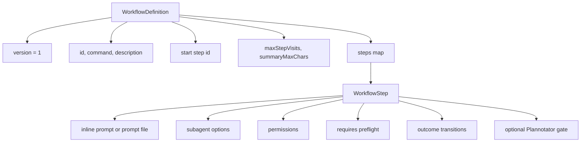
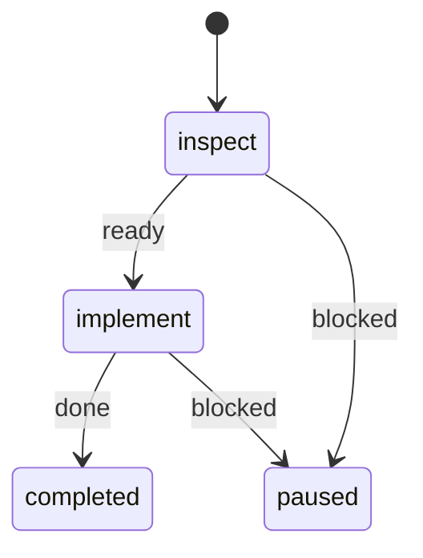
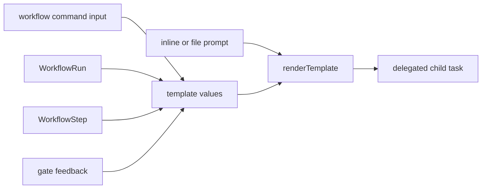
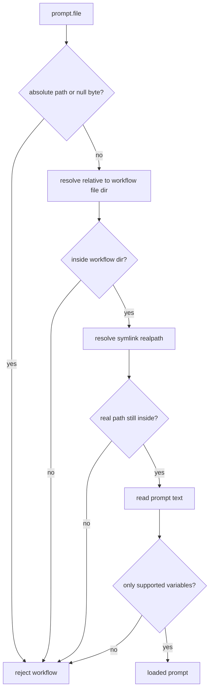
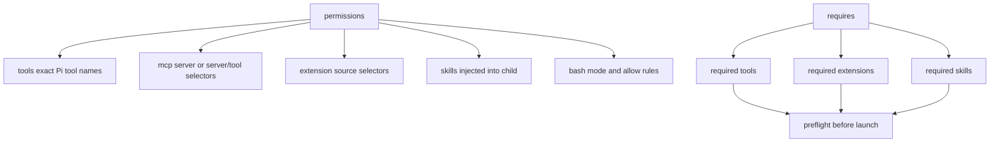
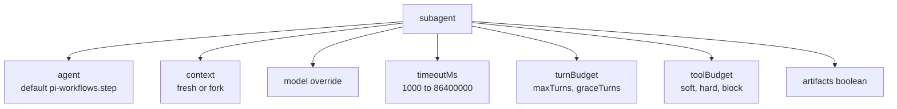
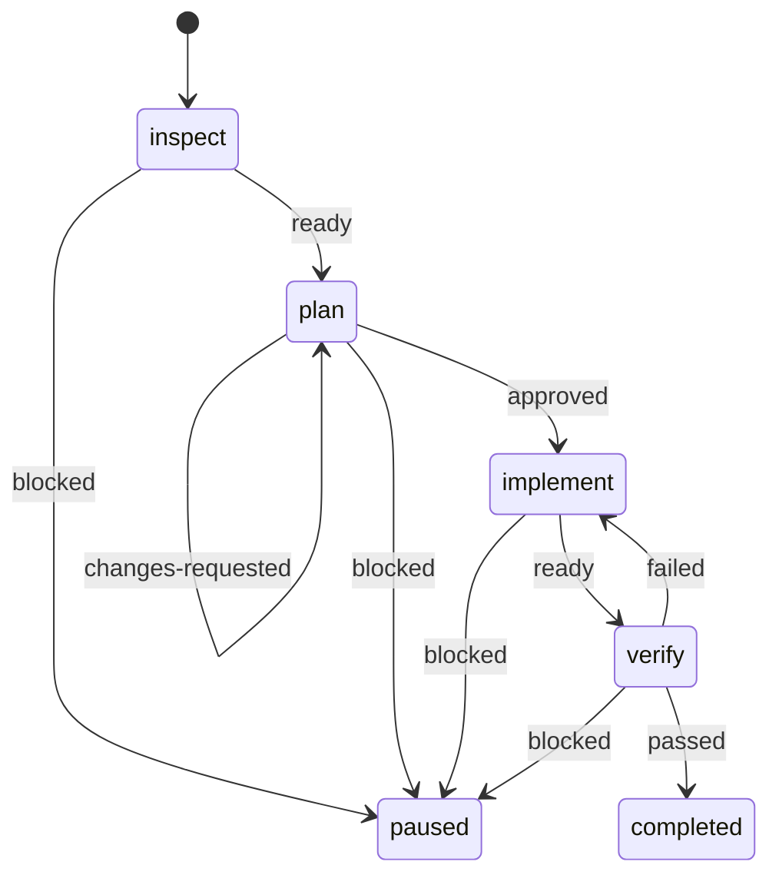

# Workflow Authoring

## Workflow Shape



## Minimal Two-Step Graph



```json
{
  "version": 1,
  "id": "fix",
  "command": "fix",
  "description": "Inspect, implement, and verify a change",
  "start": "inspect",
  "steps": {
    "inspect": {
      "prompt": "Inspect {{workflow.input}} without modifying files.",
      "permissions": {
        "tools": ["read", "grep", "bash"],
        "bash": { "mode": "read-only" }
      },
      "transitions": {
        "ready": "implement",
        "blocked": "$pause"
      }
    },
    "implement": {
      "prompt": { "file": "prompts/implement.md" },
      "permissions": {
        "tools": ["read", "edit", "write", "bash"],
        "bash": {
          "mode": "allow-list",
          "allow": [{ "executable": "npm", "argsPrefix": ["test"] }]
        }
      },
      "transitions": {
        "done": "$done",
        "blocked": "$pause"
      }
    }
  }
}
```

## Prompt Rendering



Supported variables:

| Variable | Source |
| --- | --- |
| `{{workflow.input}}` | Command input. |
| `{{workflow.id}}` | Workflow definition. |
| `{{run.id}}` | Runtime run. |
| `{{step.id}}` | Current step. |
| `{{step.title}}` | Current step. |
| `{{last.summary}}` | Previous completed step. |
| `{{gate.feedback}}` | Latest rejected gate. |

## Prompt File Safety



## Permissions Shape



## Subagent Options



## Example MR Comments Workflow



Business intent: inspect merge-request feedback, create a reviewed plan, implement it, then verify the result.

