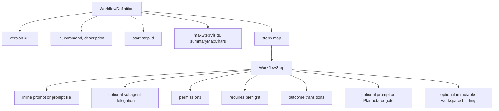
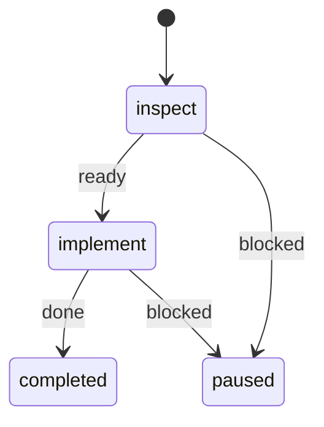
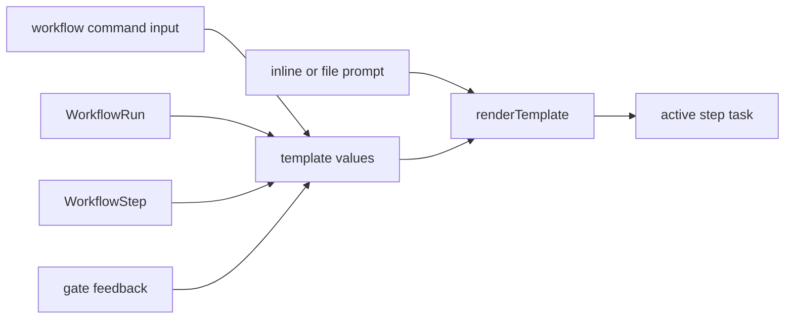
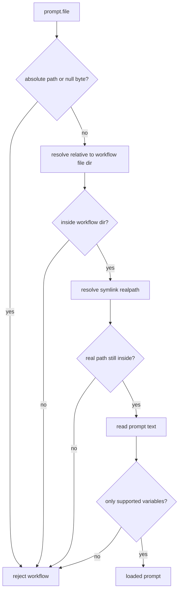
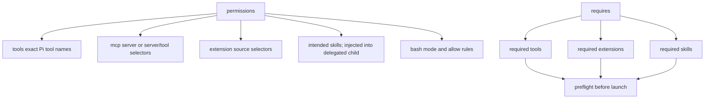
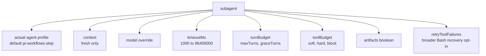
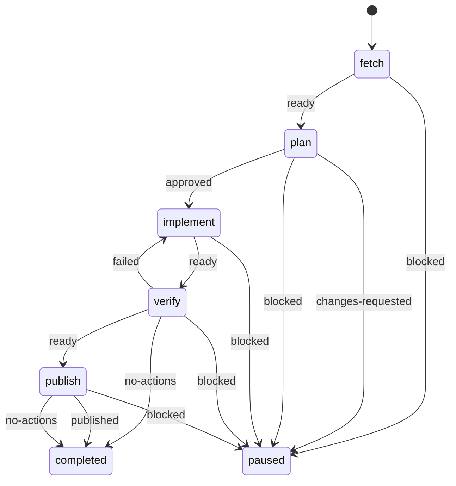

# Workflow Authoring

## Workflow Shape



## Minimal Two-Step Graph



```yaml
version: 1
id: fix
command: fix
description: Inspect, implement, and verify a change
start: inspect
steps:
  inspect:
    prompt: Inspect {{workflow.input}} without modifying files.
    permissions:
      tools: [read, grep, bash]
      bash:
        mode: allow-list
        allow:
          - executable: git
            argsPrefixes: [[status], [diff]]
          - executable: rg
    transitions:
      ready: implement
      blocked: $pause

  implement:
    prompt: { file: prompts/implement.md }
    permissions:
      tools: [read, edit, write, bash]
      bash:
        mode: allow-list
        allow:
          - executable: project-check
            argsPrefix: [test]
    transitions:
      done: $done
      blocked: $pause
```

Workflow definitions use YAML with either the `.yaml` or `.yml` suffix. The
bundled JSON Schema provides structural editor feedback, including safe
relative prompt paths. The runtime loader is authoritative for relationships
that standard JSON Schema cannot derive from user-defined keys: transition and
gate outcomes, workspace binding outcomes, permission/requirement subsets,
Bash-tool coupling, and budget ordering.

## Liveness Contract

Before start or resume, Pi Workflows rejects a graph when its start cannot reach
`$done` or when any reachable step cannot reach `$done`.
`/workflow-doctor [id]` also reports unreachable steps and cyclic components in
deterministic order. Cycles that have an exit to `$done` remain valid but
produce a warning.

At runtime, `maxStepVisits` bounds uninterrupted graph advancement. After a step
has executed that many times, the next attempted entry pauses at a checkpoint.
This prevents automatic infinite cycling; an explicit resume may continue and
time spent inside a step or gate is outside this graph bound. An explicit human
gate rejection back to the same gated step bypasses the visit-limit check for
that transition: every revision retains the step's original incoming handoff,
then must return to a gate and wait for another decision. The visit is still
recorded. A same-step agent retry retains that handoff and gate context but
remains subject to the limit, so all transitions produced solely by agents are
bounded.

## Verification Repair Loops

Make a verifier return an actionable outcome to the mutation step, rather than
using `$pause` for a definite repairable finding:

```yaml
implement:
  transitions:
    ready: verify
    blocked: $pause

verify:
  transitions:
    passed: $done
    failed: implement
    retry: verify
    blocked: $pause
```

The verifier's `failed` summary becomes the next implementor's
`{{last.summary}}` handoff. It should name the exact evidence and smallest
safe fix; the implementor should return to `verify` only after applying that
fix. Keep `blocked` for stale, ambiguous, or unsafe situations. This loop is
still bounded by `maxStepVisits`; resume the durable checkpoint or raise that
workflow-specific limit when more repair rounds are appropriate.

## Prompt Rendering



Supported variables:

| Variable                | Source                                                                                                                     |
| ----------------------- | -------------------------------------------------------------------------------------------------------------------------- |
| `{{workflow.input}}`    | Command input.                                                                                                             |
| `{{workflow.id}}`       | Workflow definition.                                                                                                       |
| `{{run.id}}`            | Runtime run.                                                                                                               |
| `{{step.id}}`           | Current step.                                                                                                              |
| `{{step.title}}`        | Current step.                                                                                                              |
| `{{last.summary}}`      | Previous completed handoff; during a pause or same-step revision, combines it with the current-step summary.               |
| `{{gate.artifact}}`     | Opaque artifact returned by the latest rejected or failed gate.                                                            |
| `{{gate.feedback}}`     | Latest rejected gate.                                                                                                      |
| `{{reviewed.artifact}}` | Immutable artifact from the approved gate.                                                                                 |
| `{{reviewed.feedback}}` | Feedback paired with that approval.                                                                                        |
| `{{resume.input}}`      | User task-level amendment supplied for the current attempt by `/workflow-resume [guidance]`; it cannot bypass YAML policy. |

## Prompt File Safety



## Permissions Shape



## Bash Contract

`permissions.bash` is a generic execution boundary:

- `deny` rejects every Bash call.
- `allow-list` accepts only safely tokenized commands matching an explicit
  executable and optional ordered argument prefix.
- `unrestricted` accepts Bash calls without allow-list matching.

The extension does not know package managers, languages, frameworks, Git
operations, hosted APIs, or command-specific argument placement. It neither
rewrites commands nor extracts executable authority from prompts, summaries,
or gate artifacts. The workflow author declares executable scope in YAML, and
the agent determines command syntax from its own context.

Gate artifacts are opaque data. An approved artifact is available through
`{{reviewed.artifact}}`; the latest rejected artifact is available to its
configured transition target through `{{gate.artifact}}`. Their format and
downstream meaning belong to the workflow prompt. Outcome names are also opaque
labels whose only engine-level behavior is the transition
target declared beside them.

## Compact Bash Rules

Use `argsPrefix` for one ordered token sequence. Use `argsPrefixes` to express
several OR alternatives without repeating the executable:

```yaml
allow:
  - executable: git
    argsPrefixes: [[status], [diff], [show, --stat]]
```

This expands to three normalized rules. An empty inner alternative is rejected;
omit both fields when deliberately allowing all safely tokenized arguments for
that executable.

## Subagent Options

Omitting `subagent` runs the step in the main Pi agent. `subagent: {}` opts
into pi-subagents with the defaults shown below. A name such as
`subagent: worker` launches the actual Pi Subagents `worker` profile. Its
profile prompt supplies the specialty, while the workflow prompt supplies the
exact step contract. Use the object form for model, timeout, budget, or artifact
overrides.

Delegation requires pi-subagents 0.36.0 or newer. Requests disable any
profile-default output file, provide the workflow result schema, and opt into
agent contract v1. The upstream `structured_output` tool completes delegated
steps; `workflow_complete_step` remains the main-agent completion tool. After
capability verification, workflow permissions replace the profile's ordinary
active-tool list. The selected profile still determines which extension
providers are loaded, so an unavailable provider cannot be activated.

Each child receives the original workflow input plus the previous step's
self-contained compact `summary`. Approved and rejected gate artifacts appear
only when the prompt explicitly uses `{{reviewed.artifact}}` or
`{{gate.artifact}}`. It never inherits the parent or sibling transcript.

## Workspace Binding

The run starts in Pi's captured absolute working directory. One delegated,
non-gated step may declare:

```yaml
workspace:
  bindOn: [ready]
  allowedRoots: ['..']
```

On a listed outcome, the structured result must include
`workspace: { cwd: "/absolute/directory" }`; every other outcome must omit it.
The harness canonicalizes the existing directory, requires it to remain under
one allowed root relative to the run-start directory, and accepts only one
canonical binding. A revisit to the sole binding step may re-affirm that same
directory, but cannot replace it. All reachable nonterminal descendants must
be delegated. Their first visits, cycles, recovery attempts, and resumes
receive the same bound cwd.

The prompt owns directory preparation and domain meaning. Pi Workflows neither
creates worktrees nor knows Git, package managers, languages, frameworks, or
command syntax. Summaries and gate artifacts cannot select a workspace. A
workflow may define a separate bounded transition back to its binding step for
domain-specific refresh work, such as the starter kit's guarded clean-branch
rebase; that policy remains user-authored prompt data.



## Starter `/mr-comment` Workflow



Business intent: fetch hosted review comments, create and approve a complete
fix plan, implement and independently verify it on the current checkout, then
push and reply through a configured MCP, CLI, or cURL route.
