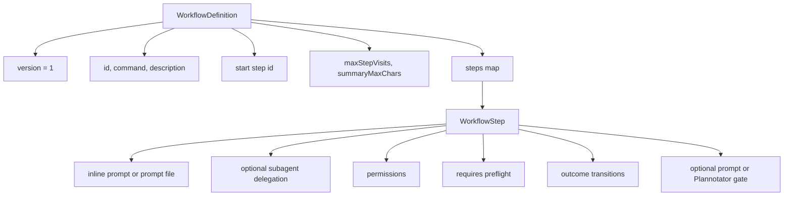
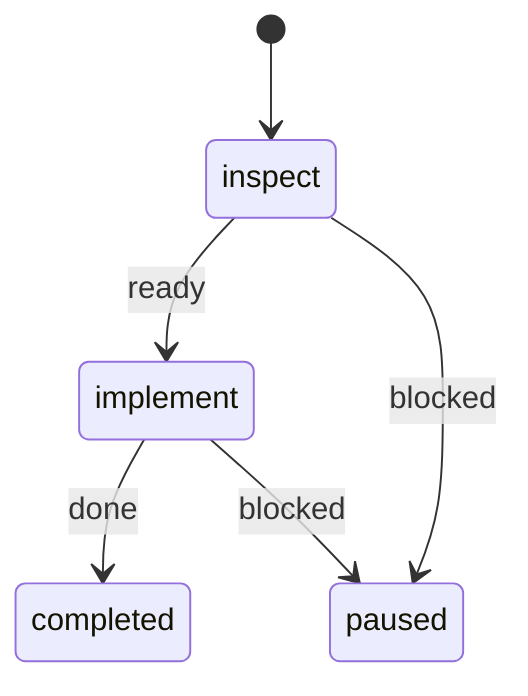
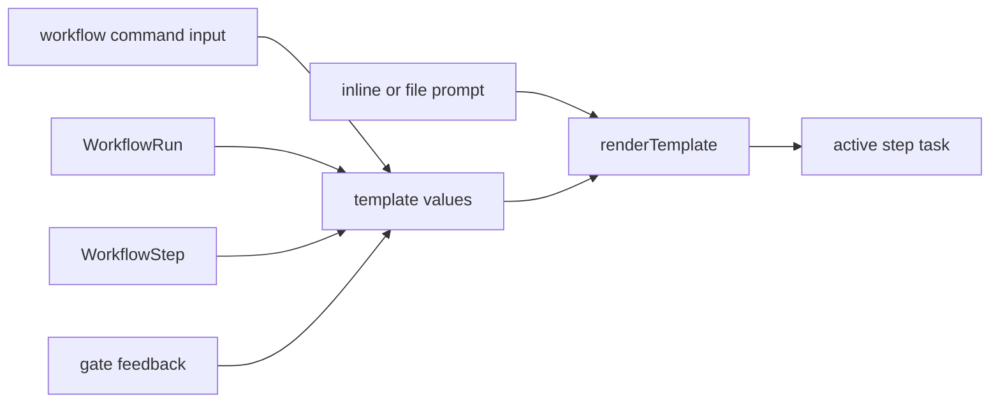
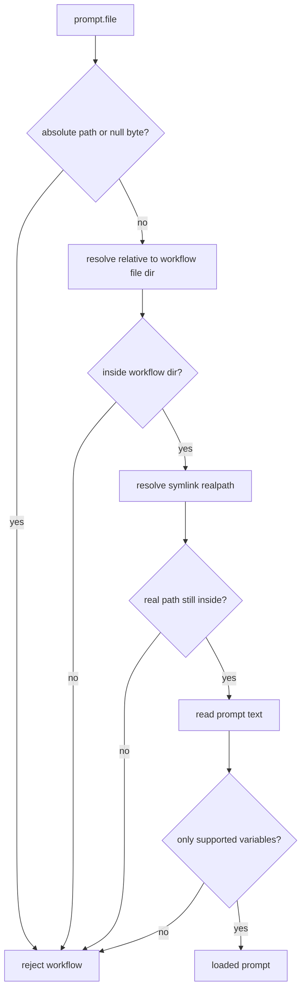
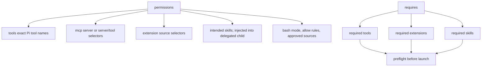
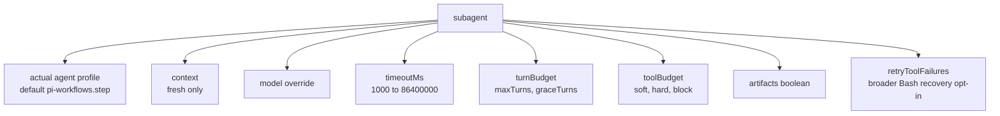
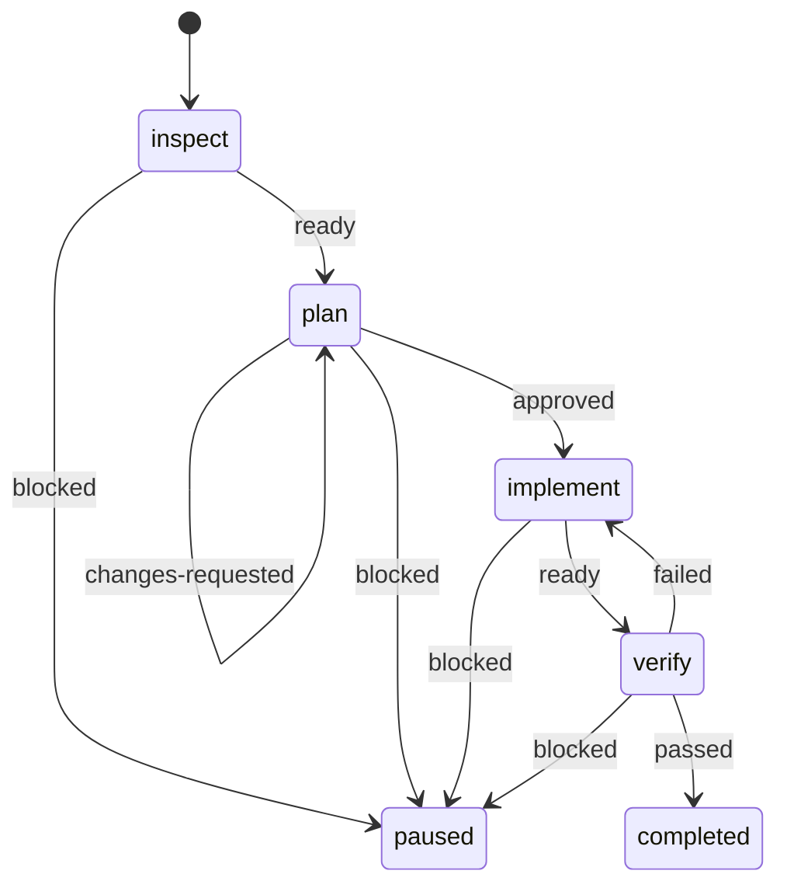

# Workflow Authoring

## Workflow Shape



## Minimal Two-Step Graph



```yaml
version: 1
id: fix
command: fix
description: Inspect, implement, and verify a change
start: inspect
steps:
  inspect:
    prompt: Inspect {{workflow.input}} without modifying files.
    permissions:
      tools: [read, grep, bash]
      bash: { mode: read-only }
    transitions:
      ready: implement
      blocked: $pause

  implement:
    prompt: { file: prompts/implement.md }
    permissions:
      tools: [read, edit, write, bash]
      bash:
        mode: allow-list
        allow:
          - executable: bun
            argsPrefix: [test]
    transitions:
      done: $done
      blocked: $pause
```

Workflow definitions use YAML with either the `.yaml` or `.yml` suffix.

## Prompt Rendering



Supported variables:

| Variable                | Source                                                                                             |
| ----------------------- | -------------------------------------------------------------------------------------------------- |
| `{{workflow.input}}`    | Command input.                                                                                     |
| `{{workflow.id}}`       | Workflow definition.                                                                               |
| `{{run.id}}`            | Runtime run.                                                                                       |
| `{{step.id}}`           | Current step.                                                                                      |
| `{{step.title}}`        | Current step.                                                                                      |
| `{{last.summary}}`      | Previous completed handoff; after `$pause`, preserved incoming handoff plus latest paused attempt. |
| `{{gate.feedback}}`     | Latest rejected gate.                                                                              |
| `{{reviewed.artifact}}` | Immutable artifact from the approved gate.                                                         |
| `{{reviewed.feedback}}` | Feedback paired with that approval.                                                                |

## Prompt File Safety



## Permissions Shape



## Reviewed Bash Sources

An `allow-list` may supplement static rules with exact commands from the run's
most recent human-approved gate artifact:

| `approvedSources` value | Fenced JSON path                                 |
| ----------------------- | ------------------------------------------------ |
| `verification-worker`   | `repositories[].worker[].command`                |
| `verification-reviewer` | `repositories[].reviewer[].command`              |
| `remote-actions`        | Bash `actions[].input.command`                   |
| `remote-push`           | Exact approved non-force push command            |
| `remote-drafts`         | Parent-synthesized author-private draft commands |

The step must include `bash` in `permissions.tools`. Exact strings are filtered
by source and correlated into the step policy. Static `gh api` and `glab api`
rules are default-GET-only; API mutations and non-force pushes require an exact
reviewed `remote-actions` command. Ordinary summaries and legacy checkpoints
without reviewed-artifact provenance grant nothing.

`handoffSources` optionally permits only `verification-worker` and
`verification-reviewer` to propose command-only retry repairs. It never grants
new targets, effects, paths, or authority; a material change must pause or be
handled by a new workflow.

`approvedSources` selects provenance, not an executable family. For example,
`verification-worker` extracts only exact
`repositories[].worker[].command` strings from the latest approved artifact.
Each cwd-dependent command must encode the exact absolute
`repositories[].cwd` from the same object. Changing an argument or directory
produces a different, unauthorized execution. A delegated step currently
accepts one distinct reviewed directory; repeated identical values are allowed,
while missing, relative, or multiple different directories fail closed. A
missing target worktree may bootstrap only from the same contract's one
existing absolute `sourceCwd`. The child confines edits and writes to the
reviewed target, and every setup or later Bash command still requires an exact
reviewed string.

## Compact Bash Rules

Use `argsPrefix` for one ordered token sequence. Use `argsPrefixes` to express
several OR alternatives without repeating the executable:

```yaml
allow:
  - executable: git
    argsPrefixes: [[status], [diff], [show, --stat]]
```

This expands to three normalized rules. An empty inner alternative is rejected;
omit both fields when deliberately allowing all safely tokenized arguments for
that executable.

## Subagent Options

Omitting `subagent` runs the step in the main Pi agent. `subagent: {}` opts
into pi-subagents with the defaults shown below. A name such as
`subagent: worker` launches the actual Pi Subagents `worker` profile. Its
profile prompt supplies the specialty, while the workflow prompt supplies the
exact step contract. Use the object form for model, timeout, budget, or artifact
overrides.

Delegation requires pi-subagents 0.36.0 or newer. Requests disable any
profile-default output file, provide the workflow result schema, and opt into
agent contract v1. The upstream `structured_output` tool completes delegated
steps; `workflow_complete_step` remains the main-agent completion tool. After
capability verification, workflow permissions replace the profile's ordinary
active-tool list. The selected profile still determines which extension
providers are loaded, so an unavailable provider cannot be activated.

Each child receives the original workflow input plus only the previous step's
self-contained compact `summary` or approved review artifact. It never inherits
the parent or sibling transcript.



## Example MR Comments Workflow



Business intent: inspect merge-request feedback, create a reviewed plan, implement it, then verify the result.
