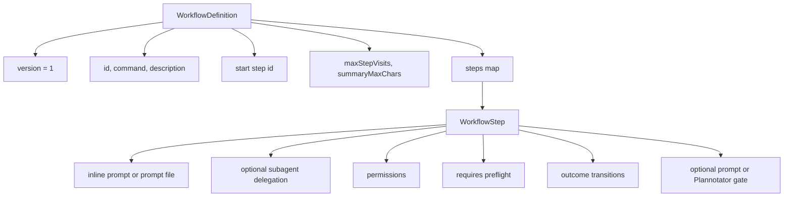
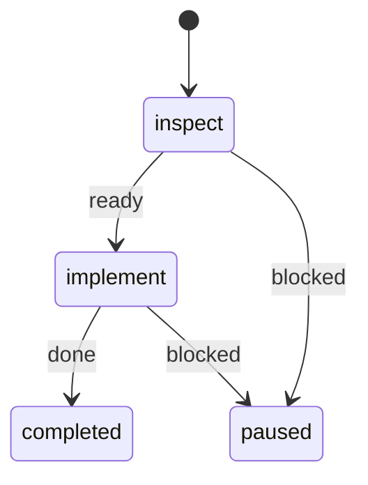
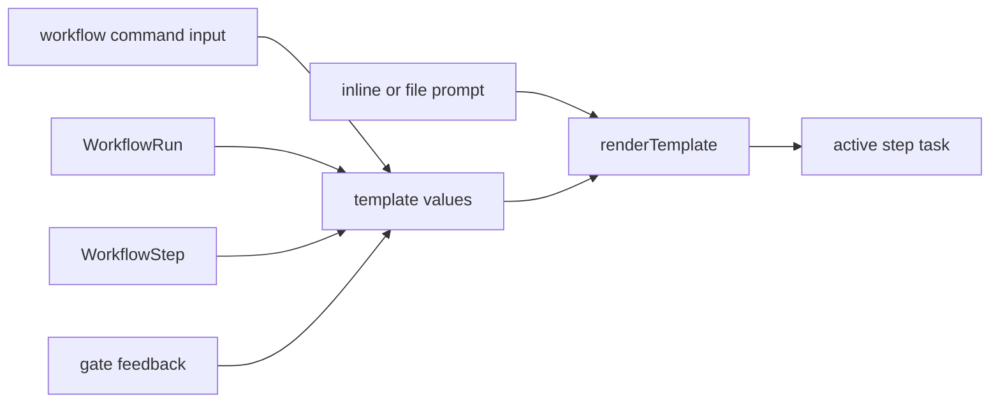
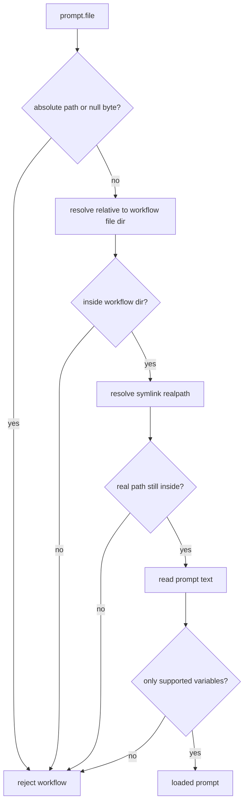
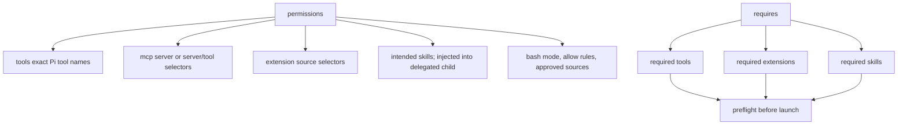
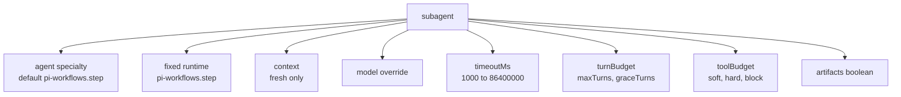
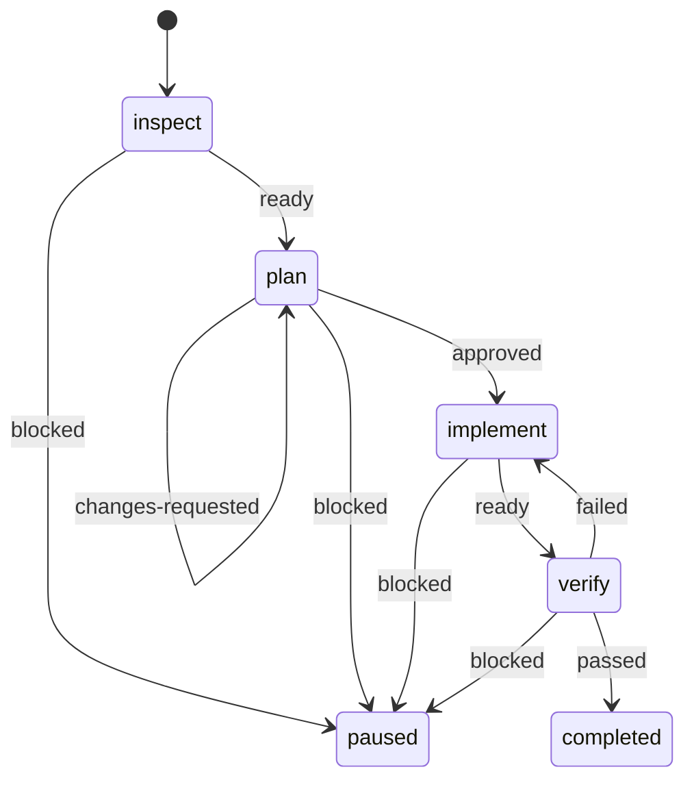

# Workflow Authoring

## Workflow Shape



## Minimal Two-Step Graph



```yaml
version: 1
id: fix
command: fix
description: Inspect, implement, and verify a change
start: inspect
steps:
  inspect:
    prompt: Inspect {{workflow.input}} without modifying files.
    permissions:
      tools: [read, grep, bash]
      bash: { mode: read-only }
    transitions:
      ready: implement
      blocked: $pause

  implement:
    prompt: { file: prompts/implement.md }
    permissions:
      tools: [read, edit, write, bash]
      bash:
        mode: allow-list
        allow:
          - executable: bun
            argsPrefix: [test]
    transitions:
      done: $done
      blocked: $pause
```

Workflow definitions use YAML with either the `.yaml` or `.yml` suffix.

## Prompt Rendering



Supported variables:

| Variable             | Source                                                                                             |
| -------------------- | -------------------------------------------------------------------------------------------------- |
| `{{workflow.input}}` | Command input.                                                                                     |
| `{{workflow.id}}`    | Workflow definition.                                                                               |
| `{{run.id}}`         | Runtime run.                                                                                       |
| `{{step.id}}`        | Current step.                                                                                      |
| `{{step.title}}`     | Current step.                                                                                      |
| `{{last.summary}}`   | Previous completed handoff; after `$pause`, preserved incoming handoff plus latest paused attempt. |
| `{{gate.feedback}}`  | Latest rejected gate.                                                                              |

## Prompt File Safety



## Permissions Shape



## Reviewed Bash Sources

An `allow-list` may supplement static rules with exact commands from the run's
most recent human-approved gate artifact:

| `approvedSources` value | Fenced JSON path                    |
| ----------------------- | ----------------------------------- |
| `verification-worker`   | `repositories[].worker[].command`   |
| `verification-reviewer` | `repositories[].reviewer[].command` |
| `remote-actions`        | Bash `actions[].input.command`      |

The step must include `bash` in `permissions.tools`. Exact strings are filtered
by source and correlated into the step policy. Static `gh api` and `glab api`
rules are default-GET-only; API mutations and non-force pushes require an exact
reviewed `remote-actions` command. Ordinary summaries and legacy checkpoints
without reviewed-artifact provenance grant nothing.

`approvedSources` selects provenance, not an executable family. For example,
`verification-worker` extracts only exact
`repositories[].worker[].command` strings from the latest approved artifact.
Changing even one argument produces a different, unauthorized command.

## Compact Bash Rules

Use `argsPrefix` for one ordered token sequence. Use `argsPrefixes` to express
several OR alternatives without repeating the executable:

```yaml
allow:
  - executable: git
    argsPrefixes: [[status], [diff], [show, --stat]]
```

This expands to three normalized rules. An empty inner alternative is rejected;
omit both fields when deliberately allowing all safely tokenized arguments for
that executable.

## Subagent Options

Omitting `subagent` runs the step in the main Pi agent. `subagent: {}` opts
into pi-subagents with the defaults shown below. A name such as
`subagent: worker` assigns the step's specialty identity; put the specialty's
concrete instructions in that step's prompt. Use the object form for model,
timeout, budget, or artifact overrides.

Every delegated step uses the bundled `pi-workflows.step` runtime. The fixed
runtime keeps `workflow_complete_step` available even when general-purpose Pi
Subagents profiles declare tool allow-lists that would hide a dynamically
registered completion tool. The `agent` field is therefore a workflow prompt
identity, not an upstream profile selector. Delegation still requires the
optional pi-subagents integration.

Each child receives the original workflow input plus only the previous step's
self-contained compact `summary` or approved review artifact. It never inherits
the parent or sibling transcript.



## Example MR Comments Workflow



Business intent: inspect merge-request feedback, create a reviewed plan, implement it, then verify the result.
