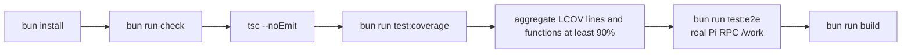
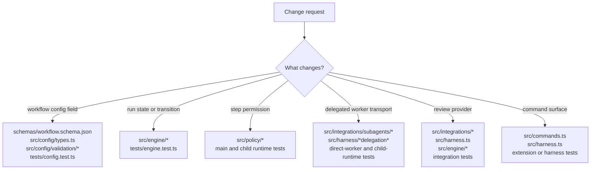
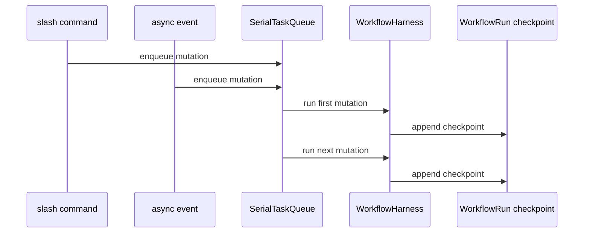
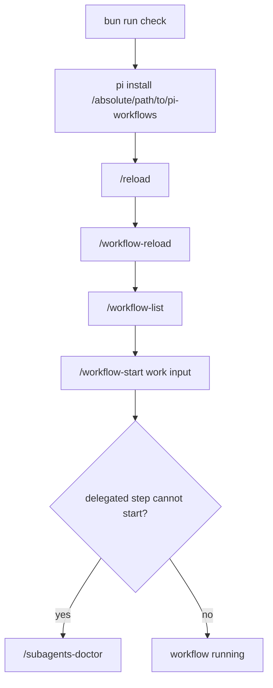

# Development And Testing

## Check Pipeline

Ordinary and focused tests use `bunfig.toml` with coverage disabled.
`bun run test:coverage` instead uses `bunfig.coverage.toml`, preserving the 90%
lines, functions, and statements thresholds while writing release evidence to
`coverage/full/lcov.info`. The E2E run also keeps coverage disabled, so neither
focused nor E2E tests can replace that report before CI uploads it to Codecov.

## Test Coverage Map

```mermaid
flowchart TD
  Tests[test/*.test.ts]
  Tests --> Config[test/config.test.ts<br/>YAML loading, validation, ceilings]
  Tests --> Engine[test/engine.test.ts<br/>state, transitions, gates]
  Tests --> Policy[test/policy.test.ts<br/>Bash, MCP, tool selection]
  Tests --> Doctor[test/workflow-doctor.test.ts<br/>graph liveness and deterministic diagnostics]
  Tests --> DirectClient[test/direct-worker-client.test.ts<br/>delegation events, timeout, cancellation]
  Tests --> Child[test/subagent-child-runtime.test.ts<br/>runtime enforcement]
  Tests --> Recovery[test/delegation-recovery.test.ts<br/>terminal evidence and replay safety]
  Tests --> Harness[test/direct-worker-harness.test.ts<br/>main, delegation, pause/resume, gates]
  Tests --> E2E[test/e2e/direct-worker-runtime.test.ts<br/>real Pi RPC revisit, captured cwd, and actual profiles]
  Tests --> Misc[checkpoint, artifacts, completion batch, immutable input, queue, examples, extension, preflight, Plannotator]
```

Harness tests verify that a run captures its starting absolute cwd and reuses it
across steps, revisits, recovery attempts, and resume. Policy tests treat command
families and argument placement as opaque while enforcing generic tokenization
and the exact executable/argument-prefix rules declared in YAML.

## Where To Change Code

## Mutation Safety Pattern

## Local Pi Smoke Test

