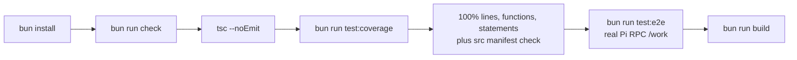
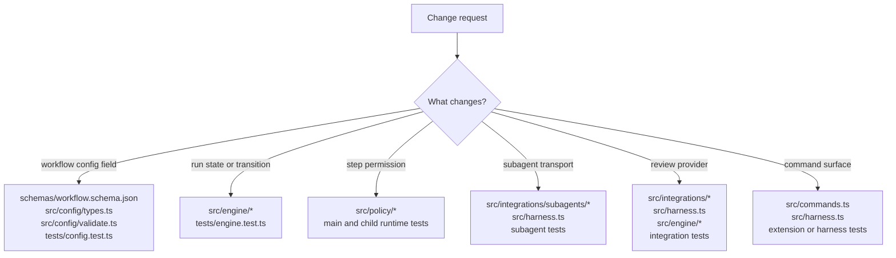
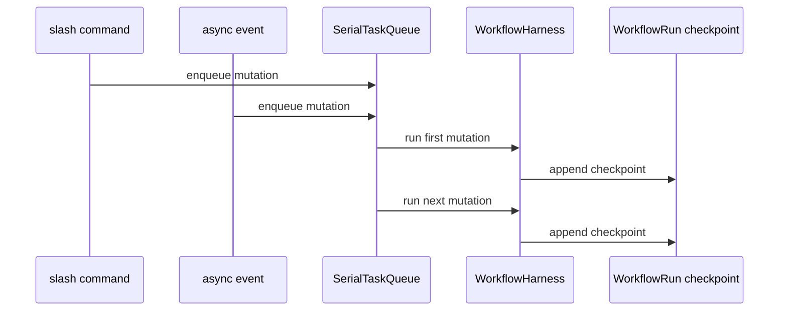
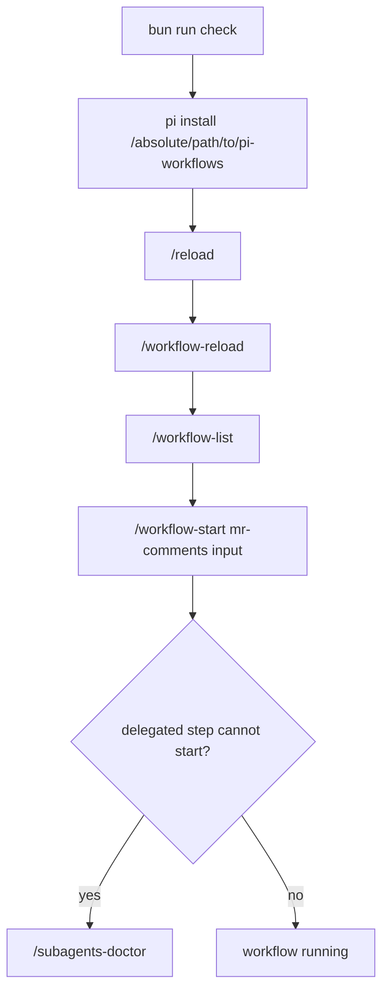

# Development And Testing

## Check Pipeline

## Test Coverage Map

```mermaid
flowchart TD
  Tests[test/*.test.ts]
  Tests --> Config[test/config.test.ts<br/>YAML loading, validation, ceilings]
  Tests --> Engine[test/engine.test.ts<br/>state, transitions, gates]
  Tests --> Policy[test/policy.test.ts<br/>Bash, MCP, tool selection]
  Tests --> Approved[test/approved-commands.test.ts<br/>reviewed exact-command filtering]
  Tests --> Protocol[test/subagent-protocol.test.ts<br/>policy envelope, result validation]
  Tests --> Client[test/subagent-client.test.ts<br/>events, timeout, cancellation]
  Tests --> Child[test/subagent-child-runtime.test.ts<br/>runtime enforcement]
  Tests --> Harness[test/harness-subagent.test.ts<br/>main, delegation, pause/resume, gates]
  Tests --> E2E[test/e2e/workflow-runtime.test.ts<br/>real Pi RPC /work flow and actual profiles]
  Tests --> Misc[checkpoint, completion batch, immutable input, queue, examples, extension, preflight, Plannotator]
```

Reviewed command fixtures include an absolute `repositories[].cwd`. Harness
tests verify existing-target launch, reviewed-source bootstrap for a missing
target, and fail-closed malformed or ambiguous paths. Child-runtime tests
confine edits and writes to the reviewed target while exact command tests reject
any unreviewed Bash string.

## Where To Change Code

## Mutation Safety Pattern

## Local Pi Smoke Test

