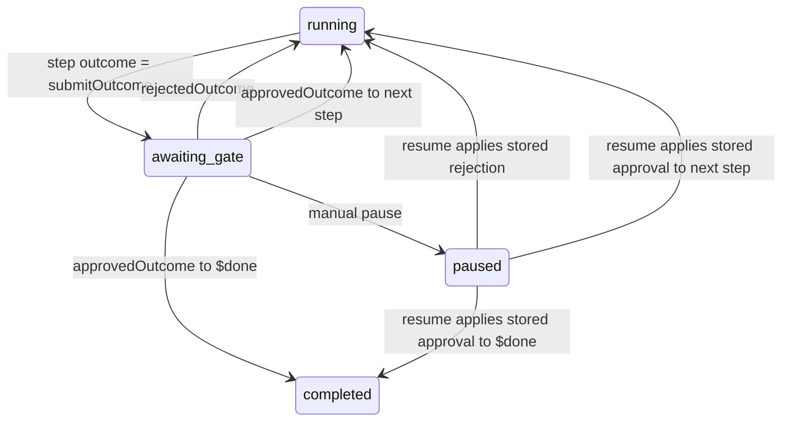
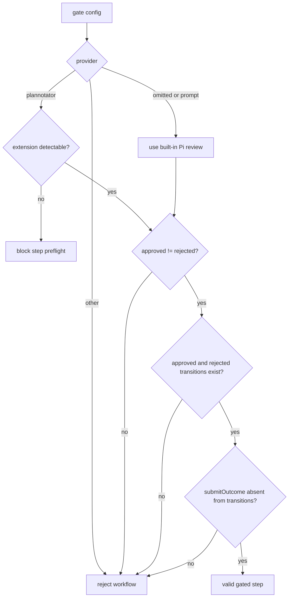
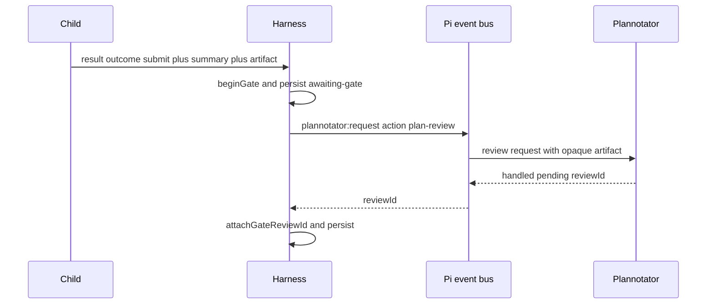
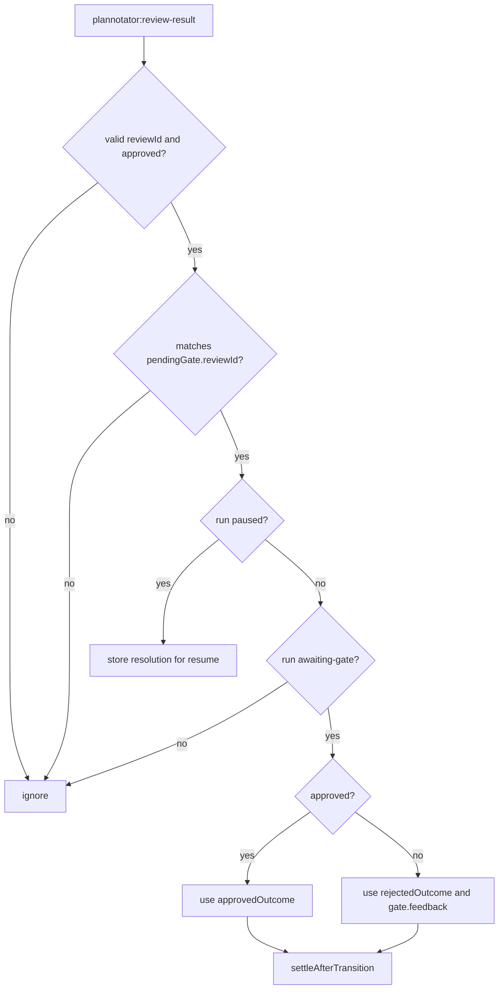
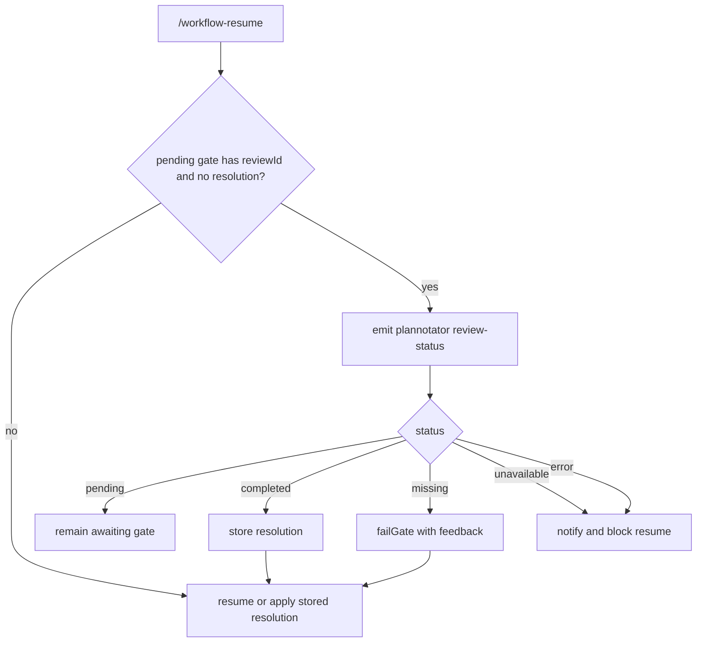
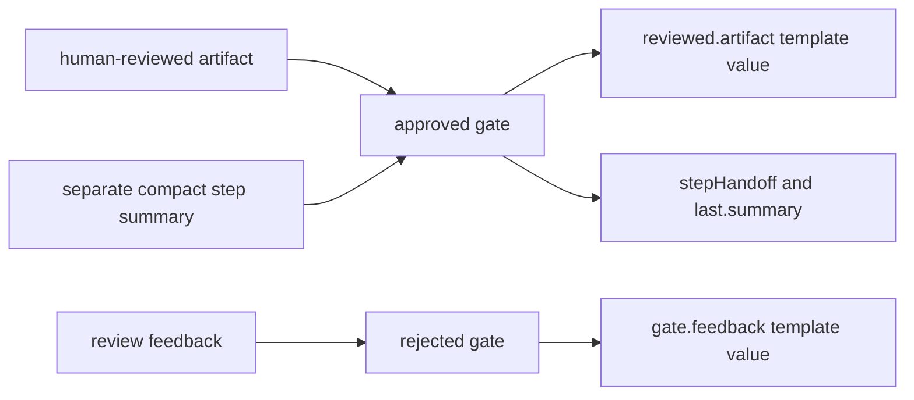

# Plannotator Integration

Plannotator is optional. A gate with no `provider` uses Pi's built-in prompt
panel; `provider: plannotator` opts into this integration.

Any gated step may submit an artifact. A delegated child returns it through
`structured_output`; a main-agent step uses `workflow_complete_step`. The step
prompt—not Pi Workflows—defines the artifact's format, purpose, acceptance
criteria, and downstream use. The integration transports that content without
parsing it or turning it into execution authority.

## Gate State Machine

## Gate Validation

## Review Submission

## Review Result

## Resume Polling

A built-in review opened from print or JSON mode remains paused because those
modes cannot show the dialog. Reopen the same session in TUI or RPC mode and
run `/workflow-resume`; the harness presents the preserved pending artifact
instead of rerunning the step.

## Feedback Flow

Approval and rejection outcome names are opaque transition labels. The
extension does not infer planning, retry, replan, or implementation semantics
from them. The approved artifact remains separate from the compact summary, and
neither value changes permissions or the run's captured working directory.
