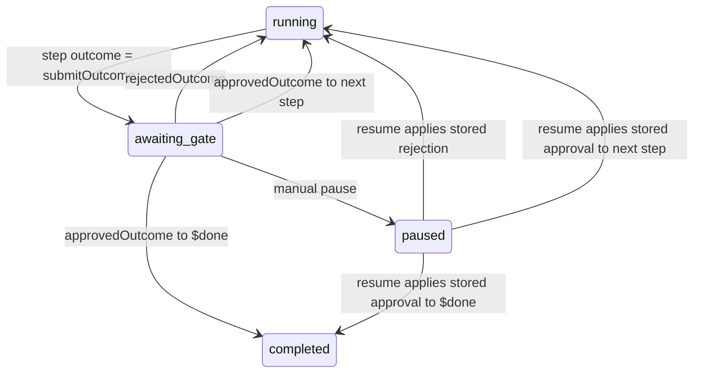
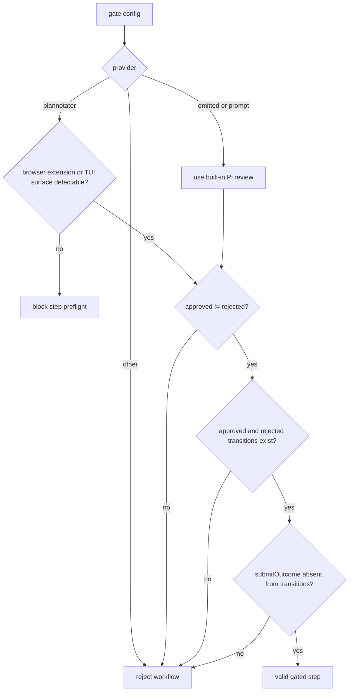
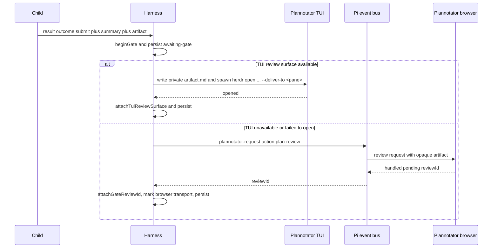
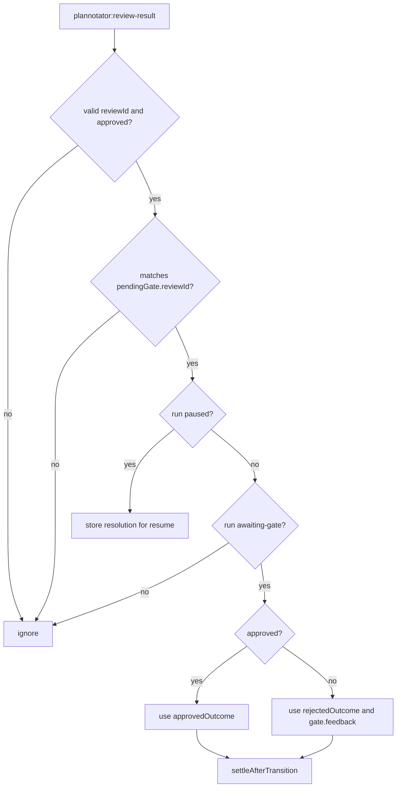
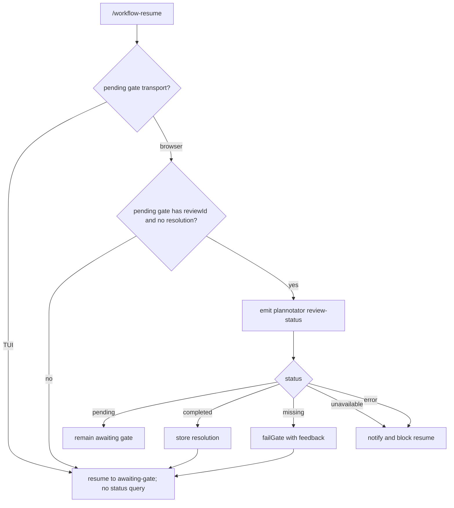
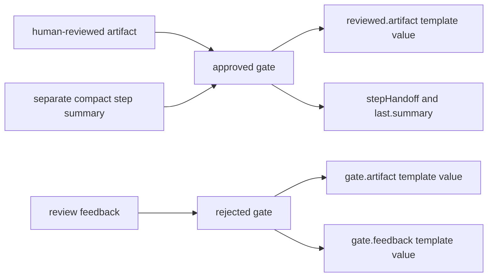

# Plannotator Integration

Plannotator is optional. A gate with no `provider` uses Pi's built-in prompt
panel; `provider: plannotator` opts into this integration.

Any gated step may submit an artifact. A delegated child returns it through
`structured_output`; a main-agent step uses `workflow_complete_step`. The step
prompt—not Pi Workflows—defines the artifact's format, purpose, acceptance
criteria, and downstream use. The integration transports that content without
parsing it or turning it into execution authority.

## Gate State Machine



## Gate Validation



## Review Submission



## Review Result



## Resume Polling



Legacy checkpoints without a `reviewTransport` field are treated as browser
backed, so existing Plannotator review IDs continue to poll and resolve exactly
as before.

A built-in review opened from print or JSON mode remains paused because those
modes cannot show the dialog. Reopen the same session in TUI or RPC mode and
run `/workflow-resume`; the harness presents the preserved pending artifact
instead of rerunning the step.

## Feedback Flow



## TUI Review Surface

A `provider: plannotator` gate first attempts to open the artifact in a local
Plannotator TUI review pane. Two sources are discovered, in order:

1. A standalone `plannotator-tui` executable on `PATH`.
2. An enabled Herdr `annotate` plugin whose manifest declares an `open` action
   and a `doc` pane, with a present executable relative to its plugin root.

Discovery requires the active Pi process to be running inside Herdr with
`HERDR_ENV=1`, a non-empty `HERDR_SOCKET_PATH`, and a non-empty
`HERDR_PANE_ID`. If any Herdr context is missing, no TUI candidate is attempted.

The launcher writes the opaque gate artifact to a mode-restricted temporary
Markdown file and invokes:

```text
plannotator-tui herdr open <artifact-path> --deliver-to <HERDR_PANE_ID>
```

When the process exits with code `0`, the launch is treated as an opened review
surface. The temporary artifact is retained because the TUI may read it after
the launcher returns; the harness owns cleanup through the persisted
`reviewArtifactPath` and removes it on abort, failed/unavailable launch, or
other known terminal lifecycle paths.

## Browser Fallback

If no TUI candidate is available, discovery fails, the spawn fails, the process
times out, exits non-zero, or does not confirm an open, the gate falls back to
the existing browser Plannotator request exactly once. The browser path emits
`plannotator:request`, receives a correlated `reviewId`, and continues with the
existing result-event handling and resume polling.

## Transport-Specific Recovery

A TUI-backed pending gate is persisted with `reviewTransport: 'tui'` and a
`reviewArtifactPath`. Resume does not treat the absence of a `reviewId` as an
interrupted submission, and it does not emit `review-status`. The gate remains
`awaiting-gate` until an explicit compatible resolution is supplied.

Browser-backed gates keep `reviewTransport: 'browser'` (or the legacy absent
marker) and continue to use `reviewId` correlation for result events and resume
status polling.

## No Implicit Approval

The extension does not infer approval or rejection from TUI annotations,
process exit status, feedback text, or the existence of a temporary artifact.
TUI-backed gates remain in `awaiting-gate` until a documented compatible result
contract is wired to `GateResolution`.

Approval and rejection outcome names are opaque transition labels. The
extension does not infer planning, retry, replan, or implementation semantics
from them. The approved artifact remains separate from the compact summary, and
neither value changes permissions or the run's captured working directory.
Plannotator's `approved` boolean is authoritative; annotation labels and
feedback text are never parsed as decisions. If a rejected outcome targets the
same gated step, the harness starts a fresh attempt with `{{gate.feedback}}`
and the opaque rejected draft in `{{gate.artifact}}`, while preserving the
step's original incoming handoff, then waits at a new review. These explicitly
human-mediated transitions bypass the visit-limit check and can continue until
approval. Each visit remains recorded, so later automatic entries are still
guarded. A same-step retry produced by the revision agent keeps the rejected
artifact and feedback available but remains subject to the normal limit.
