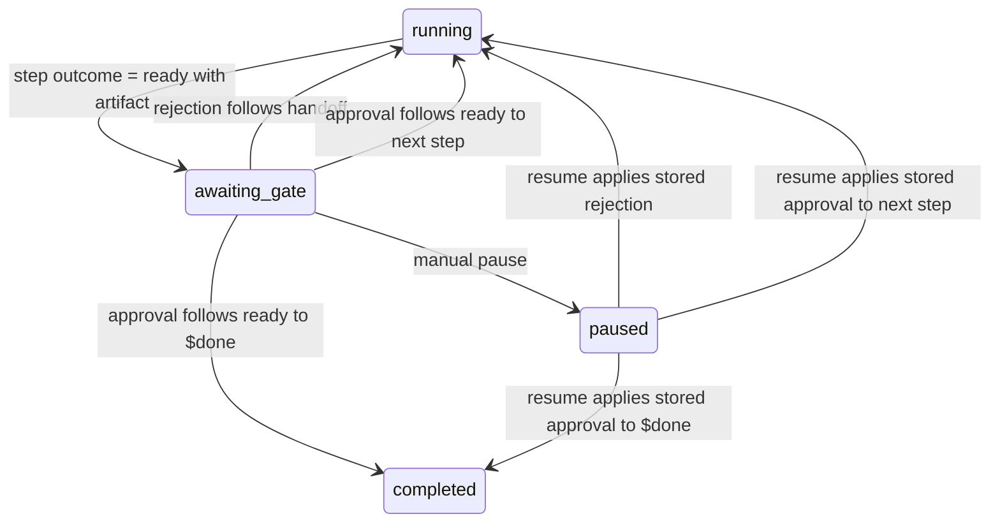
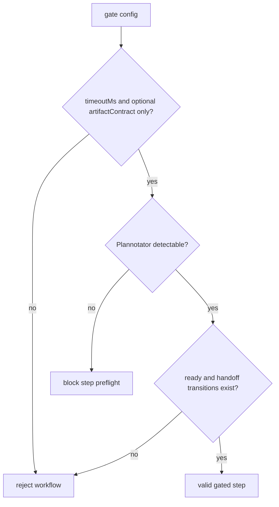
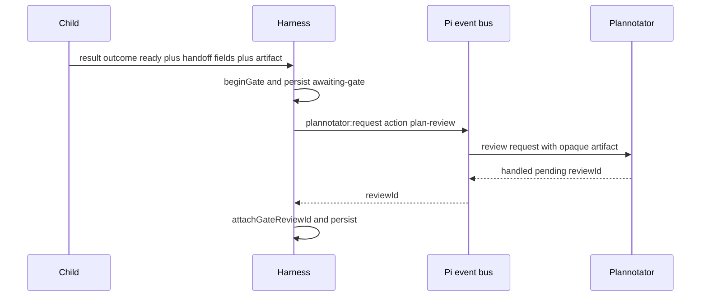
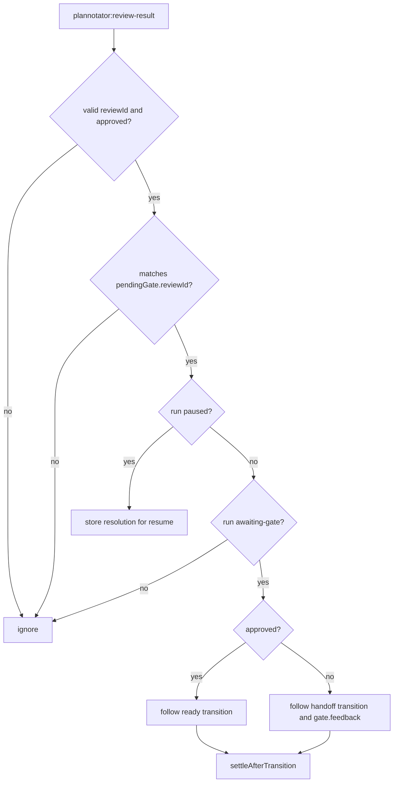
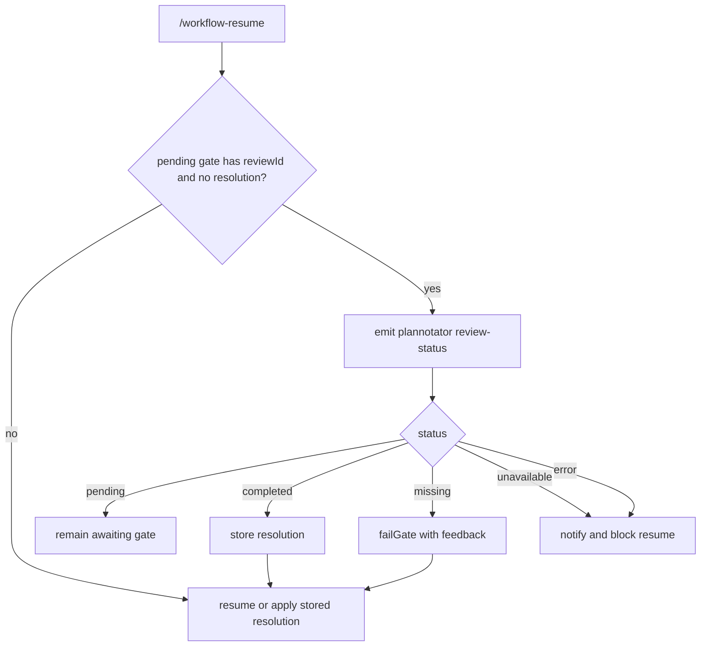
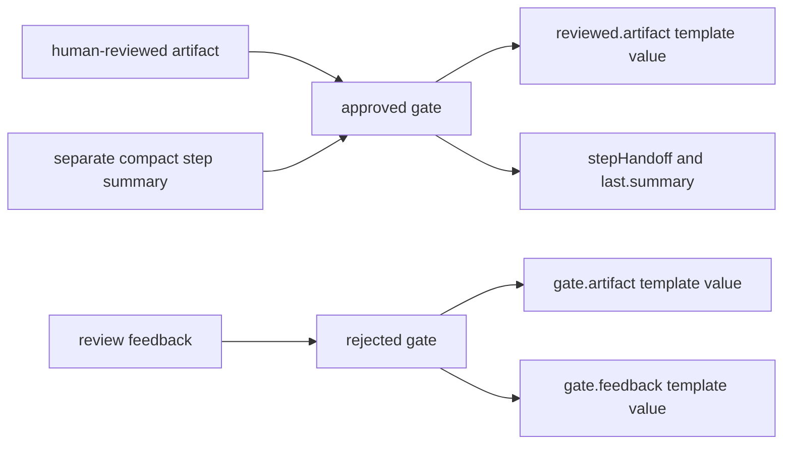

# Plannotator Integration

Plannotator is optional until a workflow step declares `gate`. Gated steps use
Plannotator for review submission and status polling; the workflow schema does
not support alternate gate providers.

Any gated step may submit an artifact. A delegated child returns it through
`structured_output`; a main-agent step uses `workflow_complete_step`. The step
prompt—not Pi Workflows—defines the artifact's format, purpose, acceptance
criteria, and downstream use. The integration transports that content without
parsing it or turning it into execution authority.

## Gate State Machine

## Gate Validation

## Review Submission

## Review Result

## Resume Polling

If a gate submission is interrupted before a Plannotator review id is recorded,
resume fails that pending submission and asks the current step to submit again.
If a review id was recorded, resume polls Plannotator and either applies the
completed decision, keeps waiting, or blocks when the review cannot be queried.

## Feedback Flow

Gate outcome names are fixed: `ready` submits the artifact and is reused after
approval, while rejection follows the step's self-looping `handoff` transition.
The approved artifact remains separate from the compact summary, and neither
value changes permissions or the run's captured working directory.
Plannotator's `approved` boolean is authoritative; annotation labels and
feedback text are never parsed as decisions. On rejection, the harness starts a
fresh same-step attempt with `{{gate.feedback}}` and the opaque rejected draft
in `{{gate.artifact}}`, while preserving the step's original incoming handoff,
then waits at a new review. These explicitly human-mediated transitions bypass
the visit-limit check and can continue until approval. Each visit remains
recorded, so later automatic same-step handoffs are still guarded.
