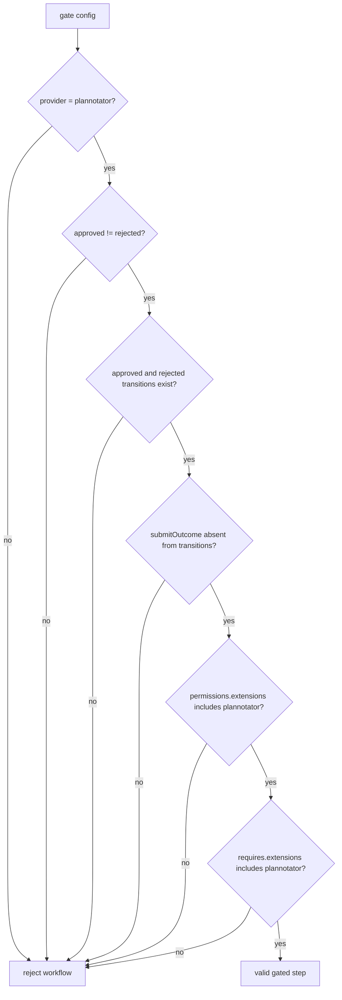
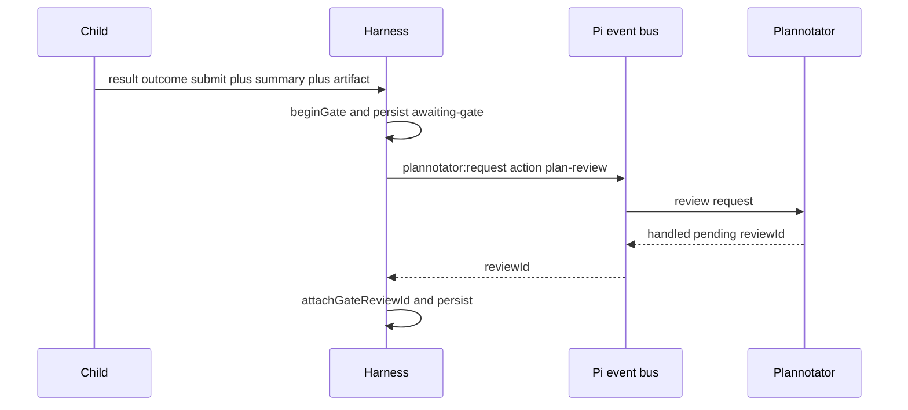
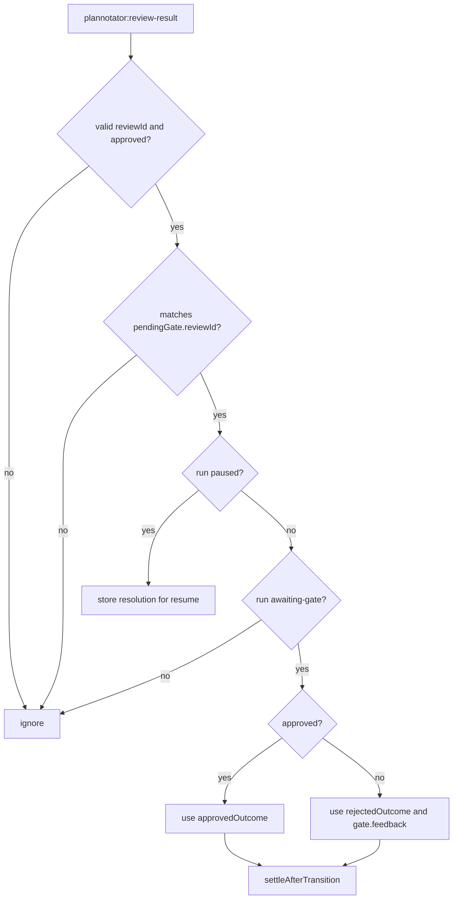
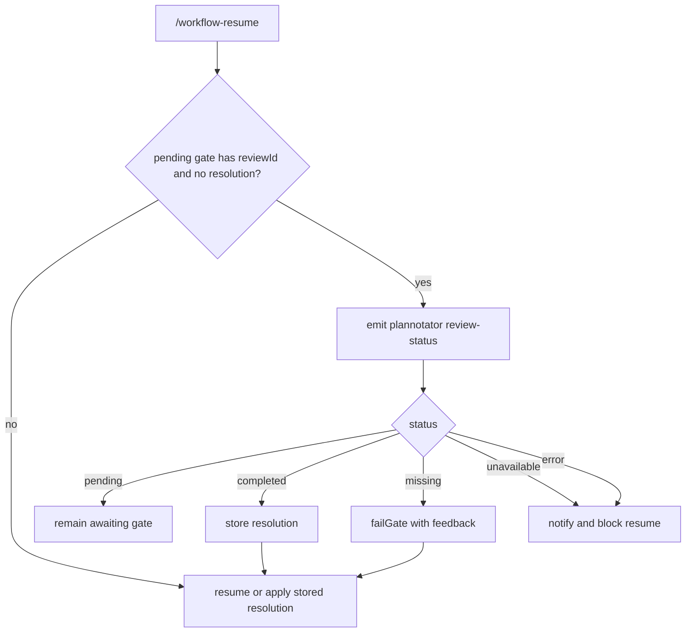
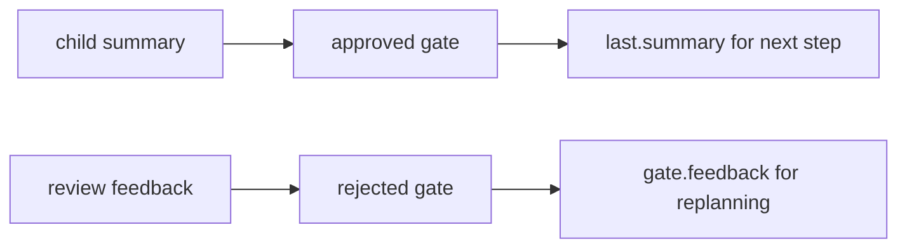

# Plannotator Integration

## Gate State Machine

```mermaid
stateDiagram-v2
  running --> awaiting_gate: child outcome = submitOutcome
  awaiting_gate --> running: rejectedOutcome
  awaiting_gate --> running: approvedOutcome to next step
  awaiting_gate --> completed: approvedOutcome to $done
  awaiting_gate --> paused: manual pause
  paused --> running: resume applies stored rejection
  paused --> running: resume applies stored approval to next step
  paused --> completed: resume applies stored approval to $done
```

## Gate Validation

```mermaid
flowchart TD
  Gate[gate config] --> Provider{provider = plannotator?}
  Provider -- no --> Reject[reject workflow]
  Provider -- yes --> Outcomes{approved != rejected?}
  Outcomes -- no --> Reject
  Outcomes -- yes --> Transitions{approved and rejected transitions exist?}
  Transitions -- no --> Reject
  Transitions -- yes --> Submit{submitOutcome absent from transitions?}
  Submit -- no --> Reject
  Submit -- yes --> Permission{permissions.extensions includes plannotator?}
  Permission -- no --> Reject
  Permission -- yes --> Requires{requires.extensions includes plannotator?}
  Requires -- no --> Reject
  Requires -- yes --> Accept[valid gated step]
```

## Review Submission

```mermaid
sequenceDiagram
  participant Child
  participant Harness
  participant Pi as Pi event bus
  participant Plan as Plannotator

  Child->>Harness: result outcome submit plus summary plus artifact
  Harness->>Harness: beginGate and persist awaiting-gate
  Harness->>Pi: plannotator:request action plan-review
  Pi->>Plan: review request
  Plan-->>Pi: handled pending reviewId
  Pi-->>Harness: reviewId
  Harness->>Harness: attachGateReviewId and persist
```

## Review Result

```mermaid
flowchart TD
  Event[plannotator:review-result] --> Parse{valid reviewId and approved?}
  Parse -- no --> Ignore[ignore]
  Parse -- yes --> Match{matches pendingGate.reviewId?}
  Match -- no --> Ignore
  Match -- yes --> Paused{run paused?}
  Paused -- yes --> Store[store resolution for resume]
  Paused -- no --> Awaiting{run awaiting-gate?}
  Awaiting -- no --> Ignore
  Awaiting -- yes --> Approved{approved?}
  Approved -- yes --> ApprovedTransition[use approvedOutcome]
  Approved -- no --> RejectedTransition[use rejectedOutcome and gate.feedback]
  ApprovedTransition --> Settle[settleAfterTransition]
  RejectedTransition --> Settle
```

## Resume Polling

```mermaid
flowchart TD
  Resume["/workflow-resume"] --> Pending{pending gate has reviewId and no resolution?}
  Pending -- no --> Apply[resume or apply stored resolution]
  Pending -- yes --> Status[emit plannotator review-status]
  Status --> Response{status}
  Response -- pending --> Await[remain awaiting gate]
  Response -- completed --> Store[store resolution]
  Response -- missing --> Fail[failGate with feedback]
  Response -- unavailable --> Error[notify and block resume]
  Response -- error --> Error
  Store --> Apply
  Fail --> Apply
```

## Feedback Flow

```mermaid
flowchart LR
  ChildSummary[child summary] --> Approved[approved gate]
  Approved --> LastSummary[last.summary for next step]
  ReviewerFeedback[review feedback] --> Rejected[rejected gate]
  Rejected --> GateFeedback[gate.feedback for replanning]
```
