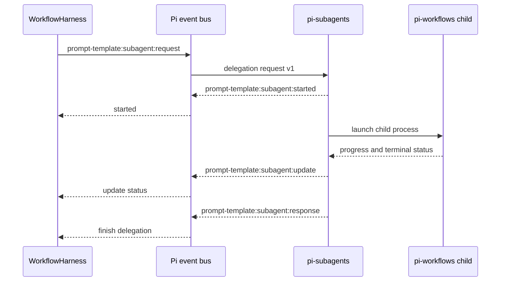
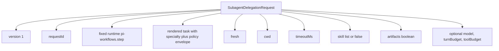
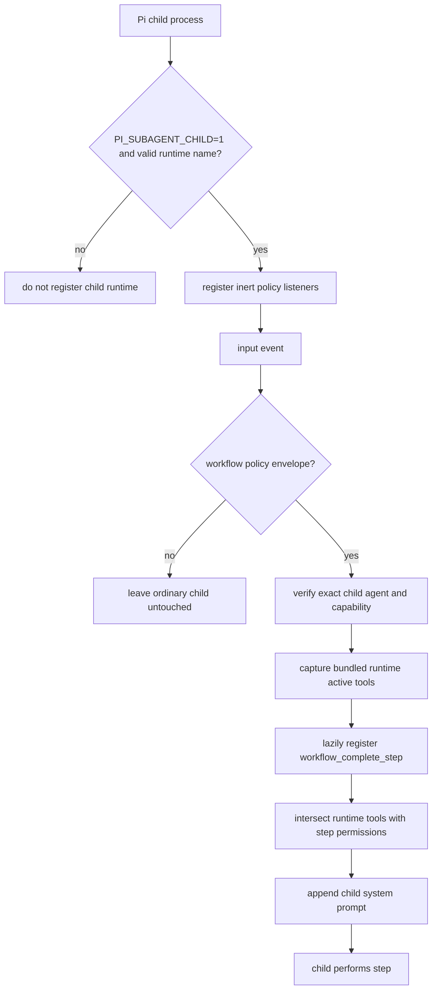
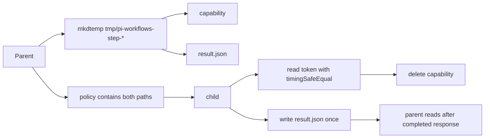
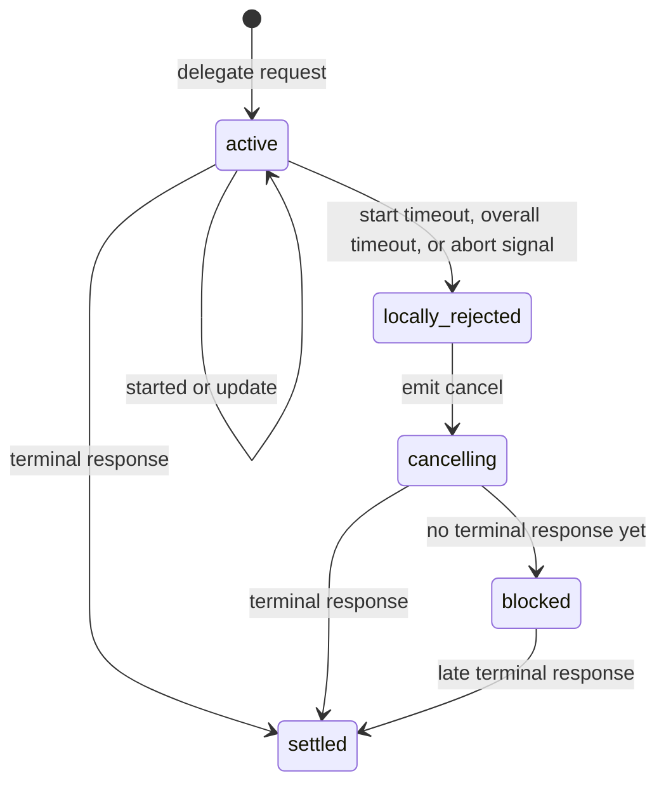
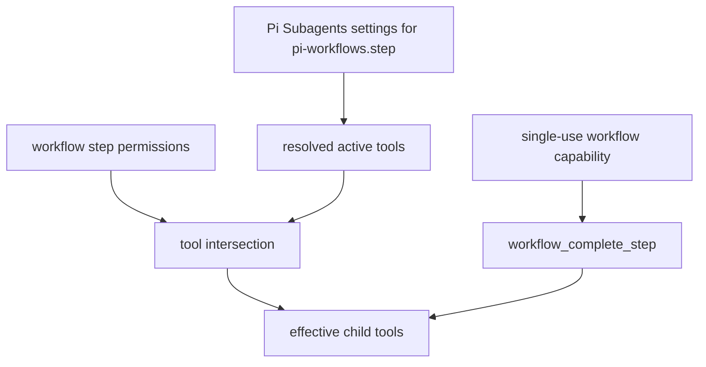

# Subagent Integration

This integration is optional. A step runs in the main Pi agent when
`subagent` is omitted; `subagent: {}` opts into the delegated runtime below.
`subagent: worker` assigns the step's `worker` specialty while retaining the
workflow defaults. The object form accepts the same specialty under `agent`
when the step also needs execution overrides.

Pi Subagents supplies the foreground-child transport. Pi Workflows always asks
it to launch the bundled `pi-workflows.step` runtime, then supplies the
specialty identity and step-specific prompt inside the correlated task.

## Event Protocol

## Delegation Request Payload

## Child Startup

## Runtime And Specialty Resolution

Pi Workflows passes `pi-workflows.step` through the public delegation API for
every workflow child. Pi Subagents resolves that packaged runtime and applies
settings for that actual name. The workflow's configured `agent` value is
instead recorded in the policy digest and rendered into the child task as
`Step specialty`; it is also used in workflow status. A value such as
`subagent: scout` therefore does not select Pi Subagents' builtin `scout`
profile.

The fixed runtime is a compatibility boundary. General-purpose Pi Subagents
profiles can declare explicit tool allow-lists; those lists can hide extension
tools registered after startup, including `workflow_complete_step`. The
bundled runtime leaves the workflow child runtime free to register that
correlated completion tool and then narrow normal tools to the step policy.

The workflow request deliberately owns fresh context, timeout, skills,
artifacts, and its optional model override. The configured specialty identifies
the role, the step prompt supplies its exact instructions, and the previous
step's self-contained compact summary or approved gate artifact supplies the
only cross-step handoff. Parent and sibling transcripts are never inherited.
The request's skill selection replaces the bundled runtime's normal skills for
that step. Pi Subagents' separate acceptance report is disabled because
`workflow_complete_step` and workflow gates are the authoritative completion
contract.

## Result Path

## Cancellation And Timeout

While blocked, the harness keeps main tools isolated and refuses resume because a child may still be alive.

## Planning And Questions

Delegated workflow children are non-interactive. The child runtime removes and
blocks `contact_supervisor`, `subagent_supervisor`, and `intercom`, preventing a
dependency-level detach from escaping the workflow lifecycle.

Planning steps put unresolved decisions in their plan artifact. Plannotator or
the user resolves them before approval; the approved artifact becomes the
implementation handoff. After approval, implementation and verification never
ask terminal questions. If the approved plan is insufficient or stale, the
step returns a pause outcome with evidence instead of opening a side channel.

The installed workflow set uses planning as its only human-decision gate.
Plan approval may authorize an exact remote-action contract. Later handoffs may
remove actions but cannot grant new ones: the harness intersects commands from
the reviewed plan with commands retained by the latest completed-step handoff
before enabling Bash.

## Agent And Policy Boundary

The bundled runtime's resolved tools are an outer visibility boundary. Pi
Workflows may narrow them but cannot activate a normal tool or extension that
Pi Subagents excluded. The completion tool is the sole addition and appears
only after capability verification.
