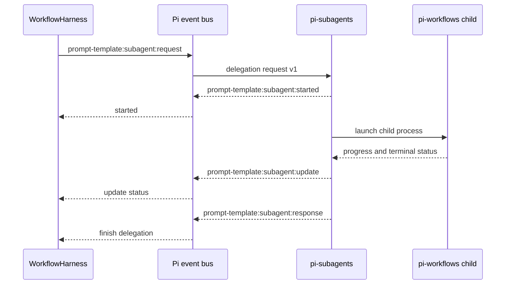
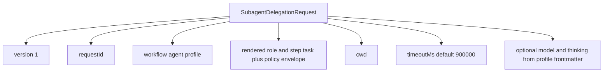
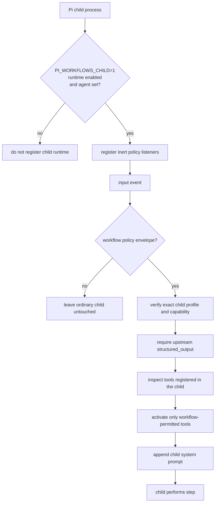
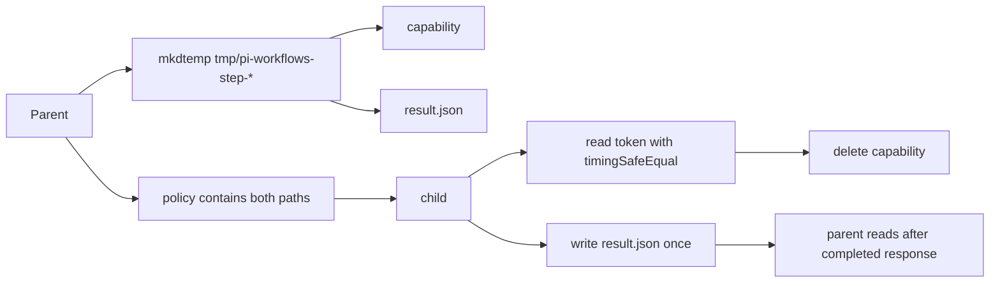
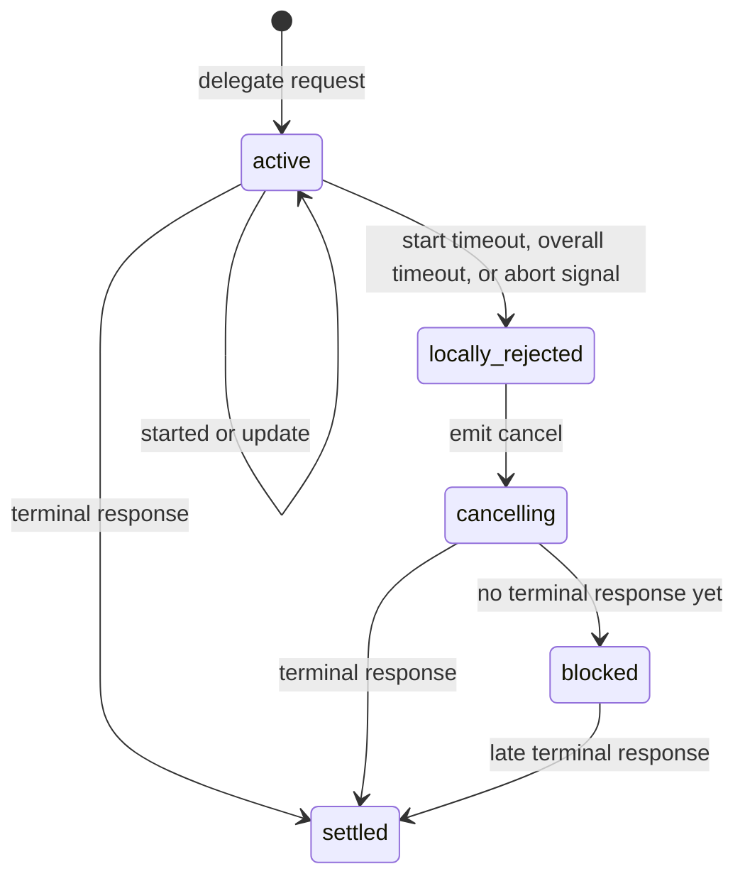
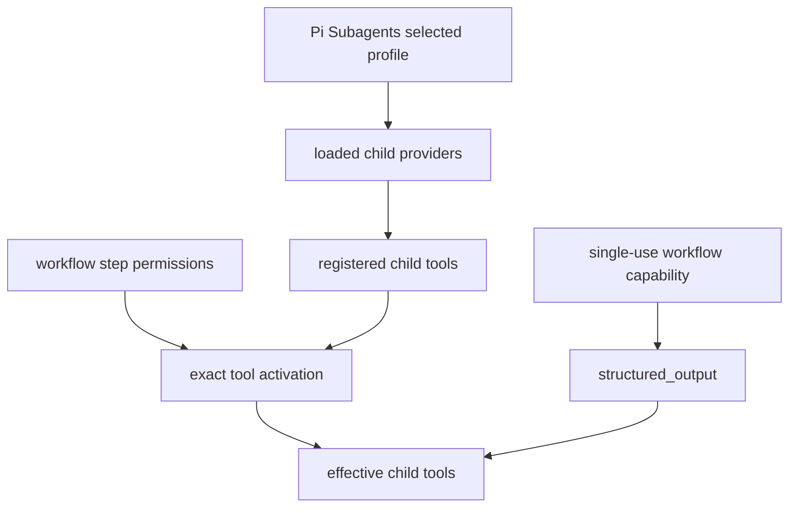

# Subagent Integration

Launched workflow steps use the `agent` field to run a delegated Pi worker with
a workflow-owned role profile. Pi Workflows loads
`~/.agents/agents/worker.md` first for `agent: worker`, then falls back to the
bundled `examples/starter-kit/agents/worker.md` profile. Profile frontmatter may
supply `model` and `thinking`; the workflow step continues to own permissions,
outcomes, gates, and workspace binding. A step without `agent` cannot create a
delegation plan and pauses before execution.

Pi Subagents 0.36.0 or newer supplies the foreground-child transport and
schema-backed completion. Pi Workflows passes the configured `agent` name
directly, so `workspace-preparer`, `scout`, `planner`, `worker`, and `reviewer`
retain their distinct role prompts and optional runtime defaults.

## Event Protocol

## Delegation Request Payload

## Child Startup

## Profile Resolution

Pi Workflows passes the workflow `agent` value through the public delegation API.
A value such as `agent: scout` therefore starts Pi Subagents' actual `scout`
profile and injects the loaded workflow role prompt into the delegated task; it
is not merely a label in a general-purpose prompt.

The loaded workflow profile supplies role instructions and optional
model/thinking overrides. Once the signed workflow capability is verified, the
declarative step permissions become the active tool policy resolved against
tools registered in that child. An unavailable tool or extension provider fails
closed. Delegated completion uses the upstream `structured_output` tool, so it
does not depend on a profile exposing the main-agent-only
`workflow_complete_step` tool.

The request carries the rendered role and step task, encoded policy envelope,
cwd, request id, default timeout, and optional model/thinking values from
profile frontmatter. The active status line and live worker detail page show
that model while the delegation is running. The step prompt supplies its exact
instructions, and the previous step's self-contained compact summary supplies
the cross-step handoff. Approved and rejected gate artifacts are persisted
separately and are available only through the explicit `{{reviewed.artifact}}`
and `{{gate.artifact}}` template values. Parent and sibling transcripts are
never inherited.

Ordinary tool failures remain inside the same child whenever its runtime can
continue. The base delegated completion contract only requires the child to
stay within configured permissions and choose an outcome defined by the step
prompt. Delegated completion is evaluated only against the active step's
instructions; later workflow steps are not unfinished work for that step. If a
child settles without producing the required correlated result, same-child
repair runs first. After that, a step with a configured self-looping `handoff`
outcome can advance with a parent-composed contextual handoff for the current
delegated step; other missing completions still require replay-safe read-only
diagnostics for one fresh retry before pausing. The workflow prompt still owns
the meaning of every outcome and decides how unresolved failures are reported.

The first request starts in the absolute working directory captured when the
workflow run began. A YAML-authorized delegated step may return a structured
workspace binding under an allowed root. Once accepted, every reachable later
step, revisit, recovery attempt, and resume receives that canonical directory.
Without a binding, they continue to reuse the run-start directory. Summaries
and gate artifacts cannot select a directory, and the extension does not
bootstrap or interpret one.

A legacy checkpoint with no captured run-start directory cannot launch a
delegated child. Abort that run and start a new one so the directory is captured
explicitly instead of guessed from the resumed process.

Pi Subagents validates `structured_output` and returns one correlated terminal
event. Pi Workflows owns declared outcomes and optional human-review gates, and
the child result is accepted only after the private capability, policy digest,
outcome, summary, artifact, and optional workspace fields validate.
Finalized worker message usage is normalized by provider/model and stored with
the exact attempt, the step aggregate, and the workflow status totals; streaming
progress does not contribute usage.

## Same-Child Completion Repair

A child that settles without writing its validated correlated result receives
one same-session repair follow-up unless it is already in budget handoff mode.
The repair removes every work tool, retains only `structured_output`, and
instructs the child not to repeat completed work. This covers omissions for
delegated workflow steps without replaying a push, write, edit, Bash command, or
remote publication.

The parent still accepts only `result.json` after policy-digest and step-result
validation; it never infers an outcome from prose. If repair also produces no
result and the step declares a self-looping `handoff` transition, the parent
records a durable fallback handoff from available active-step context, prior
checkpoint, diagnostic state, and repository state, then revisits the same
step. Without that transition, complete bounded terminal evidence can permit
one fresh retry only when all completed calls were read-only: `read`, `ls`,
`grep`, or `structured_output`. Any Bash, edit, write, MCP, unknown, failed,
started, malformed, missing, or truncated evidence pauses the workflow with
diagnostics.

When a delegated step has a productive tool-call budget, the warning at two
productive calls remaining tells the child to finish the active delegated step
with its applicable configured outcome when possible; otherwise it prepares a
handoff for incomplete active-step work. After the productive budget is
exhausted, work tools are locked and the completion reserve accepts the
configured outcome that accurately reflects the active delegated step state,
including `handoff` when active-step work is incomplete. A handoff must cite
evidence for completed or in-progress active-step work and identify the first
action for the next child.

## Result Path

## Cancellation And Timeout

While blocked, the harness keeps main tools isolated and refuses resume because a child may still be alive.

For a child that settles without `result.json`, Pi Workflows first sends one
same-session completion-only repair follow-up. If repair also produces no
result, diagnostics must prove the attempt settled, was not truncated, and
completed only read-only tools: `read`, `ls`, `grep`, or `structured_output`.
Only that evidence permits one fresh child retry. Missing diagnostics,
truncated evidence, failed or still-started calls, Bash, edit/write, MCP, or
any unknown tool class pauses the workflow.

Cancellation, interruption, protocol/setup failure, malformed evidence, and
unsafe or incomplete diagnostics pause without a fresh retry. A synchronous
startup exception is caught and routed through normal serialized failure
handling. Temporary workspace cleanup is best effort: removal failure warns but
cannot interrupt a healthy run or recovery attempt.

## Non-Interactive Child Boundary

Delegated workflow children are non-interactive. The child runtime removes and
blocks `contact_supervisor`, `subagent_supervisor`, and `intercom`, preventing a
dependency-level detach from escaping the workflow lifecycle.

The extension does not prescribe planning, implementation, verification,
question handling, or artifact structure. Each workflow prompt defines the
step's responsibility, accepted evidence, and outcome semantics. A child can
only return one of the labels declared in that step; the engine applies its
configured transition without assigning domain meaning to the label.

Human decisions belong in an explicitly configured gate. Gate approval stores
the submitted artifact as opaque data and does not expand tool, Bash, path, or
working-directory authority.

## Agent And Policy Boundary

The workflow step is the sole active-tool allow-list after capability
verification. The selected profile still controls provider loading, so an
unregistered extension tool cannot be activated. Ordinary non-workflow
subagent runs retain their profile tool lists. `structured_output` is supplied
upstream for this schema-backed request and is accepted only after capability
verification.
