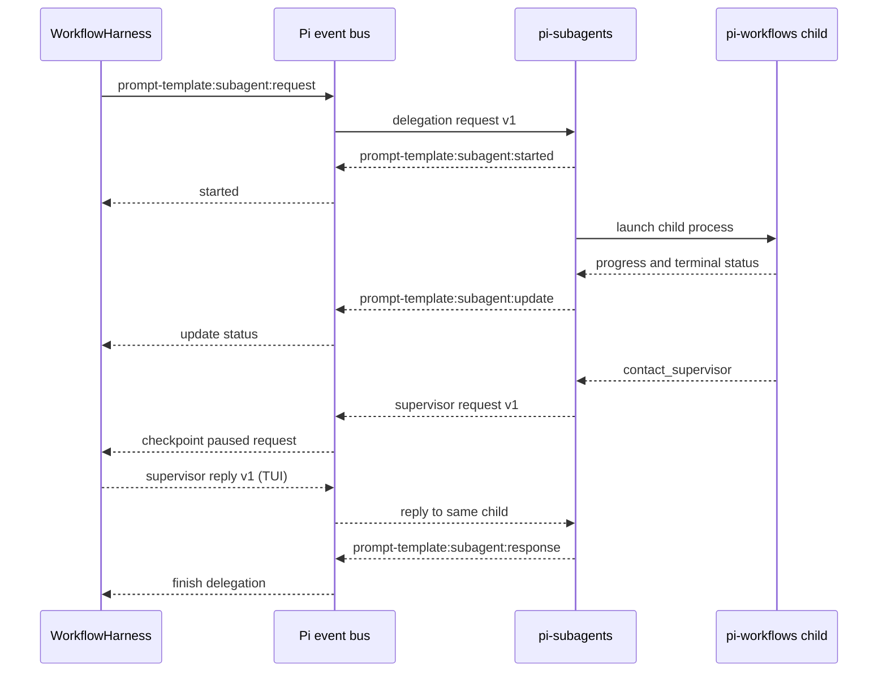
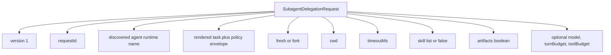
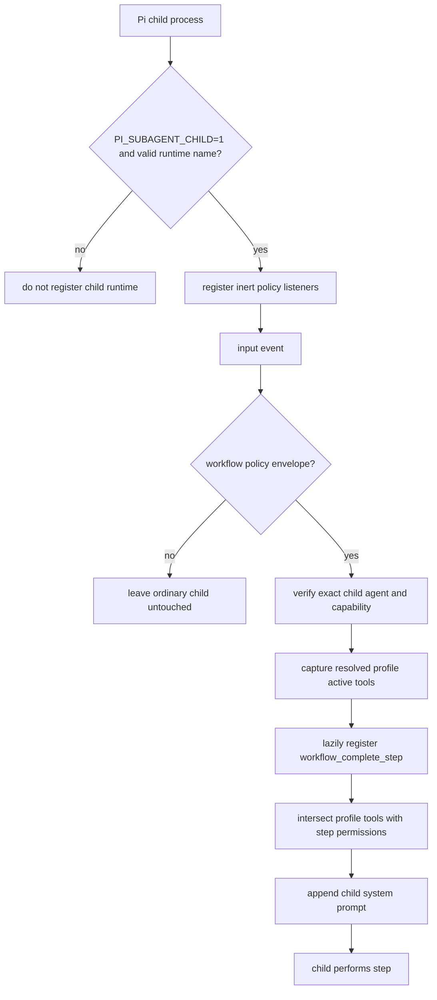
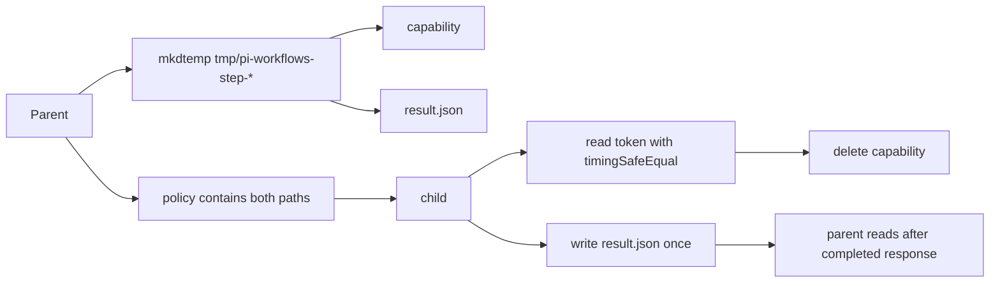
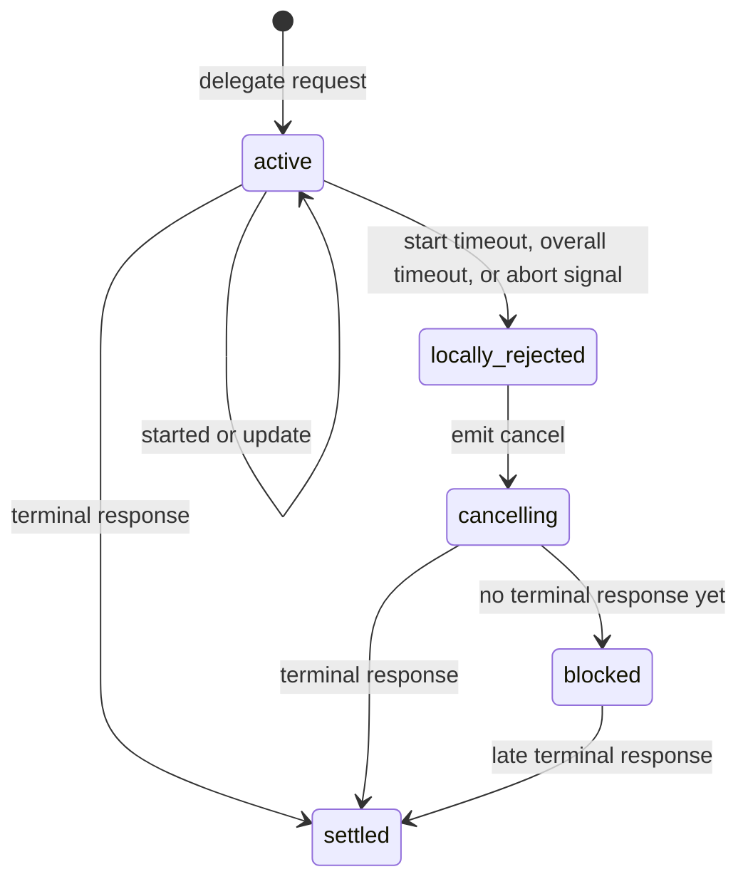
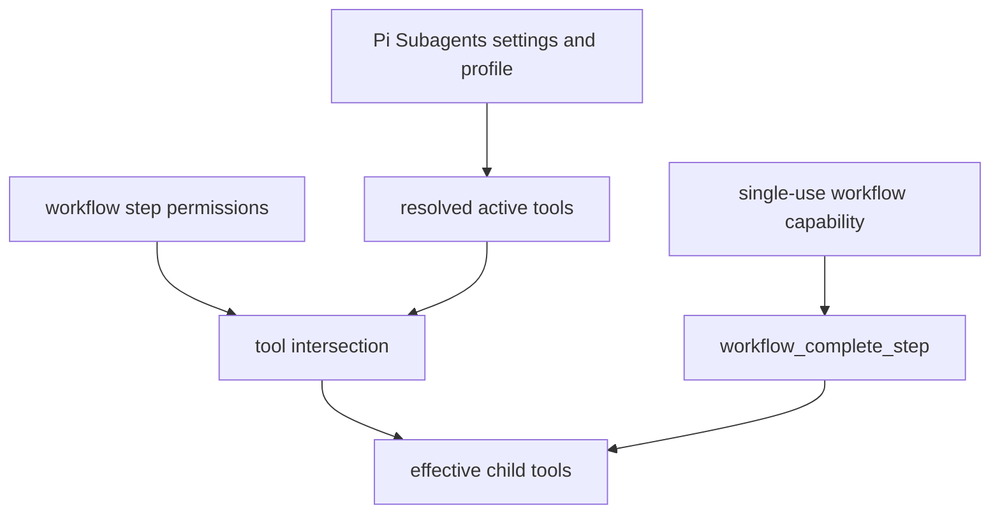

# Subagent Integration

This integration is optional. A step runs in the main Pi agent when
`subagent` is omitted; `subagent: {}` opts into the delegated runtime below.
`subagent: worker` selects the Pi Subagents `worker` runtime while retaining
the workflow defaults. The object form accepts the same name under `agent`
when the step also needs execution overrides. Pi Subagents owns discovery and
applies matching `subagents.agentOverrides` from Pi settings.

## Event Protocol

## Delegation Request Payload

## Child Startup

## Agent Resolution

Pi Workflows passes the configured `agent` unchanged through the public
delegation API. Pi Subagents resolves that name across its builtin, package,
user, and project agents, then applies `settings.json` precedence and disabled
state. Pi Workflows deliberately does not read or mirror that settings schema.

An `agentOverrides.worker` entry customizes the discovered builtin `worker`; it
does not create a new runtime named `worker`. Packaged agents may use qualified
names such as the bundled `pi-workflows.step`.

The workflow request deliberately owns context, timeout, skills, artifacts, and
its optional model override. Its skill selection replaces the agent profile's
normal skills for that step. Pi Subagents' separate acceptance report is
disabled because `workflow_complete_step` and workflow gates are the
authoritative completion contract.

## Result Path

## Cancellation And Timeout

While blocked, the harness keeps main tools isolated and refuses resume because a child may still be alive.

## Supervisor Coordination

Delegated steps support child `contact_supervisor` requests with
pi-subagents `0.36.0` or newer. A correlated request pauses the workflow and
persists the child agent, child run, request id, reason, message, and optional
interview payload. The original delegation remains active: Pi Workflows never
starts a replacement child while the request is pending.

In Pi TUI, the workflow opens a reply input. A non-empty reply is sent through
the delegation supervisor-reply event, returns the workflow to running, and
waits for that original child’s terminal response. Dismissing the input keeps
the checkpoint paused; `/workflow-resume` reopens it in TUI. RPC and non-TUI
sessions intentionally keep the workflow paused and must be reopened in TUI
to answer the child. Normal pause, abort, session change, and shutdown still
cancel the child and wait for its terminal result before releasing isolation.

## Agent And Policy Boundary

The selected profile is an outer visibility boundary. Pi Workflows may narrow
it but cannot activate a normal tool or extension that Pi Subagents excluded.
The completion tool is the sole addition and appears only after capability
verification. A custom profile that restricts extension loading must still
load Pi Workflows for delegated workflow steps.
