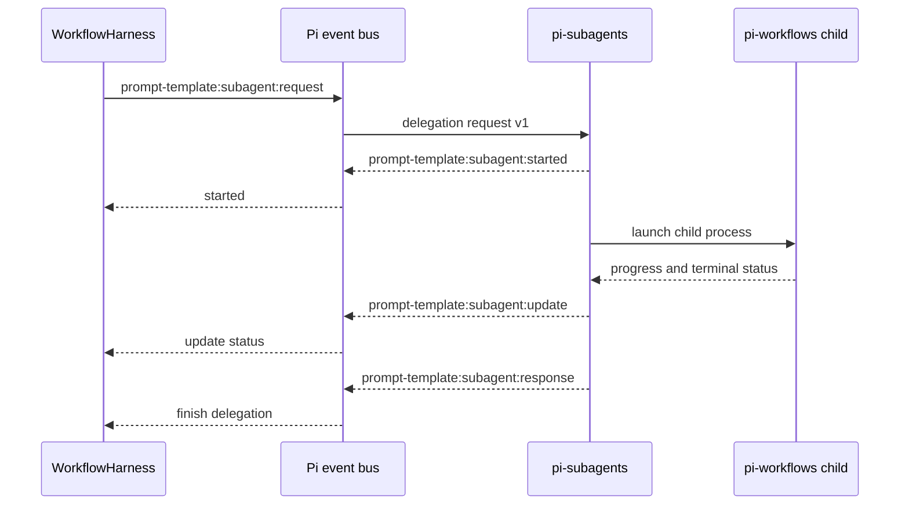
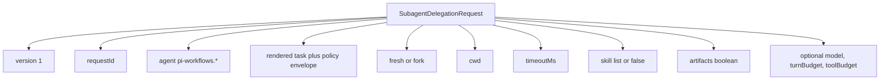
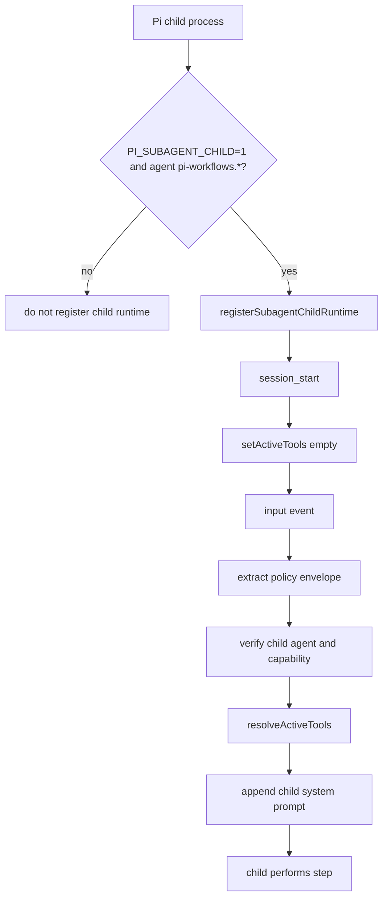
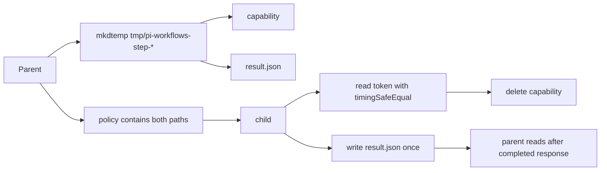
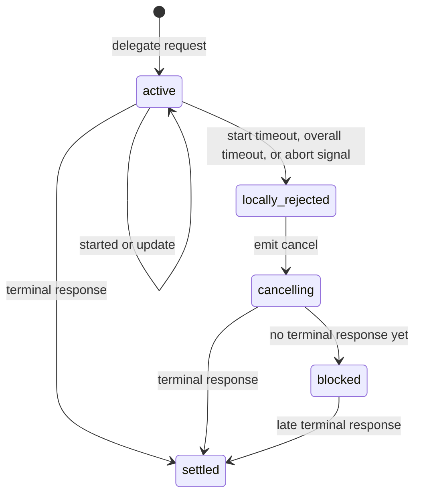
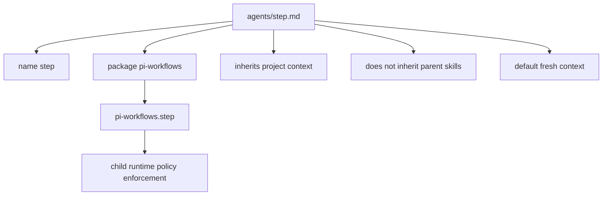

# Subagent Integration

This integration is optional. A step runs in the main Pi agent when
`subagent` is omitted; `subagent: {}` opts into the delegated runtime below.
`subagent: pi-workflows.inspector` selects a named workflow agent while
retaining the defaults. The object form accepts the same name under `agent`
when the step also needs execution overrides.

## Event Protocol

## Delegation Request Payload

## Child Startup

## Result Path

## Cancellation And Timeout

While blocked, the harness keeps main tools isolated and refuses resume because a child may still be alive.

## Bundled Agent Boundary

