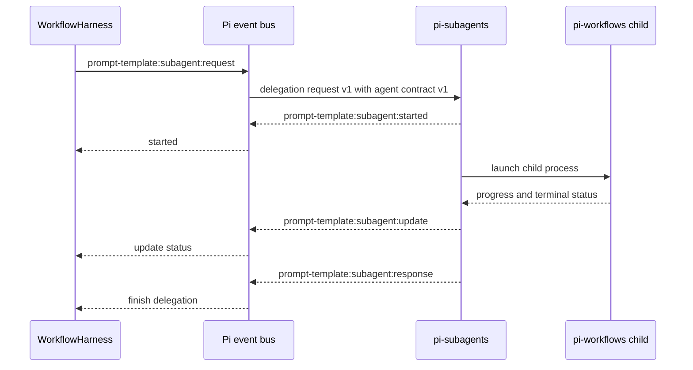
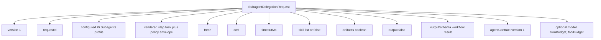
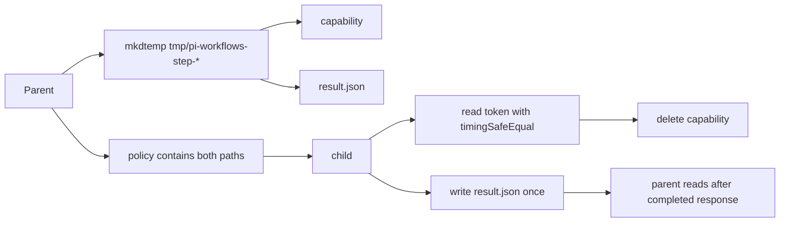
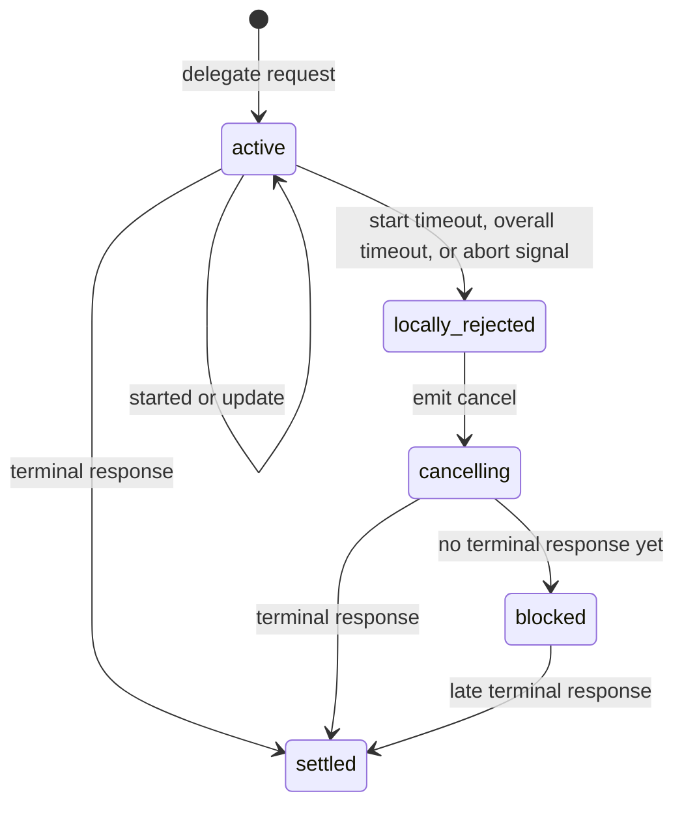
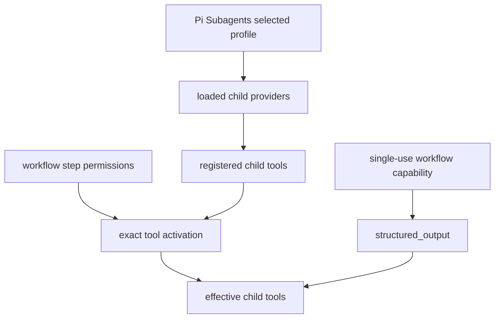

# Subagent Integration

This integration is optional. A step runs in the main Pi agent when
`subagent` is omitted; `subagent: {}` opts into the delegated runtime below.
`subagent: worker` launches the Pi Subagents `worker` profile while retaining
the workflow defaults. The object form accepts the same profile under `agent`
when the step also needs execution overrides.

Pi Subagents 0.36.0 or newer supplies the foreground-child transport and
schema-backed completion. Pi Workflows passes the configured `subagent.agent`
directly, so `scout`, `planner`, `worker`, and `reviewer` retain their distinct
profile prompts and defaults.

## Event Protocol

## Delegation Request Payload

## Child Startup

## Profile Resolution

Pi Workflows passes `subagent.agent` through the public delegation API. A value
such as `subagent: scout` therefore starts Pi Subagents' actual `scout` profile;
it is not merely a label in a general-purpose prompt. The bundled
`pi-workflows.step` profile is only the default when `agent` is omitted.

The selected profile supplies its persona, model defaults, context policy, and
loaded extensions. Once the signed workflow capability is verified, its
ordinary active-tool list is replaced by the declarative step permissions
resolved against tools registered in that child. An unloaded extension provider
remains unavailable. Pi Subagents 0.36 supplies `structured_output` from the
request's `outputSchema`, so delegated completion does not depend on a profile
exposing the main-agent-only `workflow_complete_step` tool.

The workflow request deliberately owns fresh context, timeout, skills,
artifacts, and its optional model override. The profile supplies its specialty,
the step prompt supplies its exact instructions, and the previous step's
self-contained compact summary supplies the cross-step handoff. Approved and
rejected gate artifacts are persisted separately and are available only through
the explicit `{{reviewed.artifact}}` and `{{gate.artifact}}` template values.
Parent and sibling transcripts are never inherited. The request's skill
selection replaces the selected profile's normal skills for that step.

Automatic recovery candidates include `failed` and
`structured_output_failed` responses with an error or nonzero exit, plus
`timed_out`, `turn_budget_exhausted`, and `tool_budget_exhausted`. The harness
may launch up to two fresh recovery attempts after distinct failures. Runtime
first requires a complete trusted transcript proving that every actual call
used a known-safe non-Bash tool or was rejected before execution by the active
step policy. Its persisted policy-stripped task and per-request binding must
also match the active delegation.

Denied Bash needs no additional opt-in. `subagent.retryToolFailures: true`
authorizes the same bounded recovery sequence in allow-list or unrestricted
Bash mode. A configured `edit` or `write` tool does not disable recovery when
it was never called; any recorded `edit`, `write`, executed Bash, or other
unknown-effect call makes the actual-call audit unsafe.

Ordinary tool failures remain inside the same child whenever its runtime can
continue. The base delegated completion contract only requires the child to
stay within configured permissions and choose an outcome defined by the step
prompt. When the harness launches a fresh automatic-recovery child, its task
also includes bounded failure evidence and asks the child to inspect current
state before choosing a permitted alternative. The workflow prompt still owns
the meaning of every outcome and decides how unresolved failures are reported.

The first request starts in the absolute working directory captured when the
workflow run began. A YAML-authorized delegated step may return a structured
workspace binding under an allowed root. Once accepted, every reachable later
step, revisit, recovery attempt, and resume receives that canonical directory.
Without a binding, they continue to reuse the run-start directory. Summaries
and gate artifacts cannot select a directory, and the extension does not
bootstrap or interpret one.

A legacy checkpoint with no captured run-start directory cannot launch a
delegated child. Abort that run and start a new one so the directory is captured
explicitly instead of guessed from the resumed process.

The v1 request sets `output: false`, provides the workflow result—including the
workspace field only when the active outcome requires it—as `outputSchema`, and
declares `agentContract: { version: 1 }`. Pi Subagents
validates `structured_output` and returns one correlated terminal event.
`output: false` suppresses any profile-default output file; omitted acceptance
under contract v1 avoids a second gate because Pi Workflows owns declared
outcomes and optional human-review gates.

## Same-Child Completion Repair

A child that settles without writing its validated correlated result receives one
same-session repair follow-up. The repair removes every work tool, retains only
`structured_output`, and instructs the child not to repeat completed work. This
covers omissions for every delegated workflow step without replaying a push,
write, edit, Bash command, or remote publication.

The parent still accepts only `result.json` after policy-digest and step-result
validation; it never infers an outcome from prose. If repair also produces no
result, complete bounded terminal evidence can permit one fresh retry only
when all completed calls were read-only. Any Bash, edit, write, MCP, unknown,
failed, malformed, or truncated evidence pauses the workflow with diagnostics.

## Result Path

## Cancellation And Timeout

While blocked, the harness keeps main tools isolated and refuses resume because a child may still be alive.

For a terminal error or nonzero exit, Pi Workflows audits a bounded tail of the
retained Pi child session. It accepts only regular, non-symlink files contained
by the current parent session's child-run root and requires its persisted
policy-stripped task and per-request binding to match the active delegation.
Every actual recorded call must use a known-safe non-Bash tool or be rejected
by policy before execution. Merely exposing `edit` or `write` is harmless when
neither was called, while an executed Bash or other unknown-effect call rejects
recovery. Denial-like tool output alone is not replay proof. A complete
zero-tool transcript is also replay-safe. When the terminal error identifies a
tool, the diagnostic additionally requires its output to match and includes the
exact call, tool error, exit code, terminal error, and validated session path.
Otherwise the generic terminal evidence remains actionable without attributing
an unrelated earlier call.

A failed process status is accepted without replay when the contained
transcript proves a matching successful `structured_output` after every failed
tool result and the correlated capability-bound result validates.

Without that proof, each replay-safe, semantically distinct failure may launch
a fresh child, up to two automatic recovery attempts. The next child receives
all previous bounded terminal evidence in an escaped JSON data boundary,
inspects current state, diagnoses the evidence, changes its approach, and
completes the original step. Stable fingerprints omit request IDs and session
paths; repeating an earlier fingerprint stops the sequence early.

Cancellation, interruption, detached/stopped execution, inconsistent timeout
projections, reported mutation, protocol/setup failure, and incomplete,
malformed, or incorrectly bound evidence pause without automatic recovery.
Consistent timeout and turn/tool-budget exhaustion remain eligible when their
complete audit is replay-safe. A synchronous startup exception is caught and
routed through normal serialized failure handling. Temporary workspace cleanup
is best effort: removal failure warns but cannot interrupt a healthy run or
recovery attempt.

## Non-Interactive Child Boundary

Delegated workflow children are non-interactive. The child runtime removes and
blocks `contact_supervisor`, `subagent_supervisor`, and `intercom`, preventing a
dependency-level detach from escaping the workflow lifecycle.

The extension does not prescribe planning, implementation, verification,
question handling, or artifact structure. Each workflow prompt defines the
step's responsibility, accepted evidence, and outcome semantics. A child can
only return one of the labels declared in that step; the engine applies its
configured transition without assigning domain meaning to the label.

Human decisions belong in an explicitly configured gate. Gate approval stores
the submitted artifact as opaque data and does not expand tool, Bash, path, or
working-directory authority.

## Agent And Policy Boundary

The workflow step is the sole active-tool allow-list after capability
verification. The selected profile still controls provider loading, so an
unregistered extension tool cannot be activated. Ordinary non-workflow
subagent runs retain their profile tool lists. `structured_output` is supplied
upstream for this schema-backed request and is accepted only after capability
verification.
