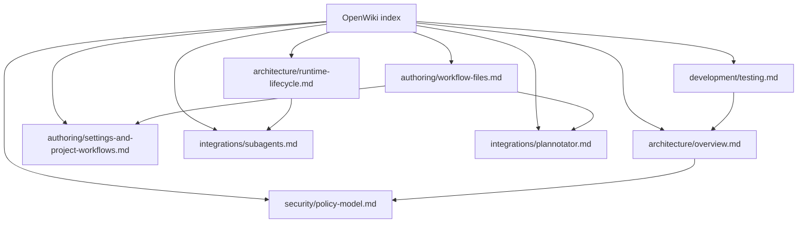
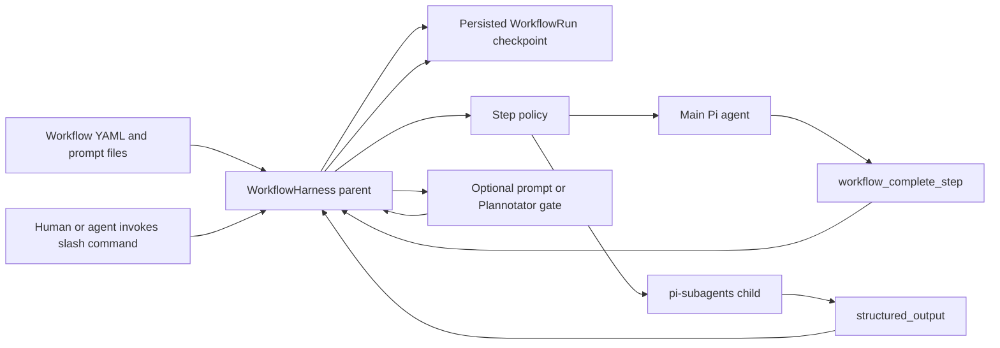
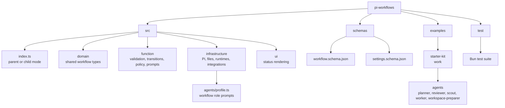

# Pi Workflows OpenWiki

This is the technical reference for Pi Workflows: its architecture, coding
boundaries, workflow contracts, security model, integrations, and verification
strategy. Use the linked pages for exact implementation decisions and edge
cases.

## Navigation

## System At A Glance

## Repository Map

