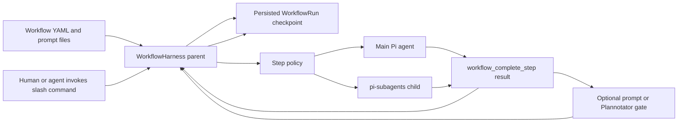
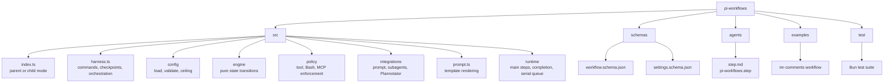
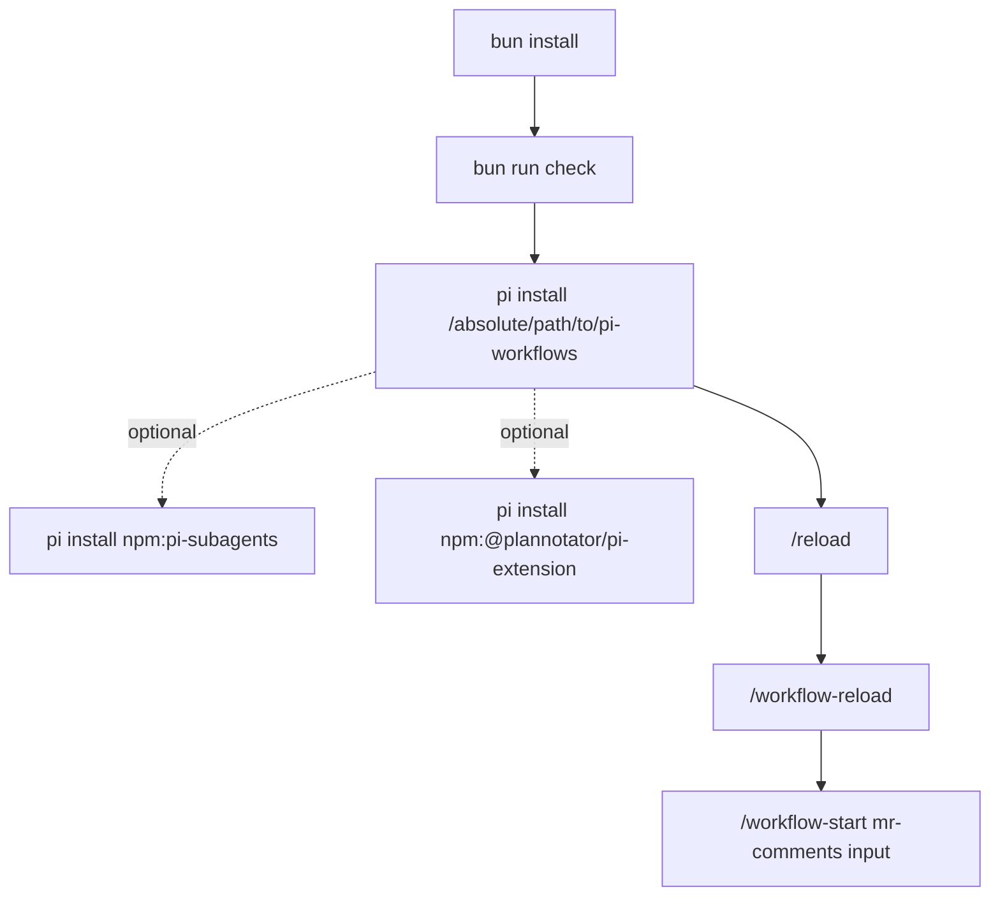
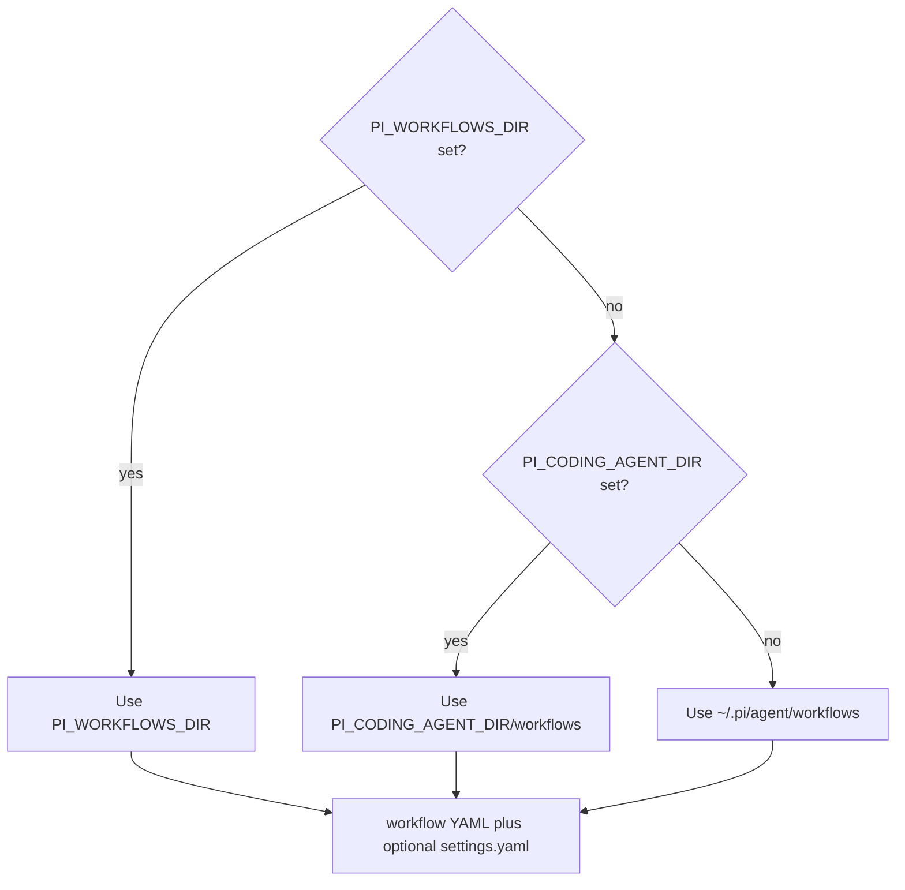

# Pi Workflows OpenWiki

Pi Workflows is a declarative, pauseable workflow harness for Pi. Read the system from the diagrams first; use the linked pages for exact fields and edge cases.

## Navigation

## System At A Glance

## Repository Map

## Install And Run

Core commands:

| Command                        | Purpose                             |
| ------------------------------ | ----------------------------------- |
| `/workflow-list`               | List loaded workflows.              |
| `/workflow-start <id> [input]` | Start by workflow id.               |
| `/<workflow command> [input]`  | Start through configured alias.     |
| `/workflow-status`             | Open a live run-status board.       |
| `/workflow-pause [reason]`     | Halt execution and checkpoint.      |
| `/workflow-resume`             | Reload, reconcile, and continue.    |
| `/workflow-abort [reason]`     | Abort active run.                   |
| `/workflow-reload`             | Reload files when no run is active. |

The live status board and footer use `↻` for running, `✓` for completed, `✕`
for failed or aborted, and `◆` for paused or awaiting review.

Configured workflow aliases accept multiline input. For example,
`/work\n"""request"""` is normalized to `/work """request"""` and dispatched as
the workflow command rather than as a normal parent-agent turn.

## Default Workflow Location

