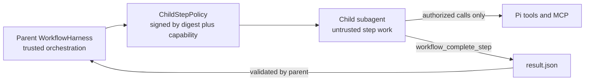
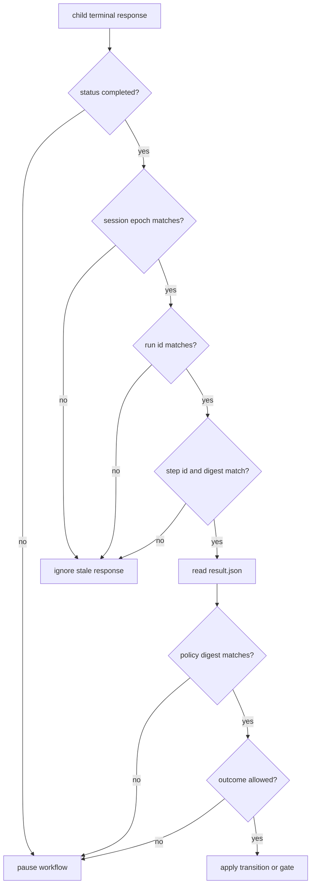
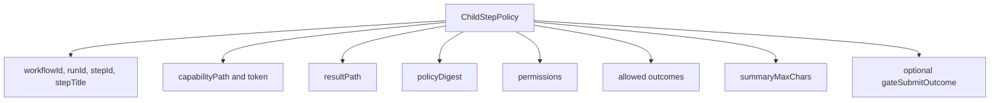
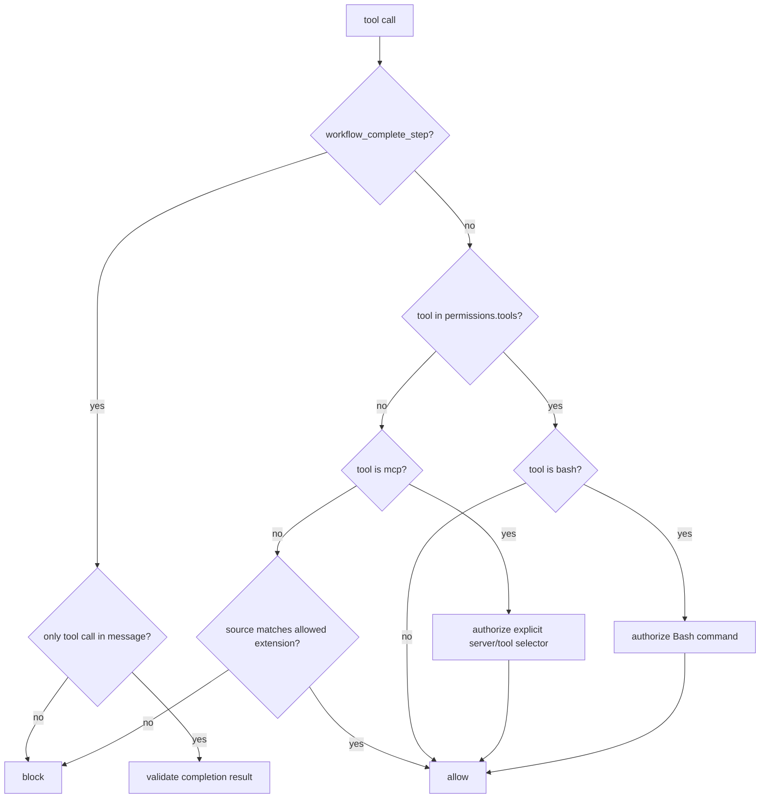
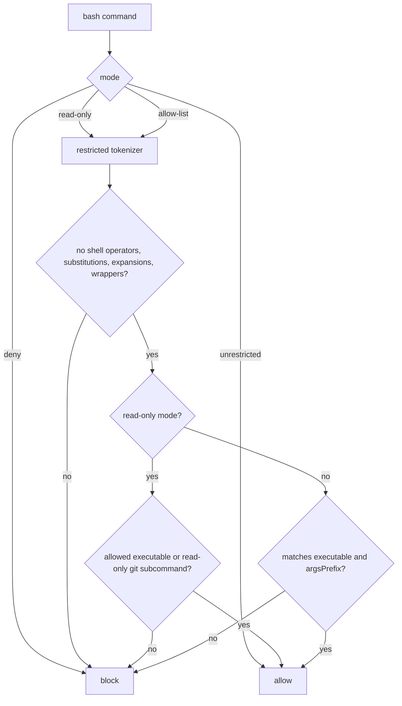
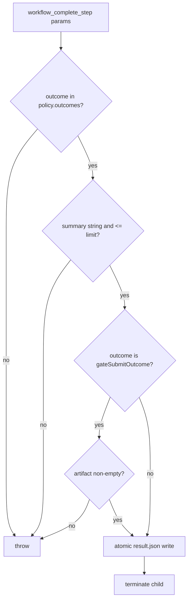
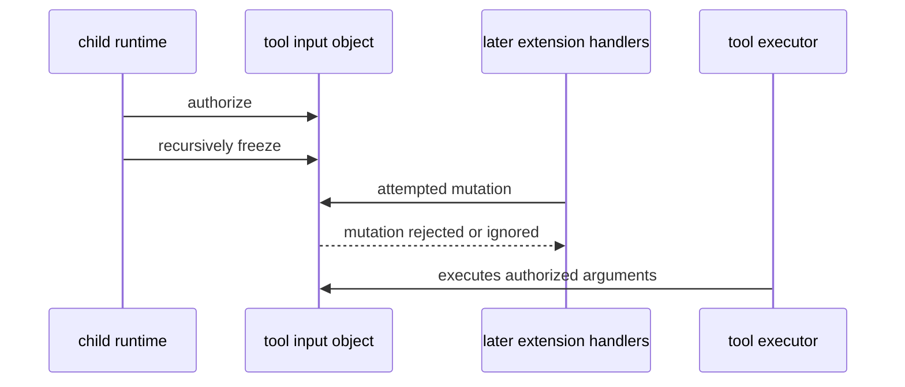

# Policy Model

## Trust Boundary

```mermaid
flowchart LR
  Parent[Parent WorkflowHarness<br/>trusted orchestration]
  Policy[ChildStepPolicy<br/>signed by digest plus capability]
  Child[Child subagent<br/>untrusted step work]
  Tools[Pi tools and MCP]
  Result[result.json]

  Parent --> Policy
  Policy --> Child
  Child -->|authorized calls only| Tools
  Child -->|workflow_complete_step| Result
  Result -->|validated by parent| Parent
```

## Parent Acceptance Checks

```mermaid
flowchart TD
  Response[child terminal response] --> Completed{status completed?}
  Completed -- no --> Pause[pause workflow]
  Completed -- yes --> Session{session epoch matches?}
  Session -- no --> Ignore[ignore stale response]
  Session -- yes --> Run{run id matches?}
  Run -- no --> Ignore
  Run -- yes --> Step{step id and digest match?}
  Step -- no --> Ignore
  Step -- yes --> Result[read result.json]
  Result --> Digest{policy digest matches?}
  Digest -- no --> Pause
  Digest -- yes --> Outcome{outcome allowed?}
  Outcome -- no --> Pause
  Outcome -- yes --> Apply[apply transition or gate]
```

## Child Policy Contents

```mermaid
flowchart TD
  Policy[ChildStepPolicy] --> Identity[workflowId, runId, stepId, stepTitle]
  Policy --> Capability[capabilityPath and token]
  Policy --> ResultPath[resultPath]
  Policy --> Digest[policyDigest]
  Policy --> Perms[permissions]
  Policy --> Outcomes[allowed outcomes]
  Policy --> Limit[summaryMaxChars]
  Policy --> Gate[optional gateSubmitOutcome]
```

## Tool Authorization

```mermaid
flowchart TD
  Call[tool call] --> Completion{workflow_complete_step?}
  Completion -- yes --> Batch{only tool call in message?}
  Batch -- no --> Block[block]
  Batch -- yes --> Complete[validate completion result]

  Completion -- no --> Exact{tool in permissions.tools?}
  Exact -- yes --> Bash{tool is bash?}
  Exact -- no --> MCP{tool is mcp?}
  MCP -- yes --> MCPAuth[authorize explicit server/tool selector]
  MCP -- no --> Extension{source matches allowed extension?}
  Extension -- yes --> Allow[allow]
  Extension -- no --> Block
  Bash -- yes --> BashAuth[authorize Bash command]
  Bash -- no --> Allow
  MCPAuth --> Allow
  BashAuth --> Allow
```

## Bash Authorization

```mermaid
flowchart TD
  BashCall[bash command] --> Mode{mode}
  Mode -- deny --> Block[block]
  Mode -- unrestricted --> Allow[allow]
  Mode -- read-only --> Parse[restricted tokenizer]
  Mode -- allow-list --> Parse
  Parse --> SafeSyntax{no shell operators, substitutions, expansions, wrappers?}
  SafeSyntax -- no --> Block
  SafeSyntax -- yes --> ReadOnly{read-only mode?}
  ReadOnly -- yes --> Preset{allowed executable or read-only git subcommand?}
  Preset -- yes --> Allow
  Preset -- no --> Block
  ReadOnly -- no --> Rule{matches executable and argsPrefix?}
  Rule -- yes --> Allow
  Rule -- no --> Block
```

## Completion Contract

```mermaid
flowchart TD
  Complete[workflow_complete_step params] --> Outcome{outcome in policy.outcomes?}
  Outcome -- no --> Reject[throw]
  Outcome -- yes --> Summary{summary string and <= limit?}
  Summary -- no --> Reject
  Summary -- yes --> Gate{outcome is gateSubmitOutcome?}
  Gate -- yes --> Artifact{artifact non-empty?}
  Artifact -- no --> Reject
  Artifact -- yes --> Write[atomic result.json write]
  Gate -- no --> Write
  Write --> Terminate[terminate child]
```

## Immutable Input Defense

```mermaid
sequenceDiagram
  participant Runtime as child runtime
  participant Input as tool input object
  participant Later as later extension handlers
  participant Tool as tool executor

  Runtime->>Input: authorize
  Runtime->>Input: recursively freeze
  Later->>Input: attempted mutation
  Input-->>Later: mutation rejected or ignored
  Tool->>Input: executes authorized arguments
```

