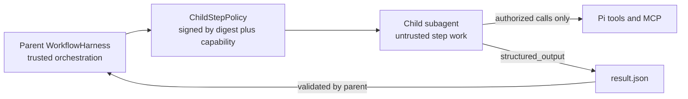
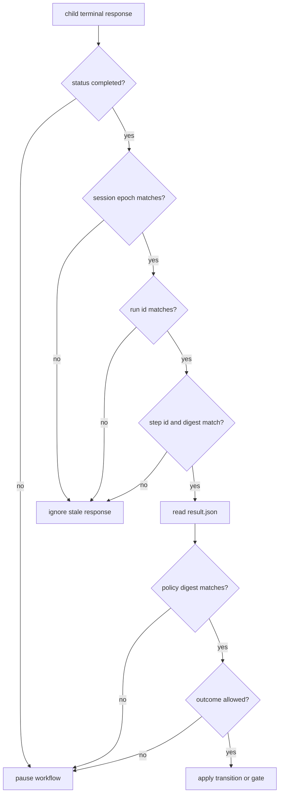
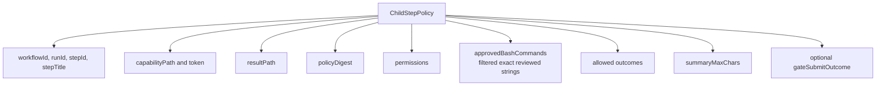
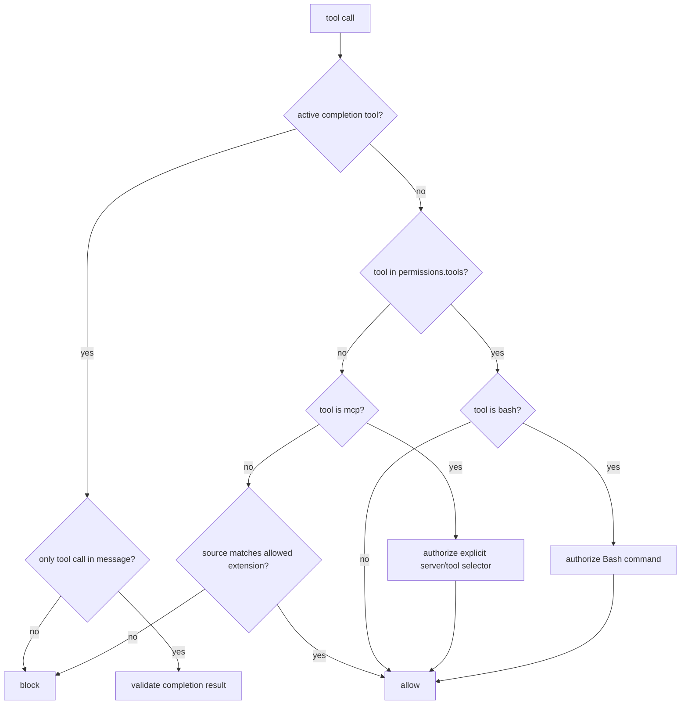
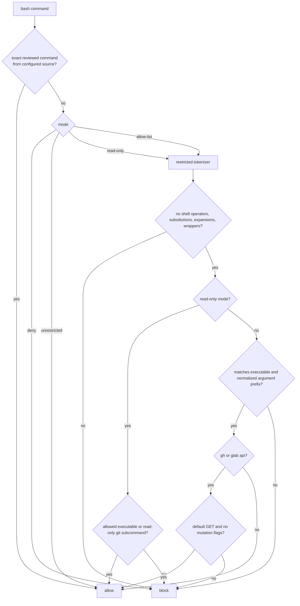
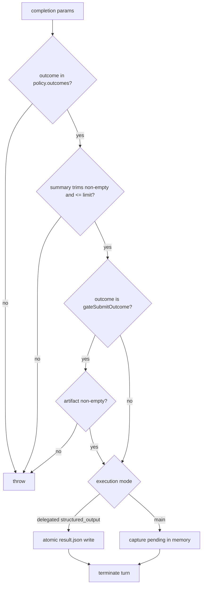
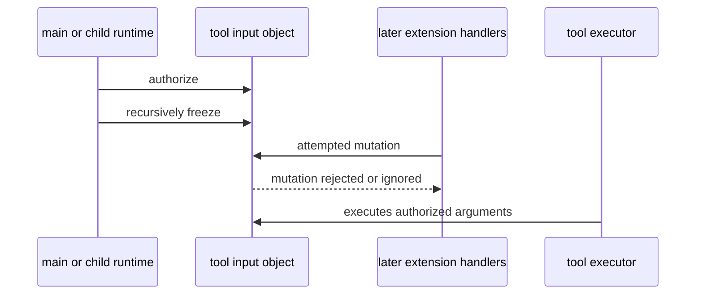

# Policy Model

Main-agent and delegated steps share tool authorization and completion parsing.
The first diagram shows the stronger delegated process boundary; main-agent
mode enforces the same model calls inside the parent process but cannot isolate
the transcript, globally loaded skills, or extension event handlers.

## Trust Boundary

## Delegated Parent Acceptance Checks

## Delegated Child Policy Contents

## Tool Authorization

## Bash Authorization

## Completion Contract

For a delegated step, pi-subagents 0.36 creates `structured_output` from the
request's workflow result schema and agent contract v1. For a main-agent step,
the harness registers `workflow_complete_step`. Both paths feed the same
outcome, summary, artifact, sole-call, and policy-digest validation. The
selected subagent profile's tool and extension allow-lists remain an outer
boundary for ordinary tools; workflow policy can narrow but never widen them.

For a reviewed repository contract, `edit` and `write` inputs are also confined
to the sole absolute `repositories[].cwd`. If that target worktree does not yet
exist, the child may bootstrap from the one reviewed existing `sourceCwd`, but
relative mutations there are rejected; it must create the target with an exact
approved Bash command and then use target-rooted paths.

Reviewed commands come only from the run's persisted human-approved artifact.
The parent filters them in `src/policy/approved-commands.ts`, includes the list
in the policy digest, and the child authorizes exact string equality. Ordinary
step summaries never become command provenance. Legacy checkpoints without the
field remain readable but receive no reviewed command capabilities.

## Immutable Input Defense

