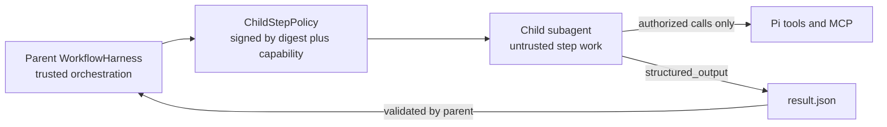
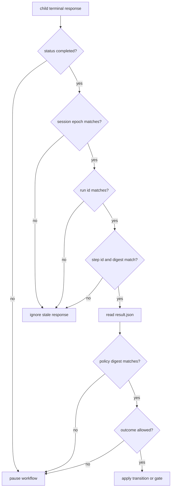
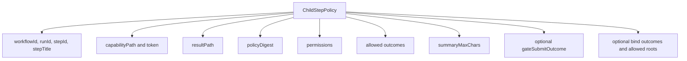
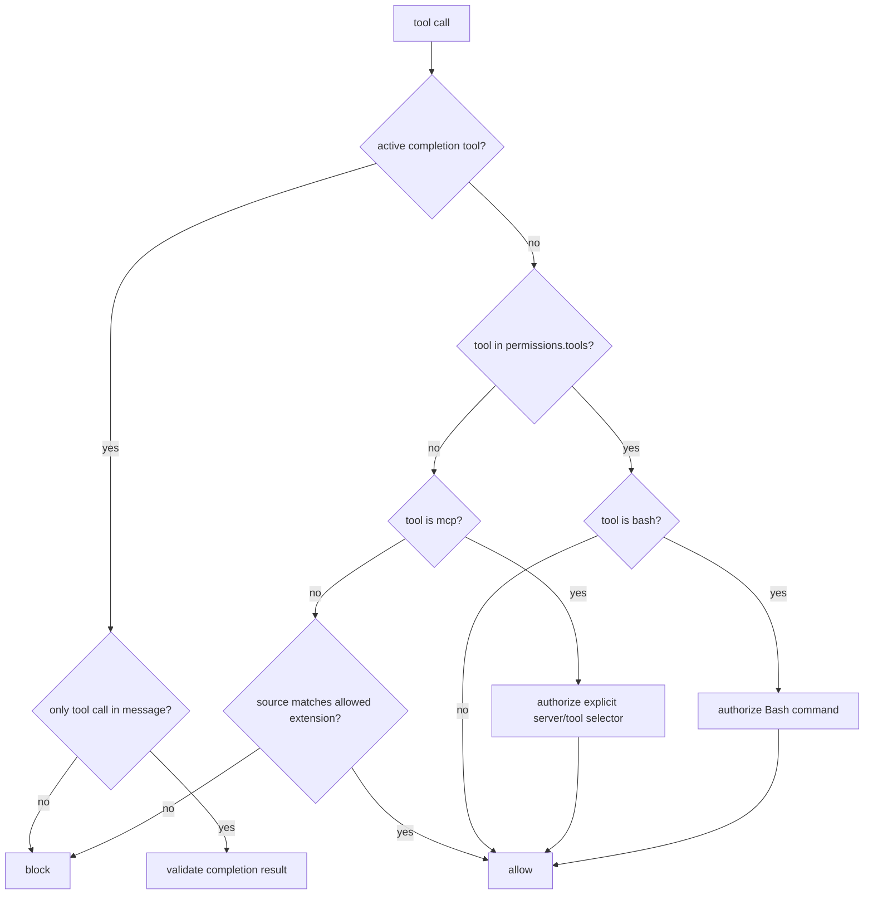
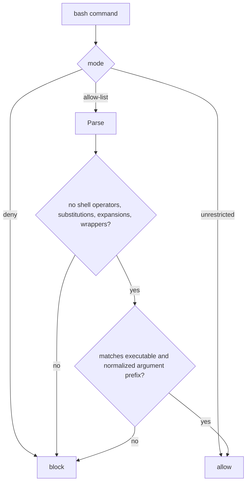
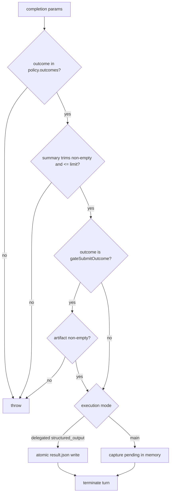
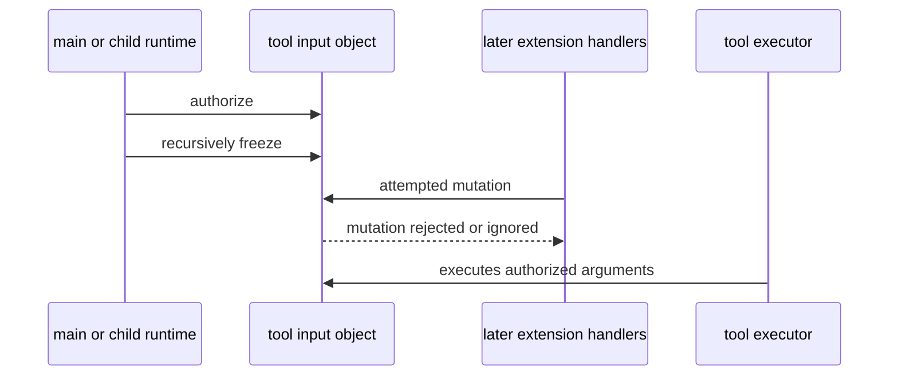

# Policy Model

Main-agent and delegated steps share tool authorization and completion parsing.
The first diagram shows the stronger delegated process boundary; main-agent
mode enforces the same model calls inside the parent process but cannot isolate
the transcript, globally loaded skills, or extension event handlers.

## Trust Boundary

## Delegated Parent Acceptance Checks

## Delegated Child Policy Contents

## Tool Authorization

## Bash Authorization

Allow-list matching is deliberately domain-neutral. The engine does not
classify package-manager, framework, version-control, or hosted-API commands,
and it does not change argument order. Command syntax comes from the agent's
context; the YAML rule only defines executable scope.

## Completion Contract

For a delegated step, pi-subagents 0.36 creates `structured_output` from the
request's workflow result schema and agent contract v1. For a main-agent step,
the harness registers `workflow_complete_step`. Both paths feed the same
outcome, summary, artifact, sole-call, and policy-digest validation. The
workflow step permissions become the sole active-tool allow-list after the
child capability is verified. The selected subagent profile still controls
which extension providers are loaded; unavailable providers fail closed.

The harness captures the working directory when a run starts. A configured
delegated step may bind one canonical existing directory under a YAML-authorized
root; every reachable downstream step, revisit, recovery attempt, and resume
then reuses it. Without a binding, the run-start directory remains effective.
The candidate is accepted only through structured result data for an exact
configured outcome. Summaries and gate artifacts cannot select a directory,
and the extension does not create or interpret worktrees.

Gate artifacts are persisted separately from compact step summaries and remain
opaque to the engine. A workflow prompt may define any artifact format and use
it through `{{reviewed.artifact}}`; neither its contents nor an outcome label
grant additional permissions.

## Immutable Input Defense

